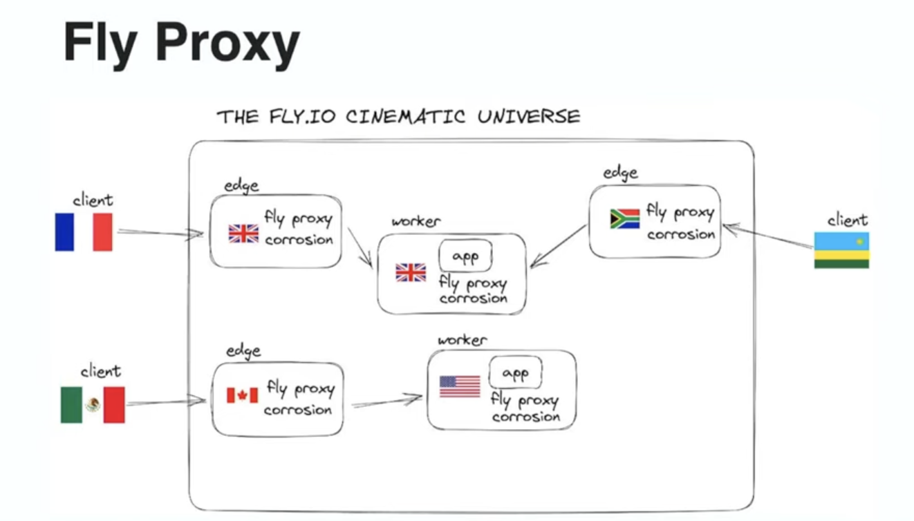
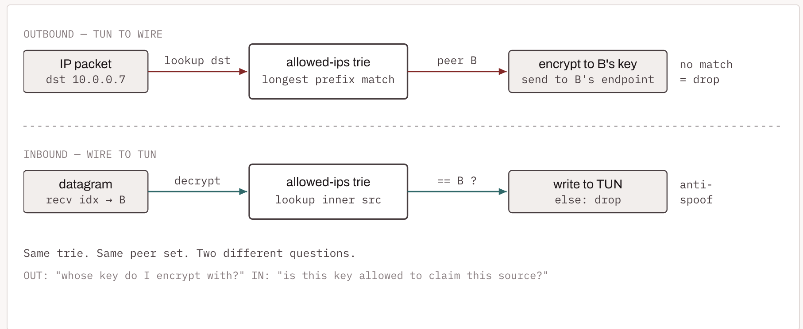
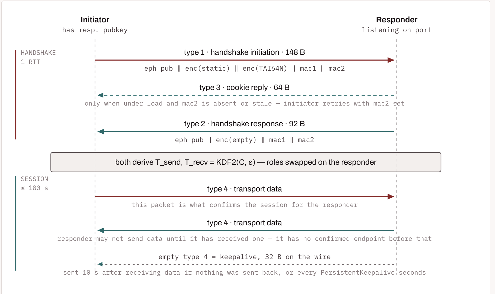
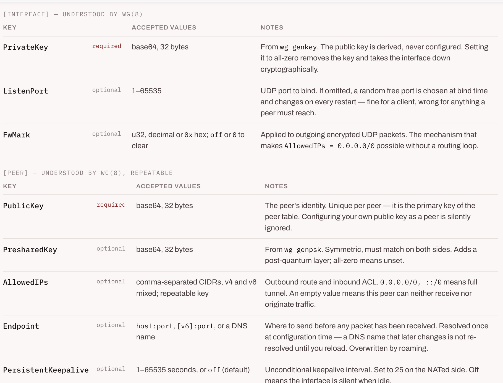

# scaleway
Scaleway manages the Kubernetes control plane (either Kapsule or Kosmos), which consists of various components responsible for managing and maintaining the cluster and its state, and scheduling applications. This includes components such as the control plane itself: etcd, API server, scheduler, cloud controller, and controller manager.

Scaleway takes care of Kubernetes system applications such as CoreDNS, Kubeproxy, Container Networking Interface (CNI), and Container Storage Interface (CSI), which are vital for the optimal functioning of the Kubernetes cluster and its associated resources.

Scaleway is also responsible for node provisioning and providing updates of operating system node images.


[Building a Production-Ready Kubernetes Cluster on Scaleway with Terraform](https://hervekhg.medium.com/building-a-production-ready-kubernetes-cluster-on-scaleway-with-terraform-269e9d558128)

```sh
kubectl create secret docker-registry scw-registry \
  --docker-server=$REGISTRY_ENDPOINT \
  --docker-username=nologin \
  --docker-password=$REGISTRY_PASSWORD
```  
`/26` means `26` bits are network bits, `6` bits are host bits.
`Mask:  11111111.11111111.11111111.11000000  =  255.255.255.192`

### Determine the block size
The mask `192` in binary is `11000000`. The last `1` sits at the `64` position.
`Block size = 256 - 192 = 64`

This means subnets start every 64 addresses: `0`, `64`, `128`, `192`

### CIDR reference table

| CIDR  | Mask              | Total IPs | Usable Hosts | Block Size | Typical Use                           |
| ----- | ----------------- | --------- | ------------ | ---------- | ------------------------------------- |
| `/24` | `255.255.255.0`   | 256       | 254          | 1          | Standard VLAN, home network           |
| `/25` | `255.255.255.128` | 128       | 126          | 128        | Splitting a /24 in half               |
| `/26` | `255.255.255.192` | 64        | 62           | 64         | Small office, guest Wi-Fi             |
| `/27` | `255.255.255.224` | 32        | 30           | 32         | Point-to-point links, small teams     |
| `/28` | `255.255.255.240` | 16        | 14           | 16         | Server clusters, IoT segments         |
| `/29` | `255.255.255.248` | 8         | 6            | 8          | Router interconnects                  |
| `/30` | `255.255.255.252` | 4         | 2            | 4          | WAN links (now often replaced by /31) |
| `/31` | `255.255.255.254` | 2         | 2\*          | 2          | RFC 3021 point-to-point only          |
| `/32` | `255.255.255.255` | 1         | 0            | —          | Single host (loopback, ACLs)          |

## Why is /24 have one block size, while /25 has 128 block size?
The block size is determined by the number of host bits in the subnet mask.

A `/24` subnet mask is `255.255.255.0`
```sh
| Octet  | 1st      | 2nd      | 3rd          | 4th      |
| ------ | -------- | -------- | ------------ | -------- |
| Mask   | 255      | 255      | **255**      | 0        |
| Binary | 11111111 | 11111111 | **11111111** | 00000000 |
```
The block size formula is: 
```sh
Block Size = 256 - (mask value of interesting octet) //the interesting octet — the one where subnetting happens
Block Size = 256 - 255 = 1
```
So subnets increment by `1 `in the 3rd octet:
- 10.0.0.0/24
- 10.0.1.0/24
- 10.0.2.0/24
- 10.0.3.0/24

The block size (increment) in the interesting octet equals 2 raised to the power of the host bits in that specific octet:
`Block Size = 2^(host bits in the interesting octet)`

`Total addresses per subnet or subnet size = 2^(total host bits in full 32-bit address)` 

Block size is the value of the lowest set bit in the mask, i.e. 256 − (mask value of the interesting octet). A /24 is 255.255.255.0
```sh
1090 → 1100     add 10, tens digit +1
10.0.0.0 → 10.0.1.0   add 256, third octet +1
```

An IPv4 dotted-quad like 192.168.1.10 is just a 32-bit integer written in base-256, where each octet is a digit (0–255)
```
192.168.1.10  =  (192 × 256³) + (168 × 256²) + (1 × 256¹) + (10 × 256⁰)
              =  3,232,235,530
```
dotted-quad is base-256 notation. Every octet is a digit.              

 in any positional system with base b, the digit k places from the right has place value b^k. Decimal: 10⁰, 10¹, 10², 10³ = 1, 10, 100, 1000 — each step left multiplies by 10, because a decimal digit holds 10 possible values.

Here each digit holds 256 possible values (0–255), so each step left multiplies by 256:
```
256⁰ = 1          4th octet
256¹ = 256        3rd octet
256² = 65,536     2nd octet
256³ = 16,777,216 1st octet
```
Now rewrite those in powers of 2 instead. Since 256 = 2⁸:
```
256⁰ = (2⁸)⁰ = 2⁰   = 1
256¹ = (2⁸)¹ = 2⁸   = 256
256² = (2⁸)² = 2¹⁶  = 65,536
256³ = (2⁸)³ = 2²⁴  = 16,777,216
```

[RFC 950] (1985) introduced the idea that an address splits into a network part and a host part, chosen by a mask.

[RFC 1519 → RFC 4632] (CIDR, 1993/2006) added two things that matter enormously here:
- The `/n` slash notation. This is decreed — `/26` is just an agreed-upon shorthand for "the mask with 26 leading ones."
- The mask must be contiguous ones followed by contiguous zeros.

Given `/n`, the top n bits are fixed and the bottom `32 − n` bits vary freely over every combination. Therefore:
- Count: the subnet holds `2^(32−n)` addresses — because `32 − n` free bits produce `2^(32−n)` combinations.
- Contiguity: those addresses are consecutive integers — because the free bits are the low-order bits, so they count 0, 1, 2, … upward.
- Alignment: the first address is a multiple of `2^(32−n)` — because its low `32 − n` bits are all zero, which is what "multiple of `2^(32−n)`" means.

- `10.0.0.0 + 256 = 10.0.1.0` — third digit went 0→1. Nothing overflowed. No carry.
- `10.0.255.0 + 256 = 10.1.0.0` — third digit was already at max, rolled over to 0 and pushed +1 into the second digit. That is a carry.
- `A carry is the overflow event: a digit exceeding 255 and spilling leftward. It depends on what the digit currently holds, not on what you added.`

Decimal makes it obvious — adding 10 always targets the tens digit, but only sometimes carries:
```sh
1020 + 10 = 1030    tens 2→3        no carry
1090 + 10 = 1100    tens 9→overflow  carry into hundreds
```
```sh
10.0.0.0     + 256  =  10.0.1.0      targets 3rd digit, no overflow
10.0.7.0     + 256  =  10.0.8.0      targets 3rd digit, no overflow
10.0.255.0   + 256  =  10.1.0.0      CARRY: 3rd digit maxed -> spills into 2nd
10.0.0.255   +   1  =  10.0.1.0      CARRY: 4th digit maxed -> spills into 3rd
10.0.0.100   +   1  =  10.0.0.101    targets 4th digit, no overflow
```

Look at rows 1 and 4 — both land on `10.0.1.0`, by completely different mechanisms. Row 1 targeted the third digit directly. Row 4 carried into it from a maxed-out fourth digit. Same destination, different arithmetic.

- `Adding 256 adds 1 to the third octet. Always true. [MATH]`
- `A carry happens when a digit exceeds 255. Depends on the current value. [MATH]`

the address isn't "in" a base. A number has no base; only a written representation does. The address is a 32-bit quantity, and base-256-with-dots is one way to write it down. Same value, four notations:
```
base 256 (dotted) : 192.168.1.10
base 10           : 3232235786
base 16           : 0xC0A8010A
base 2            : 11000000101010000000000100001010
```
`All four lines are the same number. Base 16 is worth noticing: each octet is exactly two hex digits (C0 A8 01 0A = 192, 168, 1, 10), because 16² = 256 — which is why kernel and driver code handles addresses as integers or hex and leaves dotted-quad for printing.`

`A number is the abstract quantity; a numeral is a written symbol that denotes it. Base is a property of numerals only.`

### why 2 hex digits = exactly 1 octet
The cleaner reason is bits, not 16². One hex digit represents exactly 4 bits (since 16 = 2⁴). So:
```sh
2 hex digits  =  2 × 4 bits  =  8 bits  =  1 octet    ← exact, no remainder
```
The `16² = 256` framing says the same thing from the value side: two hex digits can express `16 × 16 = 256` distinct values, and an octet holds exactly `256` values. Perfect fit.

Compare with base 10, where this fails:
```sh
hex      C0   A8   01   0A       ← octet boundaries visible, 2 digits each
decimal  3232235786              ← octets invisible, no clean split
```
Decimal fails because one decimal digit isn't a whole number of bits — `log₂(10) ≈ 3.32`. You'd need `log₁₀(256) ≈ 2.408` decimal digits per octet, which is not an integer, so decimal digits never line up with byte boundaries.

```c
/* Returns whether matches rule or not. */
/* Performance critical - called for every packet */
static inline bool
ip_packet_match(const struct iphdr *ip,
		const char *indev,
		const char *outdev,
		const struct ipt_ip *ipinfo,
		int isfrag)
{
	unsigned long ret;

	if (NF_INVF(ipinfo, IPT_INV_SRCIP,
		    (ip->saddr & ipinfo->smsk.s_addr) != ipinfo->src.s_addr) ||
	    NF_INVF(ipinfo, IPT_INV_DSTIP,
		    (ip->daddr & ipinfo->dmsk.s_addr) != ipinfo->dst.s_addr))
		return false;

	ret = ifname_compare_aligned(indev, ipinfo->iniface, ipinfo->iniface_mask);

	if (NF_INVF(ipinfo, IPT_INV_VIA_IN, ret != 0))
		return false;

	ret = ifname_compare_aligned(outdev, ipinfo->outiface, ipinfo->outiface_mask);

	if (NF_INVF(ipinfo, IPT_INV_VIA_OUT, ret != 0))
		return false;

	/* Check specific protocol */
	if (ipinfo->proto &&
	    NF_INVF(ipinfo, IPT_INV_PROTO, ip->protocol != ipinfo->proto))
		return false;

	/* If we have a fragment rule but the packet is not a fragment
	 * then we return zero */
	if (NF_INVF(ipinfo, IPT_INV_FRAG,
		    (ipinfo->flags & IPT_F_FRAG) && !isfrag))
		return false;

	return true;
}
```

`(ip->saddr & ipinfo->smsk.s_addr) != ipinfo->src.s_addr` checks if the source IP address of the packet, when masked with the source mask, does not match the expected source address. This is used to determine if the packet's source IP falls within a specified range defined by the rule.
One bitwise AND, one compare, on 32-bit integers. That's two machine instructions, under a comment reading "Performance critical - called for every packet."
mask the address to strip the host bits, compare against the stored network.Contiguous-mask subnetting is designed to be exactly this cheap.

`(ip->daddr & ipinfo->dmsk.s_addr) != ipinfo->dst.s_addr` performs a similar check for the destination IP address, ensuring that it also falls within the expected range.

| form | base | used for |
| --- | --- | --- |
| `__be32` integer | binary (machine) | all real work — masking, comparing, hashing, routing |
| `0xC0A8010A` | 16 | humans reading memory/packet dumps; octets stay visible |
| `192.168.1.10` | 256 | humans reading logs and config; converted at the boundary via `%pI4` / `in4_pton` |

Hex earns its place in the middle row for exactly the Claim-1 reason: it's the most compact base that still lets you see octet boundaries at a glance. Decimal is compact but hides them; binary shows them but is 32 characters long.

prefix length is what routes are stored and sorted by (res->prefixlen). The route table is sorted by prefix length, so the longest prefix match is found first. The prefix length is also used to determine the subnet mask for the route.

`The representation question the kernel actually cares about isn't base — it's byte order`. That's what `__be32` means: big-endian, network byte order. You'll see `ntohl()` / `htonl()` all over the network stack, never base conversion. Endianness is a real, physical property of how the 4 bytes sit in memory

Worth being fair to octal, though — it isn't defective, it's just mismatched. It fails for bytes specifically. When the natural grouping genuinely is 3 bits, octal is the ideal base:
```sh
chmod 755    ->  111 101 101
                 rwx r-x r-x     ← 3 permission bits per digit, exact fit
```                 
That's why Unix permissions are still written in octal and always will be
```
  iptables -A INPUT -s 10.0.0.0/24 ...
        │
        │  ◄── BASE CONVERSION #1 (once, at config time)
        │      userspace parses base-256 text "10.0.0.0" -> 32-bit int
        │      "/24" -> mask 0xFFFFFF00
        ▼
  rule stored in kernel:  src = 0x0A000000, smsk = 0xFFFFFF00
        │
        ▼
  ══════ packet arrives ══════════════════════════════ 10 M times/sec
        │
        │   ip->saddr & ipinfo->smsk.s_addr == ipinfo->src.s_addr
        │   ◄── NO conversion. bits in, bit out. 2 instructions.
        ▼
  ACCEPT / DROP
        │
        │  ◄── BASE CONVERSION #2 (only if logging)
        │      %pI4 renders int -> base-256 text for the log line
        ▼
  "SRC=10.0.0.1"
```
hex is the conventional way to write bit patterns for human readers (and, per earlier, it shows octet boundaries)

```c
if (NF_INVF(ipinfo, IPT_INV_SRCIP,
		    (ip->saddr & ipinfo->smsk.s_addr) != ipinfo->src.s_addr) ||
	    NF_INVF(ipinfo, IPT_INV_DSTIP,
		    (ip->daddr & ipinfo->dmsk.s_addr) != ipinfo->dst.s_addr))
		return false;
```
If the packet's source address isn't in the rule's source subnet — or its destination isn't in the rule's destination subnet — this rule doesn't apply to this packet, so give up on it and move to the next rule.

No. Under CIDR (RFC 4632) a mask must be contiguous ones followed by contiguous zeros. That leaves exactly 33 legal masks, one per prefix length:
```
/0   0.0.0.0          0x00000000  00000000000000000000000000000000
/8   255.0.0.0        0xFF000000  11111111000000000000000000000000
/16  255.255.0.0      0xFFFF0000  11111111111111110000000000000000
/22  255.255.252.0    0xFFFFFC00  11111111111111111111110000000000
/24  255.255.255.0    0xFFFFFF00  11111111111111111111111100000000
/25  255.255.255.128  0xFFFFFF80  11111111111111111111111110000000
/26  255.255.255.192  0xFFFFFFC0  11111111111111111111111111000000
/30  255.255.255.252  0xFFFFFFFC  11111111111111111111111111111100
/31  255.255.255.254  0xFFFFFFFE  11111111111111111111111111111110
/32  255.255.255.255  0xFFFFFFFF  11111111111111111111111111111111
```
legal masks total: 33 (prefix 0..32)
ILLEGAL example: 255.0.255.0 -> 11111111000000001111111100000000 <- ones not contiguous

`Same mask, different networks — and same network, different masks:`
```
Same mask /24, different src -> different subnets:
   src=10.0.0.0       smsk=255.255.255.0   matches 10.0.0.0 - 10.0.0.255
   src=10.0.1.0       smsk=255.255.255.0   matches 10.0.1.0 - 10.0.1.255
   src=192.168.1.0    smsk=255.255.255.0   matches 192.168.1.0 - 192.168.1.255

Same src 10.0.0.0, different mask -> different sized subnets:
   src=10.0.0.0     smsk=255.0.0.0        matches 10.0.0.0 - 10.255.255.255  (16,777,216 addrs)
   src=10.0.0.0     smsk=255.255.0.0      matches 10.0.0.0 - 10.0.255.255  (65,536 addrs)
   src=10.0.0.0     smsk=255.255.255.0    matches 10.0.0.0 - 10.0.0.255  (256 addrs)
   src=10.0.0.0     smsk=255.255.255.192  matches 10.0.0.0 - 10.0.0.63  (64 addrs)

iptables masks your input before storing it:
   you type -s 10.0.0.7/24      -> kernel stores src=10.0.0.0, /24
   you type -s 10.0.0.200/24    -> kernel stores src=10.0.0.0, /24
   you type -s 192.168.5.99/16  -> kernel stores src=192.168.0.0, /16
```
`(ip->saddr & ipinfo->smsk.s_addr) != ipinfo->src.s_addr`
The left side is always the result of an `AND`, so its host bits are always zero. If `src `were stored as `10.0.0.7`, the left side could never equal it — for any packet       

```sh
NORMALIZED   src=10.0.0.0   (smsk=255.255.255.0)
    packet 10.0.0.7   -> (10.0.0.7 & mask)=10.0.0.0   == 10.0.0.0   match=True
    packet 10.0.0.1   -> (10.0.0.1 & mask)=10.0.0.0   == 10.0.0.0   match=True
    packet 10.0.0.99  -> (10.0.0.99 & mask)=10.0.0.0   == 10.0.0.0   match=True
    packet 10.0.1.7   -> (10.0.1.7 & mask)=10.0.1.0   != 10.0.0.0   match=False

UNNORMALIZED src=10.0.0.7   (smsk=255.255.255.0)
    packet 10.0.0.7   -> (10.0.0.7 & mask)=10.0.0.0   != 10.0.0.7   match=False
    packet 10.0.0.1   -> (10.0.0.1 & mask)=10.0.0.0   != 10.0.0.7   match=False
    packet 10.0.0.99  -> (10.0.0.99 & mask)=10.0.0.0   != 10.0.0.7   match=False
    packet 10.0.1.7   -> (10.0.1.7 & mask)=10.0.1.0   != 10.0.0.7   match=False
```

Look at the second block, first line: a packet from 10.0.0.7 itself doesn't match a rule written src=10.0.0.7. Every possible packet fails. The rule would be dead — silently matching nothing.

That's the reason normalization isn't optional tidying. The AND on the left permanently zeroes the host bits, so `src` must have zeroed host bits too or the equality can never hold. iptables does the masking once, at config time, so the fast path stays a single compare

You can see it reflect your input back — type `iptables -A INPUT -s 10.0.0.7/24 -j DROP`, then `iptables -S`, and it prints `-s 10.0.0.0/24`

```c
struct ipt_ip {
	/* Source and destination IP addr */
	struct in_addr src, dst;
	/* Mask for src and dest IP addr */
	struct in_addr smsk, dmsk;
	char iniface[IFNAMSIZ], outiface[IFNAMSIZ];
	unsigned char iniface_mask[IFNAMSIZ], outiface_mask[IFNAMSIZ];

	/* Protocol, 0 = ANY */
	__u16 proto;

	/* Flags word */
	__u8 flags;
	/* Inverse flags */
	__u8 invflags;
};
```
```c
/* Internet address. */
struct in_addr {
	__be32	s_addr;
};
```
- `ipinfo->src.s_addr`: network address (host bits zeroed)
- `ipinfo->smsk.s_addr`: a mask — not an address at all
- `ip->saddr`: host address (the actual sender)

`ipinfo->src.s_addr` (and `ipinfo->dst.s_addr`). Those are the only two that get normalized, and it happens in userspace, before the kernel ever sees the rule

`const struct ipt_ip *ipinfo`

```sh
  10.0.1.7      00001010 00000000 00000001 00000111
& 255.255.255.0 11111111 11111111 11111111 00000000
= 10.0.1.0      00001010 00000000 00000001 00000000
```
The rule is stored as:
```sh
src  = 10.0.1.0       (0x0A000100)
smsk = 255.255.255.0  (0xFFFFFF00)
and it matches 10.0.1.0 through 10.0.1.255 — 256 addresses, including the 10.0.1.7 you typed. iptables -S would print it back as -s 10.0.1.0/24.
```

a network address must have its host bits zero:
```sh
10 . 0 . 2 . 0
00001010 . 00000000 . 00000010 . 00000000
```

so 10.0.2.0/16 is not a valid network address, because the host bits are not zero

Going from `/n `to `/m` borrows `m − n` bits from the host part and hands them to the network part. Those borrowed bits are free to take any combination, so there are `2^(m−n)` of them. Each borrowed bit doubles the subnet count and halves the subnet size — so the product never changes:
`subnets  ×  size each  =  parent size      (always)`

A subnet is defined by two things:
- A network address (all host bits = 0)
- A mask (which draws the boundary)

If you want multiple subnets, you must change the mask (make it longer) to create smaller boundaries

You might be thinking: "But 10.0.2.0 is just an IP address. Who says it can't be part of many subnets at once?"
And you're right — an IP address can belong to nested subnets depending on context:
- 10.0.2.5 is inside 10.0.2.0/24
- 10.0.2.5 is also inside 10.0.0.0/16
- 10.0.2.5 is also inside 10.0.0.0/8

But `10.0.2.0/24` as a prefix is not an IP address floating in space. It is a specific boundary declaration. It claims exactly those 256 addresses as one routing entity.
A /24 means 24 bits are locked as the network portion, leaving the rest for hosts:
```
Total bits in IPv4:     32
Network bits:           24
Host bits:              32 - 24 = 8
```
Each host bit can be 0 or 1. With 8 bits, the number of possible combinations is:
```
2^8 = 256
```
That's where the 256 comes from.

`Your cloud provider assigns you 172.16.0.0/16 for your VPC. You want standard /24 networks per availability zone.`

Take `10.0.2.0/24` split into four `/26`s. The mask is `255.255.255.192 = 11000000` in the last octet — so the top 2 bits of the 4th octet select the subnet, the bottom 6 bits are the host.

```sh
THE FOUR /26 SUBNETS INSIDE 10.0.2.0/24
(mask 255.255.255.192 -> last octet = [2 subnet bits][6 host bits])

  #   4th octet      network          range
  0   00|000000      10.0.2.0/26      10.0.2.0 - 10.0.2.63
  1   01|000000      10.0.2.64/26     10.0.2.64 - 10.0.2.127
  2   10|000000      10.0.2.128/26    10.0.2.128 - 10.0.2.191
  3   11|000000      10.0.2.192/26    10.0.2.192 - 10.0.2.255
```
```sh
NORMALIZATION: what iptables stores for -s <addr>/26

  you type  -s 10.0.2.7/26
      10.0.2.7       last octet   7 = 00|000111
    & 255.255.255.192          192 = 11|000000
    ─────────────────────────────────────────
    = 10.0.2.0       last octet   0 = 00|000000   <- host bits zeroed, subnet bits kept
      STORED:  src = 10.0.2.0   smsk = 255.255.255.192   (subnet #0)

  you type  -s 10.0.2.63/26
      10.0.2.63      last octet  63 = 00|111111
    & 255.255.255.192          192 = 11|000000
    ─────────────────────────────────────────
    = 10.0.2.0       last octet   0 = 00|000000   <- host bits zeroed, subnet bits kept
      STORED:  src = 10.0.2.0   smsk = 255.255.255.192   (subnet #0)

  you type  -s 10.0.2.100/26
      10.0.2.100     last octet 100 = 01|100100
    & 255.255.255.192          192 = 11|000000
    ─────────────────────────────────────────
    = 10.0.2.64      last octet  64 = 01|000000   <- host bits zeroed, subnet bits kept
      STORED:  src = 10.0.2.64   smsk = 255.255.255.192   (subnet #1)

  you type  -s 10.0.2.130/26
      10.0.2.130     last octet 130 = 10|000010
    & 255.255.255.192          192 = 11|000000
    ─────────────────────────────────────────
    = 10.0.2.128     last octet 128 = 10|000000   <- host bits zeroed, subnet bits kept
      STORED:  src = 10.0.2.128   smsk = 255.255.255.192   (subnet #2)

  you type  -s 10.0.2.200/26
      10.0.2.200     last octet 200 = 11|001000
    & 255.255.255.192          192 = 11|000000
    ─────────────────────────────────────────
    = 10.0.2.192     last octet 192 = 11|000000   <- host bits zeroed, subnet bits kept
      STORED:  src = 10.0.2.192   smsk = 255.255.255.192   (subnet #3)

  you type  -s 10.0.2.255/26
      10.0.2.255     last octet 255 = 11|111111
    & 255.255.255.192          192 = 11|000000
    ─────────────────────────────────────────
    = 10.0.2.192     last octet 192 = 11|000000   <- host bits zeroed, subnet bits kept
      STORED:  src = 10.0.2.192   smsk = 255.255.255.192   (subnet #3)
```      

`10.0.0.0/13` is one network of `524,288` addresses, spanning `10.0.0.0 – 10.7.255.255`. Exactly as much "one network" as a `/24` is. The only visible difference: its boundary falls 5 bits into the second octet, so the mask is `255.248.0.0` rather than a tidy run of 255s and 0s.

Same for /8 (one network, 16.7M addresses) and /16 (one network, 65,536).

```sh
a /n is                  exactly one network
its size                 2^(32−n) addresses
its network address      a multiple of 2^(32−n)
/n blocks in all IPv4    2^n
/m subnets inside it     2^(m−n)
```
So — `/8` is one network. `/16` is one network. `/13` is one network. `/26` is one network. The prefix length changes only how big the set is, never how many sets a prefix denotes.

you choose a VPC CIDR when you create the VPC (typically from RFC 1918 space)
```sh
VPC CIDR          10.0.0.0/16          ← you pick this. THE PARENT.
  ├─ subnet       10.0.1.0/24          ← must be inside the VPC CIDR
  ├─ subnet       10.0.2.0/24          ← must not overlap other subnets
  └─ subnet       10.0.3.0/24          ← each lives in exactly ONE AZ
```

RFC 950 says network + broadcast are reserved → −2. AWS reserves five in every subnet:
```sh
address	purpose
.0	network address (RFC)
.1	VPC router (AWS)
.2	DNS / Route 53 Resolver (AWS)
.3	reserved for future use (AWS)
last	broadcast address (RFC — reserved even though AWS doesn't support broadcast)
```

```sh
VPC 10.0.0.0/16 -> subnet sizes

  subnet        total   RFC usable   AWS usable    subnets per /16
  /20           4,096        4,094        4,091                 16
  /24             256          254          251                256
  /26              64           62           59              1,024
  /27              32           30           27              2,048
  /28              16           14           11              4,096

Example 3-AZ layout inside 10.0.0.0/16:

  us-east-1a   public 10.0.0.0/24     (251 usable)   private 10.0.100.0/24   (251 usable)
  us-east-1b   public 10.0.1.0/24     (251 usable)   private 10.0.101.0/24   (251 usable)
  us-east-1c   public 10.0.2.0/24     (251 usable)   private 10.0.102.0/24   (251 usable)
  ```
  Note `/28` yields only 11 usable addresses — which is why AWS sets `/28` as the hard floor. A `/29` would leave 3, and a `/30` would leave nothing.

  ```sh
  Dividing 10.0.2.0/28 down as far as it goes:

  prefix    addresses  host bits  can split into 2?
  /28              16          4  yes -> two /29
  /29               8          3  yes -> two /30
  /30               4          2  yes -> two /31
  /31               2          1  yes -> two /32
  /32               1          0  NO - no host bits left

The last possible split: /31 -> two /32s
   10.0.2.0/32
   10.0.2.1/32

Trying to subnet a /32:

   subnets of /32 into /32 = 2^(32-32) = 1  (itself, trivially)
```

```sh
VPC 10.0.0.0/16
│
├─ rtb-public                    ┌─ 10.0.0.0/16 → local
│   associated with:             └─ 0.0.0.0/0   → igw-xxxx
│     10.0.0.0/24  (us-east-1a)
│     10.0.1.0/24  (us-east-1b)
│     10.0.2.0/24  (us-east-1c)
│
├─ rtb-private-1a                ┌─ 10.0.0.0/16 → local
│   associated with:             └─ 0.0.0.0/0   → nat-1a
│     10.0.100.0/24 (us-east-1a)
│
├─ rtb-private-1b                ┌─ 10.0.0.0/16 → local
│   associated with:             └─ 0.0.0.0/0   → nat-1b
│     10.0.101.0/24 (us-east-1b)
│
└─ rtb-private-1c                ┌─ 10.0.0.0/16 → local
    associated with:             └─ 0.0.0.0/0   → nat-1c
      10.0.102.0/24 (us-east-1c)
```
```sh
rtb-private-1a (associated with subnet 10.0.100.0/24)

   10.0.0.0/16      -> local
   10.1.0.0/16      -> pcx-peering
   192.168.0.0/16   -> tgw-onprem
   0.0.0.0/0        -> nat-1a

resolution by longest-prefix-match:

   10.0.100.9     matches [10.0.0.0/16 , 0.0.0.0/0]
                    -> wins /16  target=local        (same subnet)

   10.0.2.50      matches [10.0.0.0/16 , 0.0.0.0/0]
                    -> wins /16  target=local        (different subnet, same VPC)

   10.0.255.1     matches [10.0.0.0/16 , 0.0.0.0/0]
                    -> wins /16  target=local        (unused space in VPC)

   10.1.4.4       matches [10.1.0.0/16 , 0.0.0.0/0]
                    -> wins /16  target=pcx-peering  (peered VPC)

   192.168.5.5    matches [192.168.0.0/16 , 0.0.0.0/0]
                    -> wins /16  target=tgw-onprem   (on-prem via TGW)

   8.8.8.8        matches [0.0.0.0/0]
                    -> wins /0   target=nat-1a       (internet)
```
Same subnet and different subnet resolve identically — both win on `10.0.0.0/16` → local. AWS has no per-/24 route to distinguish them. Intra-VPC routing is one route, always.

`10.0.255.1` also resolves to local even though no subnet covers it. The local route spans the whole VPC CIDR, including unallocated space — traffic there just goes nowhere.

## Other routes you'd see in a real table

| destination | target | when |
| --- | --- | --- |
| `10.0.0.0/16` | `local` | always, automatic |
| `0.0.0.0/0` | `igw-…` | public subnets |
| `0.0.0.0/0` | `nat-…` | private subnets |
| `10.1.0.0/16` | `pcx-…` | VPC peering |
| `192.168.0.0/16` | `tgw-… / vgw-…` | Transit Gateway or VPN to on-prem |
| `pl-xxxxxxxx` (prefix list) | `vpce-…` | S3/DynamoDB gateway endpoints |
| `::/0` | `eigw-…` | IPv6 egress-only |

Note interface endpoints (PrivateLink) create no routes at all — they work via DNS and an ENI in the subnet.

- Route tables you'd actually build: typically 2–4 — one public, plus one private per AZ.
- What varies per subnet is the association, not the routes. Two identical /24s become "public" or "private" solely by which table they're attached to.


So at the routing layer, every subnet in a VPC can always reach every other subnet. That's by design 

`10.0.0.0/16 → local`

```sh
So the answer to "how do we stop traffic between subnets" is: not with routes. Routing decides where a packet is allowed to be sent; it was never the tool for whether it's permitted.
```

To stop `10.0.100.0/24` from reaching `10.0.101.0/24`, you attach a NACL to a subnet with something like:
```sh
inbound   rule 100   DENY   source 10.0.100.0/24   all traffic
inbound   rule 200   ALLOW  source 0.0.0.0/0       all traffic
```
Rule `100` is checked first, so traffic from that /24 is dropped at the subnet boundary. The route still says "local" — the packet is simply denied on arrival.

For instance-level control you'd instead use security groups, which is the more common approach.

```sh
                                     ┌─> LOCAL_IN ──> local process
  NIC ─> INGRESS ─> PRE_ROUTING ─────┤
                                     └─> FORWARD ─┐
                                                  ├─> POST_ROUTING ─> NIC
                    local process ─> LOCAL_OUT ───┘
```

- ipset — hash sets of addresses/networks for matching thousands of prefixes efficiently instead of thousands of linear rules.
- ufw / firewalld — friendly frontends that generate nft/iptables rules for you.

AWS aggregates them. Instead of three connected routes for your three /24s, it installs one route for the whole VPC CIDR:`10.0.0.0/16 → local`


```sh
# Inside an EC2 instance in 10.0.100.0/24, the guest OS routing table 
10.0.100.0/24  dev eth0  scope link          ← connected route, standard
default via 10.0.100.1  dev eth0             ← the VPC router, always .1
```
One logical router per VPC — but it presents an address in every subnet.

```sh
VPC 10.0.0.0/16 — reserved addresses per subnet

  subnet           .0 network    .1 ROUTER     .2 dns        .3 future    last bcast
  10.0.0.0/24      10.0.0.0      10.0.0.1      10.0.0.2      10.0.0.3     10.0.0.255
  10.0.1.0/24      10.0.1.0      10.0.1.1      10.0.1.2      10.0.1.3     10.0.1.255
  10.0.100.0/24    10.0.100.0    10.0.100.1    10.0.100.2    10.0.100.3   10.0.100.255
  10.0.2.0/26      10.0.2.0      10.0.2.1      10.0.2.2      10.0.2.3     10.0.2.63

  -> every subnet has its OWN .1, all served by the SAME logical router
  ```

- An instance in `10.0.100.0/24` has default gateway `10.0.100.1`.
- An instance in `10.0.0.0/24` has default gateway `10.0.0.1`.
- Those are not two routers — they're two addresses of the same distributed VPC router.

## Route Summarization
Route summarization (also aggregation or supernetting) means replacing several specific routes with one shorter prefix that covers them all.
```sh
BEFORE (4 routes)              AFTER (1 route)
  10.0.0.0/24 → R1
  10.0.1.0/24 → R1       ──>     10.0.0.0/22 → R1
  10.0.2.0/24 → R1
  10.0.3.0/24 → R1
 ``` 

 A set of prefixes summarizes exactly into a `/n` if and only if they completely and exactly cover an aligned `/n` block — no gaps, no extras.

```sh
STEP 1-2: write in binary, find longest common prefix

   10.0.0.0/24    00001010 00000000 00000000 00000000
   10.0.1.0/24    00001010 00000000 00000001 00000000
   10.0.2.0/24    00001010 00000000 00000010 00000000
   10.0.3.0/24    00001010 00000000 00000011 00000000

   first 22 bits identical in all four  ->  summary is a /22
                  ^^^^^^^^ ^^^^^^^^ ^^^^^^.. ........
                  |<------- 22 common ------->|<-- differ -->|

STEP 3: summary = 10.0.0.0/22
STEP 4: verify — covers 1,024 addresses (10.0.0.0 - 10.0.3.255)
        the four /24s cover 1,024 addresses
        EXACT MATCH -> summarization is safe
```

```sh
you own: 10.0.1.0/24, 10.0.2.0/24, 10.0.3.0/24
          = 768 addresses

LAZY: longest common prefix = /22  ->  advertise 10.0.0.0/22
      but 10.0.0.0/22 covers 1024 addresses (10.0.0.0 - 10.0.3.255)
      => you'd advertise 256 addresses you DON'T own: 10.0.0.0/24
      => traffic for 10.0.0.x is drawn to you and BLACK-HOLED

CORRECT: minimal safe set = 10.0.1.0/24, 10.0.2.0/23
         covers 768 addresses — exactly what you own
         3 routes -> 2 routes (still a win)
```         


kube-controller-manager runs with:
```sh
--allocate-node-cidrs=true
--cluster-cidr=10.200.0.0/16
--node-cidr-mask-size=24
```
It hands each node a /24 slice and writes it to `node.spec.podCIDR`:

| Node | Node IP | podCIDR |
| --- | --- | --- |
| Control plane 1 | 10.0.0.4 | 10.200.0.0/24 (only if it schedules pods) |
| Worker 1 | 10.0.0.36 | 10.200.1.0/24 |
| Worker 2 | 10.0.0.37 | 10.200.2.0/24 |

```sh
192.168.1.0/24  dev eth0  proto kernel  scope link  src 192.168.1.50  metric 100
└── destination  └ iface   └── origin    └ reachability └ source IP    └ priority

default  via 192.168.1.1  dev eth0  proto dhcp  metric 100
└ dest ┘ └── next hop ──┘ └ iface ┘ └ origin ─┘ └ priority ┘
```

So a gateway(`via`) route means: "put the router's MAC on the frame, but leave the IP header alone." The router then repeats the decision with its own table. The IP destination never changes hop to hop — only the MAC does. That's the entire mechanism of hop-by-hop forwarding.

proto — from RTPROT_*

| value | shown as | who added it |
| --- | --- | --- |
| 2 | kernel | automatic — created when you assigned an IP to an interface |
| 4 | static | you, via `ip route add` |
| 16 | dhcp | the DHCP client |
| 3 | boot | added during boot, no daemon owns it |
| 9 | ra | IPv6 router advertisement |
| 1 | redirect | an ICMP redirect |
| 11/12/42/84 | zebra/bird/babel/ovn | routing daemons (FRR, BIRD, OVN…) |

There are three built-in tables: `local` (255), `main` (254), `default` (253). Policy rules choose which to consult:

```sh
$ ip rule
0:      from all lookup local
32766:  from all lookup main
32767:  from all lookup default
```

The full decision sequence:
- `ip rule` — walk rules by priority, pick a table
- Longest prefix match within that table
- Lowest `metric` breaks ties among equal-length prefixes
- ECMP hashing if the winner has multiple nexthops
- If no match, try the next rule/table

```sh
ip route                      # the main table
ip route show table all       # every table
ip rule                       # policy rules
ip route get 8.8.8.8          # ask the kernel to RESOLVE one destination
```

`dev eth0 `answers a different question from `via`.

| field | question it answers | layer |
| --- | --- | --- |
| dev eth0 | which wire does the frame leave by? | physical port |
| via 192.168.1.1 | whose MAC goes in the frame header? | layer 2 addressing |
| destination IP | who is this ultimately for? | layer 3 — never changes |

The machine has one NIC, so everything leaves via `eth0`. What differs is who on that wire is meant to pick the frame up.

To 192.168.1.60 (connected route):

```sh
Ethernet  dst = MAC of 192.168.1.60      ← ARP asked for the destination itself
IP        dst = 192.168.1.60
```
To 8.8.8.8 (default route):

```sh
Ethernet  dst = MAC of 192.168.1.1       ← ARP asked for the GATEWAY
IP        dst = 8.8.8.8                   ← unchanged
```

The default route only works because the connected route exists. To use `via 192.168.1.1`, the kernel must first answer `"how do I reach 192.168.1.1?"` — so it does a second lookup:

```sh
default via 192.168.1.1  ─────┐
                              │ resolve the gateway
                              ▼
            192.168.1.0/24 dev eth0 scope link   ← matches! directly reachable
                              │
                              ▼
                         ARP for 192.168.1.1 → send out eth0
```                         
That's where the `dev eth0` on the default route comes from — `it's inherited from resolving the gateway`, not independently configured. Remove the address from eth0 and the connected route vanishes, taking the default route with it.

Try setting a gateway that isn't in any connected subnet and the kernel refuses:
```sh
$ ip route add default via 10.99.99.1
#Error: Nexthop has invalid gateway
```
Because there's no route telling it how to reach `10.99.99.1`. The `onlink` flag from the earlier reference exists exactly to override this — "trust me, that gateway is on this link":
```sh
ip route add default via 10.99.99.1 dev eth0 onlink
```
## When dev would differ
Only when the machine has multiple interfaces — a router:
```sh
192.168.1.0/24  dev eth0  scope link     ← LAN
203.0.113.0/24  dev eth1  scope link     ← WAN
default via 203.0.113.1   dev eth1
```
Here the LAN route uses eth0, the default uses eth1.

*You state it explicitly*:

`ip route add default via 192.168.1.1 dev eth0`
*You omit it, and the kernel derives it once*:

`ip route add default via 192.168.1.1`
## nftables
The replacement for iptables, ip6tables, arptables and ebtables — one framework instead of four;driven by a single userspace tool: `nft`


The mechanism: `sbt-scalafmt` formats `unmanagedSources`, not sources.

Your codegen modules set `Compile / unmanagedSourceDirectories := Seq.empty`, so:
```sh
scaleway-iam-codegen/Compile/unmanagedSources:  0     ← what scalafmt would format
scaleway-iam-codegen/Compile/managedSources:   97     ← where the generated files actually live
```

`scaleway-iam-codegen/Compile/scalafmtCheck `succeeds in 12s having formatted nothing. The generated files reach the compiler as managed sources, and scalafmt never looks at managed sources. So the skip is a free side effect of the `sourceGenerators` wiring from earlier 

`A 32-bit sequence defined strictly as a continuous string of 1s followed by a continuous string of 0s. Because of this rule, there are only 33 possible binary subnet masks in existence`

Every octet can only ever have nine possible values: 0, 128, 192, 224, 240, 248, 252, 254, 255. The only valid subnet masks are those that can be expressed as a continuous string of 1s followed by a continuous string of 0s. This means that the binary representation of a subnet mask must have all the 1s on the left side and all the 0s on the right side.


- VPC
- Subnets
- Security groups- for fined grain firewall policies
- Route tables- for routing traffic between subnets and to the internet
- Gateway- for internet access
## Examples

Runnable programs against the generated clients live in [src/main/scala/examples/](src/main/scala/examples/). Each one
is an `IOApp` that provisions something, prints what it did, and deletes it again on the way out.

```sh
export SCW_SECRET_KEY=...              # from an IAM API key
export SCW_DEFAULT_ORGANIZATION_ID=...
export SCW_DEFAULT_PROJECT_ID=...
export SCW_DEFAULT_REGION=fr-par       # optional, this is the default
export SCW_DEFAULT_ZONE=fr-par-1       # optional, this is the default

sbt --client "runMain examples.VpcExample"
```

The listings are read-only, but anything an example creates — Instances, Kapsule clusters, Load Balancers — is billed
for as long as it exists, so let the teardown run.


### Carrying is Euclidean division

A column in a positional numeral can only hold digits `0 … b-1`. When a column's sum `S` overflows that range, split `S` into the part that fits and the part that doesn't:

```sh
S = b·C + D        with 0 ≤ D < b
D = S mod b        ← the digit you write   (the leftover)
C = ⌊S / b⌋        ← the digit you carry   (how many whole b's you packed up)
```

The carry goes *left* because of positional value: a column worth `bⁿ` sits next to a column worth `bⁿ⁺¹`, so `b` units of the right column = exactly 1 unit of the left one. Carrying is repackaging, not arithmetic. `S = bC + D` guarantees the split loses and invents nothing.

`47 + 38` in base 10 → `85`:

| column | `S`         | `D = S mod 10` | `C = ⌊S/10⌋` |
| ------ | ----------- | -------------- | ------------ |
| units  | `7+8 = 15`  | 5              | 1            |
| tens   | `4+3+1 = 8` | 8              | 0            |

`15 = 10(1) + 5` — you had 15 units, 10 of them became one ten, 5 stayed put.

`1011 + 1101` in base 2 → `11000` (11 + 13 = 24). `D` is only ever 0 or 1, so carries fire the moment `S` reaches 2:

| column | `S`         | `D = S mod 2` | `C = ⌊S/2⌋` |
| ------ | ----------- | ------------- | ----------- |
| `2⁰`   | `1+1 = 2`   | 0             | 1           |
| `2¹`   | `1+0+1 = 2` | 0             | 1           |
| `2²`   | `0+1+1 = 2` | 0             | 1           |
| `2³`   | `1+1+1 = 3` | 1             | 1           |
| `2⁴`   | `1`         | 1             | 0           |

The `S = 3` row is `3 = 2(1) + 1`: write 1, carry 1 — literally what a full adder computes in hardware, and the reason wide adders need carry-lookahead (the carry chain is serial).

`9F + 6B` in base 16 → `10A`. Large `b`, so sums get big before anything spills:

| column | `S`                  | `D = S mod 16`    | `C = ⌊S/16⌋` |
| ------ | -------------------- | ----------------- | ------------ |
| `16⁰`  | `F+B = 15+11 = 26`   | `26-16 = 10` = `A` | 1           |
| `16¹`  | `9+6+1 = 16`         | `16-16 = 0`       | 1            |
| `16²`  | `1`                  | 1                 | 0            |

Check in decimal: `159 + 107 = 266`, and `1(256) + 0(16) + 10 = 266`. ✓

**The carry is not always 0 or 1.** That only holds for two addends: the largest possible sum is `2(b-1) = 2b-2 < 2b`, so `⌊S/b⌋ ≤ 1`. Add more rows and the bound breaks — `18 + 19 + 17 + 16 = 70` carries a literal 3, because the units column `8+9+7+6 = 30` yields `D = 0`, `C = ⌊30/10⌋ = 3`: three complete tens extracted at once.

The base need not even be constant per column. Time is mixed radix — `1h 45m + 0h 30m`: minutes `S = 75`, `D = 75 mod 60 = 15`, `C = 1`; hours `1+0+1 = 2` → `2h 15m`. Same algorithm, different `b` per column.

So `b` isn't part of the arithmetic — it's part of the notation. `11 + 13 = 24` regardless of how you write it. Changing `b` only moves where the overflow line sits, and therefore how `S` gets sliced into `(D, C)`.

Which is exactly what the dotted quad is doing: an IPv4 address is base 256 (see the table above), so incrementing across an octet boundary is one carry with `b = 256`.

```sh
10.0.0.255 + 1   →   S = 256, D = 256 mod 256 = 0, C = 1   →   10.0.1.0
```

That is the same arithmetic as the *Block Size* column in the CIDR table — a `/26` steps the last octet by 64, and the fifth such step (`192 + 64 = 256`) overflows into the third octet instead of producing `10.0.0.256`, which is unrepresentable because `D < b`.

When you initialize a Kubernetes cluster (using tools like kubeadm, or managed services like EKS, GKE, or AKS), you define a Cluster CIDR (also known as the Pod Network CIDR)

Kubernetes takes that parent /16 block and divides it into smaller subnets—typically /24 blocks—and assigns one (or more) to each worker node.

- Node 1 Pod CIDR: 10.244.1.0/24 (256 IPs for pods on Node 1)

- Node 2 Pod CIDR: 10.244.2.0/24 (256 IPs for pods on Node 2)

- Node 3 Pod CIDR: 10.244.3.0/24 (256 IPs for pods on Node 3)

The Container Network Interface (CNI) plugin you choose (like Cilium, Calico, or Flannel) handles the allocation of these subnets behind the scenes:

- `IPAM (IP Address Management)`: The CNI's IPAM module tracks which node owns which /24 slice.

- `Routing / Encapsulation`: When Pod A (on Node 1, IP `10.244.1.5`) wants to talk to Pod B (on Node 2, IP `10.244.2.10`), the CNI ensures the packet knows how to cross the physical node boundary using either overlay networking (encapsulating the packet in a VXLAN/Geneve tunnel) or direct routing (updating the underlying VPC's route tables so the cloud provider knows Node 2's subnet lives behind Node 2's primary ENI).


there is always a route to the Pod CIDR, but how that route gets established depends entirely on whether your cluster uses an overlay network or direct routing (native VPC routing).

## Overlay Networking (e.g., Flannel, VXLAN, or Geneve)

In an overlay setup, the underlying cloud VPC or physical network does not know about individual Pod CIDRs. The physical network only sees the nodes' normal IP addresses (e.g., 192.168.1.x).
The Routing Table: The routing table inside the Linux kernel of Node 1 looks like this for container traffic:

- Destination: 10.244.2.0/24 (Node 2's Pod CIDR)
- Gateway/Interface: Encapsulated via a virtual tunnel interface (like flannel.1 or a VXLAN device).

## Direct Routing / Native VPC Integration (e.g., AWS VPC CNI, Google Cloud VPC Native, Cilium in Direct Routing mode)

In high-performance or cloud-native setups, you want to eliminate the overhead of tunneling. Here, the underlying cloud provider's VPC router actually knows the routes to your Pod CIDRs.

    The Cloud VPC Routing Table: The cloud provider's virtual router has explicit routing rules. For example:
-  Destination: 10.244.2.0/24 (Pod CIDR)

- Target: Node 2's primary network interface (ENI) or Node 2's IP address.


### From a Peered VPC or Corporate VPN

If you have a separate network (like your company's AWS VPC or an on-premises datacenter) connected via VPC peering or a VPN tunnel, and you want them to talk directly to your pods:
- The Solution: You have to manually add a static route in your cloud provider's VPC route table or your VPN gateway.
- The Route: Destination = 10.244.0.0/16, Target = Your Kubernetes cluster's VPC router / Transit Gateway / or specific worker nodes (depending on your CNI). Without this route, external routers will not know how to forward packets destined for the /16 block toward your cluster.

### How Kubernetes Handles External Traffic (The Right Way)

Because Pod IPs inside the /16 are internal and ephemeral, you generally do not route raw packets directly to the /16 from the outside world. Instead, Kubernetes uses abstraction layers to handle incoming traffic safely:
- Services & Load Balancers (LoadBalancer / NodePort): An external cloud load balancer receives traffic on a public/VPC IP and forwards it to a NodePort or directly to the nodes. The kube-proxy (or CNI) then uses iptables / eBPF to DNAT (Destination Network Address Translation) that traffic and route it to a specific pod inside the /16.
- Ingress Controllers: Acts as an entry point inside the cluster, receiving traffic from a single internal/external entry point and routing it based on HTTP paths to the correct internal pod /16 addresses.


### Services & Load Balancers (LoadBalancer / NodePort)

Imagine you are deploying a simple web application or a backend API, and you want it to be directly accessible from the public internet via a cloud load balancer (like an AWS Classic/Network Load Balancer or GCP Load Balancer).

```yaml
# service.yaml
apiVersion: v1
kind: Service
metadata:
  name: my-api-service
spec:
  type: LoadBalancer # Tells the cloud provider to provision an external LB
  selector:
    app: payment-api # Targets pods with this label
  ports:
    - protocol: TCP
      port: 80        # The port exposed on the external load balancer
      targetPort: 8080 # The port your containerized app is listening on inside the pod
```      

### Ingress Controllers

If you have dozens of microservices, provisioning a separate cloud Load Balancer (type: LoadBalancer) for every single one of them gets very expensive and messy. Instead, you deploy a single Ingress Controller (like NGINX Ingress, Traefik, or Envoy Gateway) behind one Load Balancer, and use it to route traffic based on HTTP paths or hostnames.

```yaml
# ingress.yaml
apiVersion: networking.k8s.io/v1
kind: Ingress
metadata:
  name: main-router
spec:
  ingressClassName: nginx # Uses the NGINX Ingress Controller
  rules:
    - host: api.mycompany.com
      http:
        paths:
          - path: /users
            pathType: Prefix
            backend:
              service:
                name: user-service
                port:
                  number: 80
          - path: /orders
            pathType: Prefix
            backend:
              service:
                name: order-service
                port:
                  number: 80
```

You configure the cloud load balancer directly from inside Kubernetes by adding Annotations to your `Service` or `Ingress` YAML manifests.

When you create the resource, a Cloud Controller Manager (like the AWS Load Balancer Controller or Azure's cloud provider integration) watches the Kubernetes API. When it sees your manifest, it reads these annotations and makes the API calls to the cloud provider to provision and configure the load balancer automatically.

### Target Types (How the LB actually reaches your pods)

The most important configuration for how traffic is routed to your service is the `Target Type`. You can tell the cloud load balancer to route traffic into your cluster in one of two ways:

#### Option A: Instance Mode (Node-Level Routing)

This is the traditional default for most Kubernetes setups.
- `The Config`: `service.beta.kubernetes.io/aws-load-balancer-nlb-target-type: "instance"` (or Azure's default behavior).

The Cloud LB registers the worker nodes (the raw VMs) as its targets. It sends traffic to a `NodePort` on the node, and the node's `kube-proxy` (using Netfilter/iptables) forwards it to the correct Pod.

- The Trade-off: It works with any overlay network (like VXLAN or WireGuard meshes), but it adds an extra network hop inside the cluster.

#### Option B: IP Mode (Direct Pod Routing)

- The Config: `service.beta.kubernetes.io/aws-load-balancer-nlb-target-type: "ip"`

The Cloud LB registers the Pod IPs directly as its targets. It completely bypasses the worker node's kube-proxy. The cloud load balancer sends packets directly to the internal Pod IPs


### The Frontend Interface (The Listener)

This is the interface that receives traffic from clients.

- Public Load Balancer: The frontend interface is assigned a Public IP address routable on the open internet, as well as a private IP within your cloud VPC/VNet.

- Internal Load Balancer: In a secure hub-and-spoke architecture (like those routing through a Palo Alto firewall in an Azure Transit VNet), the frontend interface is only assigned a private IP from the specific subnet you provision the load balancer in.


### The Backend Interface (The Target-Facing Side)

This is the interface the load balancer uses to forward traffic to your Kubernetes nodes or directly to your Pod IPs.

- Under the hood in AWS, an Application Load Balancer (ALB) or Network Load Balancer (NLB) provisions actual Elastic Network Interfaces (ENIs) in the subnets you select.

- When the load balancer decides which pod or node should receive the request, the packet is sent out through this backend ENI into your VPC routing infrastructure.


```sh
┌──────────────────┬──────────────┬──────────────────────────┐
│     OSI (7)      │  TCP/IP (4)  │          Linux           │
├──────────────────┼──────────────┼──────────────────────────┤
│ 7 Application    │              │                          │
│ 6 Presentation   │ Application  │ userspace (nginx, ssh)   │
│ 5 Session        │              │                          │
├──────────────────┼──────────────┼──────────────────────────┤
│ 4 Transport      │ Transport    │ net/ipv4/tcp.c, udp.c    │
├──────────────────┼──────────────┼──────────────────────────┤
│ 3 Network        │ Internet     │ net/ipv4/ip_input.c,     │
│                  │              │ net/ipv4/route.c         │
├──────────────────┼──────────────┼──────────────────────────┤
│ 2 Data Link      │              │ net/ethernet/            │
│ 1 Physical       │ Link         │ drivers/net/             │
└──────────────────┴──────────────┴──────────────────────────┘
```

Each layer prepends a header and never touches what's above it

```sh
L7  HTTP                                     37 bytes
L4  + TCP header (20)                    →   57
L3  + IP header (20)                     →   77
L2  + Ethernet header (14)               →   91  ← on the wire
```

What the NIC adds that isn't shown
```sh
[preamble 7B][SFD 1B][  the 91 bytes above  ][FCS/CRC 4B][interframe gap]
```
The preamble, start-frame delimiter, and CRC are generated by hardware and stripped before the kernel ever sees the frame — which is why `sk_buff` starts at the destination MAC. Ethernet also pads any frame under 64 bytes; ours is 91, so no padding.


### The handshake (TLS 1.3, RFC 8446)
```sh
CLIENT                                                    SERVER
  │                                                          │
  │──── ClientHello ────────────────────────────────────────►│
  │       • random                                           │
  │       • cipher suites offered                            │
  │       • key_share  (ephemeral ECDHE public key)          │
  │       • server_name (SNI)   ← PLAINTEXT, see below       │
  │                                                          │
  │◄──── ServerHello ────────────────────────────────────────│
  │       • random                                           │
  │       • chosen cipher suite                              │
  │       • key_share  (server's ephemeral public key)       │
  │                                                          │
  │   ══ both sides now compute the SAME shared secret ══    │
  │      via ECDHE, then derive keys with HKDF               │
  │                                                          │
  │◄──── {EncryptedExtensions}  ─────────────────────────────│  ┐
  │◄──── {Certificate}          ─────────────────────────────│  │ encrypted
  │◄──── {CertificateVerify}    ─────────────────────────────│  │ from here on
  │◄──── {Finished}             ─────────────────────────────│  ┘
  │                                                          │
  │──── {Finished} ─────────────────────────────────────────►│
  │──── [Application Data: GET /account …] ─────────────────►│   1 round trip
```
One round trip, then data flows. TLS 1.2 needed two.

The three jobs, and which crypto does each

| Job | Mechanism | What it stops |
| --- | --- | --- |
| `Confidentiality` | AEAD cipher (AES-GCM or ChaCha20-Poly1305) with keys from ECDHE | reading your data |
| `Integrity` | the AEAD auth tag — same operation | modifying your data |
| `Authentication` | server's certificate + `CertificateVerify` signature, chained to a trusted CA | talking to an impostor |

`CertificateVerify` is the part people miss. Anyone can copy a public certificate. The server must sign a hash of the whole handshake transcript with the private key matching that certificate — proving it actually holds the key, and binding the proof to this specific connection.

`Forward secrecy` comes from ECDHE being ephemeral: keys are generated per connection and discarded. Stealing the server's long-term private key next year doesn't decrypt traffic captured today. TLS 1.3 removed RSA key transport precisely because it lacked this.

`TLS 1.2 — the client must ask before it can act`:
```sh
t=0    CLIENT ──── ClientHello ──────────────────────────► SERVER
                   "here are the ciphers I support"
                   (no key material — I don't know what you'll pick)

t=½    CLIENT ◄─── ServerHello, Certificate, ──────────── SERVER
                   ServerKeyExchange, ServerHelloDone
                   "I chose ECDHE/x25519, here's MY public key"
                          ▲
                          └─ only NOW does the client know the group
       ═══════════════ RTT 1 complete ═══════════════

t=1    CLIENT ──── ClientKeyExchange, CCS, Finished ─────► SERVER
                   "here's MY public key" → both compute secret

t=1½   CLIENT ◄─── NewSessionTicket, CCS, Finished ────── SERVER
       ═══════════════ RTT 2 complete ═══════════════

t=2    CLIENT ──── GET /account ─────────────────────────► SERVER
```

`TLS 1.3 — the client guesses and commits up front`:

```sh
t=0    CLIENT ──── ClientHello + key_share ──────────────► SERVER
                   "here are my ciphers AND my public key
                    for x25519, which I bet you'll accept"

t=½    CLIENT ◄─── ServerHello + key_share, ──────────── SERVER
                   {EncryptedExtensions}, {Certificate},
                   {CertificateVerify}, {Finished}
                   ▲ server computed the secret on arrival,
                     so everything after ServerHello is ALREADY encrypted
       ═══════════════ RTT 1 complete ═══════════════

t=1    CLIENT ──── {Finished} + GET /account ───────────► SERVER
                   ▲ data rides in the SAME flight
```
TLS 1.2 negotiates first, then exchanges keys. TLS 1.3 exchanges keys speculatively during negotiation.

- The ECDHE shared secret enters once, at the Handshake Secret. Everything below is derived from it via HKDF 
- There are two generations of keys:

| Generation | Derived from | Encrypts |
| --- | --- | --- |
| `handshake traffic secrets` | Handshake Secret | `EncryptedExtensions`, `Certificate`, `CertificateVerify`, `Finished` |
| `application traffic secrets` | Master Secret | your GET, the response |

This is why TLS 1.3 can encrypt the certificate: handshake keys are available immediately after `ServerHello`, long before the handshake completes. TLS 1.2 had no such intermediate stage, which is why its certificate goes in the clear.

- Separate keys per direction. `client->server` and `server->client` have different keys and IVs. A captured client record cannot be decrypted with the server's key — so compromising one direction doesn't give you the other.

-  Every record gets a unique nonce — `iv XOR sequence_number`. This is not decoration: reusing a nonce with AES-GCM leaks the authentication key outright and is one of the most catastrophic failures in applied cryptography. The counter guarantees uniqueness for free.

- The transcript is mixed in. `Derive-Secret(..., transcript)` binds the keys to the exact bytes of the handshake. Tamper with any handshake message and both sides derive different keys → `Finished` fails → connection aborts. That's how the handshake protects itself.

### Forward secrecy, concretely
The ECDHE private keys are generated per connection and discarded when the handshake ends. Nothing in that schedule can be recomputed afterwards — not from the server's certificate key, not from anything stored on disk. Recording today's traffic and stealing the server's private key next year yields nothing.

That's precisely what TLS 1.2's old RSA key-transport suites lacked: the premaster secret was encrypted to the server's long-term key, so stealing that key later decrypted every past session. TLS 1.3 removed those suites entirely, which is why ECDHE is no longer even named in its cipher suites — it's mandatory.


|  | Connection A | Connection B |
| --- | --- | --- |
| `5-tuple` | client :60617 → LB :9001 (TCP) | LB :60618 → pod :9002 (TCP) |
| `who terminates it` | the load balancer | the pod |
| `sequence numbers` | the client's | unrelated, freshly chosen |
| `TLS session` | client ↔ LB | separate, or plaintext |
| `congestion window` | independent | independent |


keys are derived from the complete handshake transcript — including the Certificate and Finished messages. Those don't exist yet when the Certificate needs encrypting. You can't derive a key from messages you haven't sent.

So TLS 1.3 derives keys twice:

|  | When | From what transcript | Protects |
| --- | --- | --- | --- |
| `handshake keys` | right after `ServerHello` | `ClientHello`…`ServerHello` | the rest of the handshake |
| `application keys` | after `Finished` | `ClientHello`…server `Finished` | your data |

 HTTP/1.1 connections are persistent — after a response completes, the connection is perfectly reusable. Closing it would waste a TCP handshake (and a TLS handshake) on every request.

### Two different mechanisms
① HTTP/1.1 keep-alive — reuse across time (what the demo shows)

```sh
backend conn B1:  [req1][resp1] [req2][resp2] [req3][resp3]
                   ─────────── sequential ───────────►
One request at a time per connection. Reuse is temporal.
```
② HTTP/2 multiplexing — reuse across streams (concurrent)

```sh
backend conn B1:  [s1 req][s3 req][s1 resp][s5 req][s3 resp][s5 resp]
                   ────────── interleaved on ONE connection ────────►
```                   
Many requests in flight simultaneously on a single TCP connection. This is strictly more powerful — it breaks even the "one connection per in-flight request" constraint. A single HTTP/2 backend connection can carry 100+ concurrent streams.

#### Why this is only possible at L7
Because the proxy owns both connections independently — Connection A and connection B share no state, so the proxy is free to map them however it likes: many-to-few, one-to-many, or reshuffled per request.

An L4 forwarder can't do any of this. A packet belongs to exactly one flow; there's no layer at which to regroup them.

`The handshake completes before the request is ever sent`

- The session a handshake establishes — the keys and parameters for this connection. Negotiated as above.
- Session resumption — reusing that state on a later connection to skip the full handshake.

TLS 1.3 uses the words precisely — the distinction is role, not secrecy:

|  | Secret | Key |
| --- | --- | --- |
| `purpose` | input to further derivation | fed directly to a cipher |
| `length` | full hash size (32 B for SHA-256) | cipher's size (16 B for AES-128) |
| `used by` | HKDF | AES-GCM |
| `examples` | Early/Handshake/Master Secret, traffic secrets | `write_key`, `iv` |


### Why the wiping matters
Forward secrecy is entirely this property. Once the ECDHE private keys are gone, the Handshake Secret cannot be recomputed by anyone — not with the server's certificate key, not with anything on disk. Recorded traffic stays unreadable forever.

Blast radius is the other half. Compromising application keys mid-connection gives you that connection's data and nothing else: not the handshake keys, not the Master Secret, not other connections.

`resumption_master_secret` is the exception, and it's where the security model gets weaker. It's stored (client-side in a ticket, or server-side keyed by ticket ID) so a future connection can skip the handshake. That's a deliberate tradeoff:

Session tickets are encrypted with a server-held ticket key. Steal that key and you can unwrap tickets and recover resumption secrets — undermining forward secrecy for resumed sessions.
Which is why RFC 8446 caps ticket lifetime at 7 days, and why rotating ticket-encryption keys frequently is standard operational advice.


Keepalive needs `keepalive N` in the *upstream* block plus two directives in the *location* block. Without all three it has zero effect, with no warning:

```sh
upstream app {
    server 10.0.2.7:8080 max_fails=3 fail_timeout=30s;
    keepalive 32;
    keepalive_timeout 60s;    # how long an idle cached connection lives (nginx ≥1.15.3)
    keepalive_time 1h;        # max total lifetime of a reused connection (nginx ≥1.19.10)
}

server {
    location / {
        proxy_pass http://app;
        proxy_http_version 1.1;  # REQUIRED — nginx defaults to HTTP/1.0 upstream, which has no keepalive at all
        proxy_set_header Connection "";  # REQUIRED — else the client's "Connection: close" is passed through
        proxy_set_header Host $host;
        proxy_set_header X-Forwarded-For $proxy_add_x_forwarded_for;
        proxy_set_header X-Forwarded-Proto $scheme;
    }
}
```
Both failures are silent. nginx defaults to HTTP/1.0 upstream, which has no persistent connections at all, and it forwards the client's `Connection` header — so a client sending `close` closes your pooled connection. This is one of the most common nginx misconfigurations in the wild.

`keepalive_requests 1000;` — retire a connection after 1000 requests and open a fresh one. Reasons:
- caps per-connection memory growth
- lets traffic rebalance — a long-lived connection pins to one backend, so with multiple servers or DNS-resolved upstreams you'd get skew
- default was 100, raised to 1000 in nginx 1.19.10


① Nonce uniqueness — the critical one

Each direction keeps its own sequence counter starting at 0, and the nonce is iv XOR seq. Share a key between directions and you get this

A TLS connection is full-duplex — both sides send whenever they like, with no coordination. A single shared counter would require them to synchronize on every record, which is impossible. Separate keys let each side count independently with zero coordination, and uniqueness comes for free.

② Reflection resistance. An attacker can't capture a record the server sent and replay it back at the server pretending it came from the client — it won't authenticate under client_key. With one shared key, that attack works.

③ Limiting exposure to a third party 

Everything used after the handshake descends from it:
```sh
Master Secret
   ├── client_application_traffic_secret_0    your requests
   ├── server_application_traffic_secret_0    responses
   ├── exporter_master_secret                 keying for other protocols
   └── resumption_master_secret               session tickets
```   
It genuinely is the master of the application phase

```sh
CONNECTION 1  (full handshake, ~1 RTT)
     resumption_master_secret
              │
              ▼
     NewSessionTicket × N  ──────────►  client stores the tickets
                                        (opaque blobs, can't read them)

CONNECTION 2  (later, maybe days later)
     client sends a ticket in the pre_shared_key extension of ClientHello
              │
              ▼
     server unwraps it (decrypt with STEK, or cache lookup) → recovers the PSK
              │
              ▼
     PSK fills the Early Secret slot → handshake skipped → 1-RTT, or 0-RTT
```

Ticket lifetime is capped at 7 days by RFC 8446. Longer would widen the window in which a stolen ticket is useful.

STEK(Session Ticket Encryption Key) rotation matters. If an attacker steals the server's ticket-encryption key, they can unwrap tickets, recover PSKs, and decrypt resumed sessions. Rotating it frequently limits that. This is the main way forward secrecy gets undermined in practice — not by breaking crypto, but by a long-lived ticket key sitting on disk.

"still the same session but a different connection?" — that was TLS 1.2's model, and it was literally true there. In 1.2 resumption reused the same master_secret; the new connection genuinely shared cryptographic state with the old one. That's why "one session, many connections" was the standard phrasing.

① A ticket should be used once. Present the same ticket on two connections and an observer sees the identical identity twice — those connections are now linkable to the same client. That's a tracking vector, so a client wants a fresh ticket per resumption. One ticket = one future resumption.

② Browsers open connections in parallel. Several simultaneous connections to the same host each need their own ticket.

TLS 1.3 has no multiplexing. That's HTTP/2 (or HTTP/3), a layer above.

TLS is a byte-stream protocol. It takes bytes in, encrypts them into records, emits bytes.

```sh
  HTTP/1.1  →  TLS 1.3  →  TCP        no multiplexing anywhere
  HTTP/2    →  TLS 1.3  →  TCP        multiplexing at the HTTP layer
  HTTP/3    →  QUIC (TLS 1.3 inside) → UDP    multiplexing at the TRANSPORT layer
```

Encryption needs shared keys. Two parties who have never communicated must agree on a secret over a channel an attacker can read. That's the only reason for the TLS handshake

`HTTP's statelessness is what makes connection pooling possible.`


### TLS's two sub-layers
TLS_HEADER_SIZE = 5 is the giveaway — that's the record header: type(1) + version(2) + length(2).

```sh
   [ IP ][ TCP ][ TLS RECORD LAYER ][ ────── payload ────── ]
                  5-byte header:            │
                  type, version, length     │
                                            │
              ┌─────────────┬───────────────┼────────────────┐
              ▼             ▼               ▼                ▼
         type 22        type 23         type 21          type 20
        HANDSHAKE   application_data     alert      change_cipher_spec
         ├ ClientHello    your HTTP
         ├ ServerHello
         ├ Certificate
         └ Finished
```         
The handshake is content type 22 — a protocol carried by the record layer, exactly as your HTTP is content type 23 carried by the same record layer.

```sh
      packet                  direction       proto  type   HTTP inside?
  --------------------------------------------------------------------------
  ①   SYN                     client→server   TCP    —      no
  ②   SYN-ACK                 server→client   TCP    —      no
  ③   ACK                     client→server   TCP    —      no
  ④   ClientHello             client→server   TLS    22     no
  ⑤   ServerHello…Finished    server→client   TLS    22/23  no
  ⑥   Finished                client→server   TLS    23     no
  ══════════════════════════════════════════════════════════════════════════
  ⑦   GET /account            client→server   TLS    23     YES ← first time
  ⑧   200 OK                  server→client   TLS    23     YES
```
packets ①-⑥ contain ZERO bytes of HTTP.
the GET does not exist on the wire until packet ⑦.

`syn`, `ack`, `fin` are single bits in the TCP header — the entire TCP handshake is three packets that differ only in which of those bits are set.

#### TCP: why three packets?
Each direction needs its own sequence number synchronized:
```sh
  client ──► SYN          "my ISN is X"
  client ◄── SYN-ACK      "my ISN is Y, and I ack X"    ← two messages merged
  client ──► ACK          "I ack Y"
```  
Sequence numbers matter because TCP promises ordered delivery — both sides must agree where numbering starts. ISNs are randomized specifically to stop blind packet injection.

```sh
========================================================================
  TCP + TLS 1.2 (full)   →  3 RTT of setup

     t=0.0  →  SYN
     t=1.0  ←  SYN-ACK                      ⟵ RTT 1
     t=1.0  →  ACK + ClientHello
     t=2.0  ←  ServerHello, Cert, SKE, Done ⟵ RTT 2
     t=2.0  →  ClientKeyExchange, CCS, Finished
     t=3.0  ←  CCS, Finished                ⟵ RTT 3
     t=3.0  →  *** GET ***

========================================================================
  TCP + TLS 1.3 (full)   →  2 RTT of setup

     t=0.0  →  SYN
     t=1.0  ←  SYN-ACK                      ⟵ RTT 1
     t=1.0  →  ACK + ClientHello (key_share)
     t=2.0  ←  ServerHello,{EE,Cert,CV,Fin} ⟵ RTT 2
     t=2.0  →  {Finished} + *** GET ***

========================================================================
  TCP + TLS 1.3 (resumed, 1-RTT)   →  2 RTT of setup

     t=0.0  →  SYN
     t=1.0  ←  SYN-ACK                      ⟵ RTT 1
     t=1.0  →  ACK + ClientHello (PSK)
     t=2.0  ←  ServerHello, {Finished}      ⟵ RTT 2   (no Cert! but same RTTs)
     t=2.0  →  {Finished} + *** GET ***

========================================================================
  TCP + TLS 1.3 0-RTT   →  1 RTT of setup

     t=0.0  →  SYN
     t=1.0  ←  SYN-ACK                      ⟵ RTT 1
     t=1.0  →  ACK + ClientHello (PSK) + *** GET *** as early data

========================================================================
  TCP Fast Open + TLS 1.3 0-RTT   →  0 RTT of setup

     t=0.0  →  SYN + TFO cookie + ClientHello + *** GET ***   (all in packet 1)

========================================================================
  QUIC, first connection   →  1 RTT of setup

     t=0.0  →  Initial: ClientHello in a CRYPTO frame
     t=1.0  ←  ServerHello,{EE,Cert,CV,Fin} ⟵ RTT 1
     t=1.0  →  {Finished} + *** GET ***

========================================================================
  QUIC 0-RTT   →  0 RTT of setup

     t=0.0  →  Initial + 0-RTT: ClientHello + *** GET ***     (all in packet 1)

========================================================================

  scenario                         setup RTT    @22ms    @80ms   @250ms
  TCP + TLS 1.2 (full)                     3     66ms    240ms    750ms
  TCP + TLS 1.3 (full)                     2     44ms    160ms    500ms
  TCP + TLS 1.3 (resumed, 1-RTT)           2     44ms    160ms    500ms
  TCP + TLS 1.3 0-RTT                      1     22ms     80ms    250ms
  TCP Fast Open + TLS 1.3 0-RTT            0      0ms      0ms      0ms
  QUIC, first connection                   1     22ms     80ms    250ms
  QUIC 0-RTT                               0      0ms      0ms      0ms
```
The 0-RTT rows are *setup overhead*, not time-to-first-byte — the request still takes ½ RTT to arrive and the response ½ RTT to come back. And both 0-RTT modes require a prior connection (for the PSK ticket, and for the TFO cookie), so no first-ever connection reaches them. 0-RTT early data is also replayable by design, so it's only safe for idempotent requests.

Look at rows `2` and `3` — resuming TLS saves nothing at 2 RTTs. That's the crucial observation:
```You can optimize TLS all you like, but TCP's round trip is separate and unavoidable. Two independent handshakes means two independent round trips.```

That is precisely why QUIC exists. It:
- runs over UDP, so there's no TCP handshake at all
- merges transport parameters and the TLS 1.3 handshake into a single exchange (RFC 9001 — TLS handshake messages travel in QUIC CRYPTO frames)
- reaches 1 RTT on a first connection and 0 RTT on resumption

Resumption saves ZERO round trips. Rows 2 and 3 are identical — 2 RTT both. Look at their timelines: same shape, the only difference is Cert, CV missing from the server's flight.

Resumption saves bytes and CPU, not latency. To save latency you need 0-RTT.

```sh
  0 ms ──────────────────────────────── 125.8 ms ──── 125.9 ms
  │                                              │
  │  DNS, TCP handshake, TLS handshake           │  ← 125.8 ms, ZERO HTTP
  │                                              │
                                                 └─► at this instant, in microseconds:
                                                        HTTP created
                                                        → encrypted
                                                        → TCP header
                                                        → IP header
                                                        → Ethernet header
```

```sh
  THE SAME OSI STACK, ONCE PER PACKET  (.. = empty, nothing at this layer)

                        ①     ②    ③    ④     ⑤    ⑥     ⑦ 
                                                                    
  L7  Application       ..    ..    ..    ..    ..    ..     L7
  --  TLS               ..    ..    ..    TL    TL    TL     TL
  L4  Transport         L4    L4    L4    L4    L4    L4     L4
  L3  Network           L3    L3    L3    L3    L3    L3     L3
  L2  Data Link         L2    L2    L2    L2    L2    L2     L2
  L1  Physical          L1    L1    L1    L1    L1    L1     L1
  ------------------------------------------------------------
                        ①    ②     ③    ④     ⑤    ⑥     ⑦ 

     ① SYN            TCP handshake
     ② SYN-ACK        TCP handshake
     ③ ACK            TCP handshake
     ④ ClientHello    TLS handshake
     ⑤ ServerHello…   TLS handshake
     ⑥ Finished       TLS handshake
     ⑦ GET /account   YOUR REQUEST
```
packets ①-⑥ have NOTHING at layer 7. The row is empty.
only packet ⑦ fills the whole stack — and by then the session is long established

 the application contributes nothing to packets ①–⑥

```sh
 === file descriptor limits (this machine) ===
   soft: 1048576    hard: unlimited

=== ephemeral port range (source ports for OUTBOUND connections) ===
   default range : 49152 - 65535   (16384 ports)
   'hi' range    : 49152 - 65535   (16384 ports)

=== what that means for a proxy ===
   max SIMULTANEOUS outbound connections to ONE backend ip:port  = 16,384
   ...because the 5-tuple (proto, srcIP, srcPORT, dstIP, dstPORT) must be unique
   and only srcPORT is free to vary.

   to exceed it:
      2 backend ips   -> 32,768
      4 backend ports -> 65,536
      3 source ips    -> 49,152
```      

```sh
CASE A — proxy → ONE backend (10.0.2.7:8080)

   srcIP      srcPort   dstIP       dstPort
   10.0.1.5 : 49152  →  10.0.2.7 : 8080     ok
   10.0.1.5 : 49153  →  10.0.2.7 : 8080     ok
   10.0.1.5 : 49154  →  10.0.2.7 : 8080     ok
   ...
   10.0.1.5 : 65535  →  10.0.2.7 : 8080     ok   ← the 16,384th
   10.0.1.5 :   ??   →  10.0.2.7 : 8080     FAIL — no source ports left
   ^^^^^^^^   ^^^^^     ^^^^^^^^   ^^^^
    fixed     VARIES     fixed     fixed

   only ONE of the four numbers can change -> 16,384 combinations. That's the cap.

================================================================

CASE B — proxy → TWO backends

   10.0.1.5 : 49152  →  10.0.2.7 : 8080     ok
   10.0.1.5 : 49152  →  10.0.2.8 : 8080     ok  ← SAME source port!
                          ^^^^^^^^
                          different dstIP makes it a DIFFERENT connection

   now TWO numbers can vary -> 32,768 combinations.

================================================================

CASE C — server ACCEPTING on :443  (why inbound never runs out)

   203.0.113.9  : 51234  →  10.0.1.5 : 443    ok
   198.51.100.4 : 51234  →  10.0.1.5 : 443    ok  ← same client port, different client
   203.0.113.9  : 51235  →  10.0.1.5 : 443    ok
   ^^^^^^^^^^^^   ^^^^^     ^^^^^^^^   ^^^
      VARIES      VARIES     fixed     fixed
```
two numbers vary, and one of them is the whole internet -> effectively unlimited.
inbound is capped by file descriptors (~1,000,000 here), not by ports.


An fd is an index into a per-process table. The table entry points to a kernel object:

```sh
   your process              kernel
   ┌─────────────┐
   │ fd 0 ───────┼────────► struct file ────► terminal
   │ fd 1 ───────┼────────► struct file ────► terminal
   │ fd 2 ───────┼────────► struct file ────► terminal
   │ fd 3 ───────┼────────► struct file ────► inode  (/etc/hosts)
   │ fd 4 ───────┼────────► struct file ────► socket (TCP connection)
```   

Each TCP connection = at least one fd. Run out and accept() fails with EMFILE — "Too many open files." 

And an L7 proxy burns two per client — one for the frontend connection, one for the backend. That halves its effective ceiling, and it's a number people forget when sizing.


## Frontend IP configuration

The IP address of your Azure Load Balancer. It's the point of contact for clients. These IP addresses can be either:
- Public IP Address
- Private IP Address

The nature of the IP address determines the type of load balancer created. Private IP address selection creates an internal load balancer. Public IP address selection creates a public load balancer.

`source IP : source port  →  destination IP : destination port`
No two connections may have all four the same


## Global Settings
You can configure global sbt settings in `~/.sbt/`:
- `~/.sbt/1.0/global.sbt` - Global build settings
- `~/.sbt/1.0/plugins/` - Global plugins
- `~/.sbt/repositories` - Custom repository configuration


## Layer 7 — HTTP: just bytes you write()
There is no HTTP header structure in the kernel. It's ASCII text your application produces:

```sh
47 45 54 20 2F 20 48 54 54 50 2F 31 2E 31 0D 0A    GET / HTTP/1.1..
48 6F 73 74 3A 20 65 78 61 6D 70 6C 65 2E 63 6F    Host: example.co
6D 0D 0A 0D 0A                                     m....
```
37 bytes. You hand these to `write(fd, buf, 37)`. Everything below is the kernel's doing.

Before any header is written, the kernel allocates an `sk_buff` with reserved headroom at the front. Then each layer walks the data pointer backwards. 

```c
void *skb_push(struct sk_buff *skb, unsigned int len)
{
	skb->data -= len;          /* move the start backwards */
	skb->len  += len;
	if (unlikely(skb->data < skb->head))
		skb_under_panic(skb, len, __builtin_return_address(0));
	return skb->data;          /* ← write your header here */
}
```
That's the whole encapsulation mechanism: pointer subtraction. No copying, no reallocation, no memmove.


```sh
after tcp_sendmsg:
  head                                    data                     tail
   │◄────── headroom (MAX_HEADER) ───────►│◄──── HTTP 37 B ───────►│

after tcp_transmit_skb — skb_push(20):
  head                             data
   │◄──── headroom ───────────────►│ TCP 20 │◄──── HTTP 37 ───────►│

after __ip_queue_xmit — skb_push(20):
  head                      data
   │◄─── headroom ─────────►│ IP 20 │ TCP 20 │◄──── HTTP 37 ──────►│

after eth_header — skb_push(14):
  head              data
   │◄── headroom ──►│Eth 14│ IP 20 │ TCP 20 │◄──── HTTP 37 ───────►│
                    └──────────── 91 bytes on the wire ────────────┘
```

## Layer 4 — TCP header (20 bytes)
Built in `tcp_transmit_skb`

```sh
	th->source		= inet->inet_sport;
	th->dest		= inet->inet_dport;
	th->seq			= htonl(tcb->seq);
	...
	th->check		= 0;
```  
```sh
       0                   1                   2                   3
       0 1 2 3 4 5 6 7 8 9 0 1 2 3 4 5 6 7 8 9 0 1 2 3 4 5 6 7 8 9 0 1
      +-------------------------------+-------------------------------+
   0  |    Source Port = 1234         |   Destination Port = 80       |   04 D2 00 50
      +-------------------------------+-------------------------------+
   4  |                 Sequence Number = 0x1F2E3D4C                  |   1F 2E 3D 4C
      +---------------------------------------------------------------+
   8  |              Acknowledgment Number = 0x5A6B7C8D               |   5A 6B 7C 8D
      +-------+-------+-------------- +-------------------------------+
  12  | Off=5 | rsvd  | P S H , A C K |        Window = 64240         |   50 18 FA F0
      +-------------------------------+-------------------------------+
  16  |      Checksum (see below)     |    Urgent Pointer = 0         |   ?? ?? 00 00
      +-------------------------------+-------------------------------+

```      
`Data Offset = 5 means 5 × 4 = 20 bytes `of header — no options. That's the field that says where TCP ends and your HTTP begins.

Segment is now `57` bytes.


## Layer 3 — IP header (20 bytes)
Built in `__ip_queue_xmit`

```c
	iph->version  = 4;
	iph->ttl      = ip_select_ttl(inet, &rt->dst);
	iph->saddr    = saddr;
	iph->protocol = sk->sk_protocol;      /* ← your circled field: 6 = TCP */
```  

```sh
      +-------+-------+---------------+-------------------------------+
   0  | Ver=4 | IHL=5 |    ToS = 0    |     Total Length = 77         |   45 00 00 4D
      +-------------------------------+-------+-----------------------+
   4  |    Identification = 0x1C46    |  DF   |  Fragment Offset = 0  |   1C 46 40 00
      +---------------+---------------+-------+-----------------------+
   8  |   TTL = 64    | Protocol = 6  |     Header Checksum           |   40 06 ?? ??
      +---------------+---------------+-------------------------------+
  12  |            Source Address = 10.0.0.5  (A)                     |   0A 00 00 05
      +---------------------------------------------------------------+
  16  |         Destination Address = 93.184.216.34  (B)              |   5D B8 D8 22
      +---------------------------------------------------------------+
```      
`Protocol = 6 `is the demultiplexing key you circled. It's the only thing telling the receiving host that the next 20 bytes are a TCP header and not UDP (17) or ICMP (1). Without it, IP would have no idea what it's carrying

Total Length = 77 covers IP header + everything after. Note it does not include the Ethernet header — each layer's length field describes only itself and its payload.

`Packet is now 77 bytes`.

## Layer 2 — Ethernet header (14 bytes)
net/ethernet/eth.c:83 
```c
int eth_header(struct sk_buff *skb, struct net_device *dev,
	       unsigned short type,
	       const void *daddr, const void *saddr, unsigned int len)
{
	struct ethhdr *eth = skb_push(skb, ETH_HLEN);   /* make room */

	eth->h_proto = htons(type);                      /* 0x0800 = IPv4 */
	memcpy(eth->h_source, saddr, ETH_ALEN);
	memcpy(eth->h_dest,   daddr, ETH_ALEN);

      +-----------------------------------------------------------+
   0  |  Destination MAC (next hop / router)   00:1A:2B:3C:4D:5E   |
      +-----------------------------------------------------------+
   6  |  Source MAC (your NIC)                 00:0C:29:AB:CD:EF   |
      +---------------------------+-------------------------------+
  12  |  EtherType = 0x0800 (IPv4)|                                   08 00
      +---------------------------+
```      
`EtherType 0x0800` is the same idea as `Protocol = 6`, one layer down — the tag that says "the payload is IPv4." Every layer carries a demux tag for the layer above it.

The destination MAC is the router's, not the server's. B is on another network; MACs are hop-by-hop while IPs are end-to-end. This MAC comes from ARP (`neigh_output`), and it gets rewritten at every hop — while the IP addresses you annotated as A and B stay constant for the entire journey.

`Frame is 91 bytes`, plus a `4-byte CRC (FCS)` appended by the NIC = 95 bytes on the wire, preceded by an 8-byte preamble/SFD the hardware generates.

## The full kernel path
```sh
write(fd, "GET / HTTP/1.1...", 37)
  │
  ├─ fdget(fd) ─────────────────► struct file        (the fd table lookup)
  ├─ f_op->write_iter ──────────► sock_write_iter    net/socket.c
  ├─ file->private_data ────────► struct socket
  ├─ sock->ops->sendmsg ────────► inet_sendmsg       inet_stream_ops
  ├─ tcp_sendmsg ───────────────► copies your 37 bytes into an skb
  ├─ tcp_transmit_skb ──────────► skb_push(20)  writes TCP header   tcp_output.c:1545
  ├─ tcp_v4_send_check ─────────► pseudo-header checksum            tcp_ipv4.c:665
  ├─ __ip_queue_xmit ───────────► skb_push(20)  writes IP header    ip_output.c:164
  ├─ ip_output → neigh_output ──► ARP resolves the next-hop MAC
  ├─ eth_header ────────────────► skb_push(14)  writes Eth header   eth.c:83
  └─ dev_queue_xmit → ndo_start_xmit → NIC DMAs the frame out
```
Two practical numbers this explains
MSS = 1460. Ethernet's MTU is 1500 bytes of payload. Subtract 20 for IP and 20 for TCP → 1460 bytes of application data per segment. That's where the number comes from, and why adding TCP options (timestamps, SACK) or a VPN header lowers it.

Your 37-byte GET is one packet; a 100 KB POST is ~69. TCP segments the byte stream at MSS boundaries and each chunk gets its own full set of headers


```c
/*
 *	IEEE 802.3 Ethernet magic constants.  The frame sizes omit the preamble
 *	and FCS/CRC (frame check sequence).
 */

#define ETH_ALEN	6		/* Octets in one ethernet addr	 */
#define ETH_TLEN	2		/* Octets in ethernet type field */
#define ETH_HLEN	14		/* Total octets in header.	 */
#define ETH_ZLEN	60		/* Min. octets in frame sans FCS */
#define ETH_DATA_LEN	1500		/* Max. octets in payload	 */
#define ETH_FRAME_LEN	1514		/* Max. octets in frame sans FCS */
#define ETH_FCS_LEN	4		/* Octets in the FCS		 */

#define ETH_MIN_MTU	68		/* Min IPv4 MTU per RFC791	*/
#define ETH_MAX_MTU	0xFFFFU		/* 65535, same as IP_MAX_MTU	*/
```
```sh
#define ETH_HLEN	14	/* Total octets in header.	 */
#define ETH_DATA_LEN	1500	/* Max. octets in payload	 */   ← this is the MTU
#define ETH_FRAME_LEN	1514	/* Max. octets in frame sans FCS */   ← 14 + 1500
#define ETH_FCS_LEN	4	/* Octets in the FCS		 */
```
```sh
   8      6        6      2 │              1500              │  4  │    12
┌──────┬───────┬───────┬────┼────────────────────────────────┼─────┼────────────┐
│Pre-  │ Dst   │ Src   │Type│  IP packet (20 IP + 20 TCP +   │ FCS │ interframe │
│amble │ MAC   │ MAC   │    │             1460 data)         │     │    gap     │
└──────┴───────┴───────┴────┴────────────────────────────────┴─────┴────────────┘
 ╰─ not counted ─╯╰──── ETH_HLEN 14 ────╯╰─── MTU = 1500 ───╯╰ 4 ╯
                  ╰──────── ETH_FRAME_LEN = 1514 ───────────╯
                  ╰────────── on the wire = 1518 ─────────────────╯
                  ╰──────── wire time = 1538 bytes ────────────────────────────╯
```                  
So one maximum-size Ethernet frame is 1518 bytes transmitted (1538 including preamble and the mandatory inter-frame gap), carrying 1460 bytes of your HTTP.

`The MSS math stands: 1500 − 20 (IP) − 20 (TCP) = 1460`.

```c
/**
 *	skb_headroom - bytes at buffer head
 *	@skb: buffer to check
 *
 *	Return the number of bytes of free space at the head of an &sk_buff.
 */
static inline unsigned int skb_headroom(const struct sk_buff *skb)
{
	return skb->data - skb->head;
}

/**
 *	skb_tailroom - bytes at buffer end
 *	@skb: buffer to check
 *
 *	Return the number of bytes of free space at the tail of an sk_buff
 */
static inline int skb_tailroom(const struct sk_buff *skb)
{
	return skb_is_nonlinear(skb) ? 0 : skb->end - skb->tail;
}
```

Each `skb_push(skb, N)` does `skb->data -= N`. So the `headroom` drops by exactly that layer's header size:

```sh
64      headroom after skb_reserve()
  − 20      TCP header    skb_push(skb, 20)   →  44
  − 20      IP header     skb_push(skb, 20)   →  24
  − 14      Ethernet      skb_push(skb, 14)   →  10
```  
44 is 64 − 20.

Only one layer contributes data at all. The lower layers add nothing to the payload:

| Layer           | Data it adds | Header it adds | Call used  |
| --------------- | ------------ | -------------- | ---------- |
| Your app (HTTP) | 37 bytes     | —              | `skb_put`  |
| TCP             | none         | 20 bytes       | `skb_push` |
| IP              | none         | 20 bytes       | `skb_push` |
| Ethernet        | none         | 14 bytes       | `skb_push` |


The Linux kernel avoids the massive CPU overhead of repeatedly copying data between network layers by using a structural wrapper called the `sk_buff` (socket buffer). Instead of moving the actual packet payload from one memory location to another, the kernel simply shifts pointers around a single, pre-allocated block of memory.

When a packet is created, Linux allocates a contiguous block of memory large enough to hold the application data plus all the maximum possible headers (TCP, IP, Ethernet) it might need.

The `sk_buff `tracks this memory space using four crucial pointers:
- `head`: The absolute beginning of the allocated memory block.
- `data`: The start of the currently valid packet content (headers + payload).
- `tail`: The end of the currently valid packet content.
- `end`: The absolute end of the allocated memory block.


## The Zero-Copy Journey

Instead of copying the payload to a new buffer to attach a header, Linux uses built-in helper functions to manipulate the `data` and `tail` pointers within the "headroom" (space between head and data) and "tailroom" (space between `tail` and `end`).
- Allocation (`alloc_skb` & `skb_reserve`): The kernel allocates the memory block and sets all four pointers near the top. It then immediately shifts `data` and `tail` downward to create empty headroom for future headers.
- Adding the Payload (`skb_put`): The application data is copied once into the buffer. The `tail` pointer is pushed down to accommodate the payload size.
- Encapsulation (`skb_push`): As the packet travels down the network stack (TCP -> IP -> Ethernet), each layer calls `skb_push`. This slides the `data` pointer backward into the reserved headroom, creating space to write the new header directly in front of the existing data.
- Decapsulation (`skb_pull`): When receiving a packet, it travels up the stack. Each layer reads its specific header, then calls `skb_pull` to slide the `data` pointer forward. This logically "strips" the header from the packet without erasing or copying any memory.

By simply adjusting where `data` starts and `tail` ends, Linux can dynamically grow and shrink the packet as it traverses the OSI layers using a single, unified memory reference.


# Tracking a 1,000-byte HTTP Payload Through the Linux Kernel

Tracking a 1,000-byte HTTP payload through the kernel reveals exactly how pointers shift within the `sk_buff` memory block. To avoid copying data, Linux allocates a buffer larger than the payload to leave empty "headroom" for incoming headers.

### 1. Allocation & Reservation: `skb_alloc` & `skb_reserve`
The kernel allocates a **1,500-byte** memory block (matching standard network Maximum Transmission Unit sizes) and sets the `head` pointer to **byte 0** and `end` to **byte 1500**. It then reserves **128 bytes** of headroom by shifting both `data` and `tail` pointers down to **byte 128**.

### 2. Injecting the Payload: `skb_put(1000)`
The 1,000-byte HTTP response is copied into the buffer starting at the `data` pointer. To enclose this payload, the kernel calls `skb_put(1000)`, which pushes the `tail` pointer down 1,000 bytes to **byte 1128**.

### 3. Adding the TCP Header: `skb_push(20)`
The payload moves to the Transport Layer. Instead of moving the 1,000 bytes of data, the kernel calls `skb_push(20)`. This slides the `data` pointer backward into the empty headroom to **byte 108**. The **20-byte TCP header** is written directly into bytes 108 through 127.

### 4. Adding the IP Header: `skb_push(20)`
At the Network Layer, the kernel calls `skb_push(20)` again. The `data` pointer slides backward to **byte 88**. The **20-byte IPv4 header** is written into bytes 88 through 107.

### 5. Adding the Ethernet Header: `skb_push(14)`
Finally, at the Data Link Layer, `skb_push(14)` slides the `data` pointer backward one last time to **byte 74**. The **14-byte Ethernet header** (Destination MAC, Source MAC, and EtherType) is written into bytes 74 through 87.

---

> **Summary:** The packet is now fully constructed. The Network Interface Card (NIC) is instructed to read the memory block starting precisely at `data` (**byte 74**) and ending at `tail` (**byte 1128**), transmitting exactly **1,054 bytes** over the wire—all without ever moving the original 1,000 bytes of HTTP data in memory.

Unused Tailroom: In the previous 1,000-byte payload example, the `tail` pointer stopped at byte 1128, while the `end` pointer remained at byte 1500. This leaves 372 bytes of empty, unused memory sitting at the back of the buffer.

Hardware Ignorance: The Network Interface Card (NIC) uses Direct Memory Access (DMA) to fetch the packet directly from RAM. The kernel instructs the NIC to start reading exactly at the `data` pointer and stop exactly at the `tail` pointer. The hardware is completely blind to the end pointer and simply ignores the leftover 372 bytes.


The hardware never learns where `end` is. A TX descriptor carries a `start address and a length`, nothing more. The length is `tail - data` for the linear part. `end` exists purely for the kernel's own bounds checking — it's what `skb_tailroom()` measures against, and what makes `skb_put()` panic if someone tries to append past the allocation. It's a guard rail, not a transmission boundary.

MTU and Tunneling Optimization: VPNs (WireGuard, IPsec) and cloud overlays (VXLAN) prepend additional headers to packets. If an engineer does not account for this extra "headroom," the packet exceeds the 1,500-byte limit, forcing the kernel into expensive IP fragmentation. Understanding this structure allows engineers to properly tune the Maximum Segment Size (MSS) to prevent performance degradation.


Everything is an offset from head. head never moves; it's the origin.

Allocation is `alloc_skb_fclone(MAX_TCP_HEADER, gfp)` then `skb_reserve(skb, 192)` — so the payload starts at +192.

### allocate and reserve
```c
	skb = alloc_skb_fclone(MAX_TCP_HEADER, gfp);   /* net/ipv4/tcp.c:910  */
	skb_reserve(skb, MAX_TCP_HEADER);              /* net/ipv4/tcp.c:922  */
```  

| Pointer    | Offset | Meaning                        |
| ---------- | ------ | ------------------------------ |
| `head`     | +0     | origin, fixed forever          |
| `data`     | +192   | slid forward by `skb_reserve`  |
| `tail`     | +192   | same as data — buffer is empty |
| `skb->len` | 0      | no packet yet                  |

`skb_reserve` moved `data` and `tail` together. That's only legal on an `empty skb`, and it's what creates the 192 bytes of headroom.

### payload in: skb_put(37)

```c
	err = skb_do_copy_data_nocache(sk, skb, from, skb_put(skb, copy), ...);
	                                            /* include/net/sock.h:2302 */
```

| Pointer    | Before | After                  |
| ---------- | ------ | ---------------------- |
| `data`     | +192   | +192 (unchanged)       |
| `tail`     | +192   | +229 ← moved right 37  |
| `skb->len` | 0      | 37                     |

Written at +192 … +228:
```sh
47 45 54 20 2F 20 48 54 54 50 2F 31 2E 31 0D 0A   "GET / HTTP/1.1.."
48 6F 73 74 3A 20 65 78 61 6D 70 6C 65 2E 63 6F   "Host: example.co"
6D 0D 0A 0D 0A                                    "m...."
```
`tail` will not move again. Every remaining step moves only `data`.

### TCP: skb_push(20)
```c
	skb_push(skb, tcp_header_size);       /* net/ipv4/tcp_output.c:1533 */
	skb_reset_transport_header(skb);      /* net/ipv4/tcp_output.c:1534 */
```  

| Pointer            | Before | After                |
| ------------------ | ------ | -------------------- |
| `data`             | +192   | +172 ← moved left 20 |
| `tail`             | +229   | +229                 |
| `skb->len`         | 37     | 57                   |
| `transport_header` | —      | +172 (recorded)      |

Written at +172 … +191:
```sh
04 D2  00 50  00 00 03 E8  00 00 13 88  50 18  FA F0  0F A0  00 00
 1234    80      seq 1000    ack 5000   off=5  win    cksum  urg
                                        PSH|ACK
```                                        

 ### IP: skb_push(20)
```c
	skb_push(skb, sizeof(struct iphdr) + ...);   /* net/ipv4/ip_output.c:508 */
	skb_reset_network_header(skb);               /* net/ipv4/ip_output.c:509 */
```

| Pointer          | Before | After                |
| ---------------- | ------ | -------------------- |
| `data`           | +172   | +152 ← moved left 20 |
| `tail`           | +229   | +229                 |
| `skb->len`       | 57     | 77                   |
| `network_header` | —      | +152 (recorded)      |


### Ethernet: skb_push(14)
```c
	struct ethhdr *eth = skb_push(skb, ETH_HLEN);   /* net/ethernet/eth.c:83 */
```

| Pointer      | Before | After                |
| ------------ | ------ | -------------------- |
| `data`       | +152   | +138 ← moved left 14 |
| `tail`       | +229   | +229                 |
| `skb->len`   | 77     | 91                   |
| `mac_header` | —      | +138                 |

Written at +138 … +151:

```sh
AA BB CC 00 00 01   AA BB CC 00 00 05   08 00
   router MAC          A's MAC          IPv4
```   

```go
mtu := cfg.MTU
if mtu == 0 {
    mtu = device.DefaultMTU  // 1420
}
tunDev, gNet, err := netstack.CreateNetTUN(localIPs, []netip.Addr{dnsIP}, mtu)
```

```go
fmt.Fprintf(wgConf, "private_key=%s\n", cfg.LocalPrivateKey.ToHex())
fmt.Fprintf(wgConf, "public_key=%s\n",  cfg.RemotePublicKey.ToHex())
fmt.Fprintf(wgConf, "endpoint=%s\n",    endpointAddr)
fmt.Fprintf(wgConf, "allowed_ip=%s\n",  cfg.RemoteNetwork)
```

Each peer is identified by a Curve25519 public key, and each public key is associated with a set of AllowedIPs. That association is used in both directions:
- Outbound: look up the destination IP → find the peer → encrypt with that peer's session key → send to that peer's endpoint.
- Inbound: decrypt → look at the inner source IP → if it isn't in that peer's AllowedIPs, drop it.

`flyctl` generates a keypair locally — `internal/wireguard/wg.go:124-131`:

```go
func C25519pair() (string, string) {
	var private [32]byte
	rand.Read(private[:])
	public, err := curve25519.X25519(private[:], curve25519.Basepoint)
```  
32 random bytes is the private key; the public key is that scalar multiplied by the curve basepoint. The private key never leaves the machine. Only the public key goes to the Fly API via `CreateWireGuardPeer`, which replies with the gateway's public key, the gateway's endpoint IP, and an IPv6 address for you.

```sh
C25519pair()  →  pubkey       ─── sent to Fly ──→  CreateWireGuardPeer(…, pubkey, …)
              →  privatekey   ─── stays local                    │
                                                                 ▼
                                          data = CreatedWireGuardPeer{
                                              Peerip, Pubkey, Endpointip
                                          }
```
```sh
OUTBOUND:  packet dst 10.0.0.1
              │
              └─→ longest-prefix match against all peers' AllowedIPs
                     → matches server's 10.0.0.0/24
                     → encrypt with server's session key, send to its Endpoint
                  (no match → packet is dropped, no route)

INBOUND:   UDP arrives, decrypt & authenticate → reveals inner packet
              │
              └─→ is inner SOURCE address inside THIS peer's AllowedIPs?
                     yes → deliver to the network stack
                     no  → DROP
```
`AllowedIPs` does two jobs at once,
Outbound it's a routing table. Inbound it's an access control list. The same table.





WireGuard is a UDP-encapsulated, key-routed tunnel with exactly four message types on the wire and no negotiation of anything. There is no cipher suite list, no version bits to downgrade, no rekey renegotiation, no connection setup you can observe as a state machine with a dozen states.

Everything is fixed at build time: X25519 for key agreement, ChaCha20-Poly1305 for the AEAD, BLAKE2s for hashing and keyed MACs, HKDF for key derivation, TAI64N for the replay-resistant timestamp. If any one of those primitives falls, the answer is a new protocol version, not a new negotiated parameter. That decision is what makes the whole thing fit in a few thousand lines.

The transport is UDP and only UDP. There is no TCP mode, no TLS wrapper, no HTTP fallback — that is a deliberate omission, not a gap. It is also silent: an interface with no configured endpoint and no traffic emits nothing at all, and an unauthenticated packet arriving at the listening port produces no response whatsoever. Port scanners see a closed UDP port.

Both peers are symmetric. There is no client and no server in the protocol; "server" only means "the peer whose Endpoint the other side wrote down." Either side may initiate a handshake at any time, and the roles reverse freely.

## Cryptokey routing

The one concept that everything else hangs off: a peer's public key is simultaneously its identity, its authentication, and its routing table entry. There is no separate authentication step where a certificate is checked against a name, and no separate routing decision that could disagree with the crypto.

Each peer is configured with a set of AllowedIPs prefixes. Those prefixes go into a binary trie keyed on address bits. The trie is consulted twice, in opposite directions, and it means something different each time:




## A packet, from application to application

Follow one TCP segment from a process on host A to a process on host B, where B is reachable only over the tunnel. This is the whole system in one pass; the sections after it zoom into the parts.
- *The kernel routes it to the tunnel interface*
Nothing WireGuard-specific yet. A route says `10.0.0.0/24 dev wg0`, so the IP stack hands the fully formed IP packet to the TUN device. WireGuard sees a plain IP packet — it is a layer-3 tunnel and carries no Ethernet framing.
    
- *Destination address selects a peer*
The trie lookup on the destination address returns a peer, or nothing. Nothing means the packet is dropped with a "no key" error — this is why a misconfigured `AllowedIPs` shows up as silence rather than a connection error.
    
- *If no live keypair exists, the packet is staged and a handshake fires*
The packet goes into a small bounded staging queue and a handshake initiation is sent. Traffic itself is what triggers key exchange; there is no connect step. If the queue is full, the oldest element is dropped to make room.
    
- *Handshake: 148 bytes out, 92 bytes back*
One round trip completes a Noise IKpsk2 exchange. Both sides come out of it with a fresh pair of ChaCha20-Poly1305 keys and a pair of 32-bit session indices. 

- *Payload is padded, encrypted, and framed*
The inner packet is zero-padded up to a multiple of 16 bytes, then sealed with the sending key using the 64-bit message counter as the nonce. A 16-byte header carrying the type, the receiver's index and that counter goes in front; the 16-byte Poly1305 tag goes behind.

- *Out over UDP to the peer's current endpoint*
Sent from the configured `ListenPort` to whatever endpoint is currently recorded for that peer — either the configured one, or the source address of the last authenticated packet received from them.
    
- *B looks up the receiver index, not the source address*
The 4-byte receiver index in the header indexes straight into a hash table of live keypairs. The datagram's source IP is irrelevant to finding the key — which is exactly what makes roaming free.

- *Decrypt, then check the counter against the replay window*
Authenticated decryption first; only a packet that verifies gets to advance any state. The counter is then checked against an RFC 6479 sliding window 8 128 bits wide, which tolerates reordering without permitting replay.
    
- *Verify the inner source address against the same peer*
The decrypted packet's source IP must resolve, through the trie, back to the peer whose key just decrypted it. This is the anti-spoofing gate: peer B cannot inject traffic claiming to come from peer C.
- *Endpoint is updated, timers are poked, packet is written to the TUN*
Because the packet authenticated, B records A's current source address as A's endpoint — roaming, for free, with no signalling. Then the plaintext IP packet is written to the TUN and the kernel routes it normally.

## The 1-RTT handshake
WireGuard uses the Noise `IK` pattern with a second pre-shared-key mixin (`psk2`). `I` means the initiator's static key is transmitted, encrypted, in the first message. `K` means the responder's static key is already known to the initiator — which it always is, because you configured it as `PublicKey`.



One round trip, then data. The responder never speaks first and never sends transport data before receiving some — until an authenticated packet arrives it has no verified endpoint to reply to. That is why a peer behind NAT must be the one to initiate, and why `PersistentKeepalive` exists.


X25519 is the one primitive here a cryptographically relevant quantum computer would break. The pre-shared key is mixed into the chain in a way that a quantum adversary with all recorded traffic still cannot invert — so a 32-byte secret distributed out of band today gives you post-quantum protection against store-now-decrypt-later, without changing the protocol. It costs one PresharedKey line per peer pair.

## The wg(8) configuration file

There are exactly three keys under [Interface] and five under [Peer] that WireGuard itself understands 
The file is INI-style: one [Interface] section, then any number of [Peer] sections. Keys are case-insensitive. Comments start with `#`



```sh
[Interface]
PrivateKey = yAnz5TF+lXXJte14tji3zlMNq+hd2rYUIgJBgB3fBmk=
ListenPort = 51820

[Peer]
PublicKey = xTIBA5rboUvnH4htodjb6e697QjLERt1NAB4mZqp8Dg=
AllowedIPs = 10.0.0.2/32
Endpoint = 198.51.100.7:51820
```


### Point to point

Two hosts, one link. Symmetric except that only one of them needs to know where the other lives.
```sh
# host A — 10.0.0.1

[Interface]
PrivateKey = <A priv>
Address    = 10.0.0.1/24
ListenPort = 51820

[Peer]
PublicKey  = <B pub>
AllowedIPs = 10.0.0.2/32

# host B — 10.0.0.2, behind NAT

[Interface]
PrivateKey = <B priv>
Address    = 10.0.0.2/24

[Peer]
PublicKey  = <A pub>
AllowedIPs = 10.0.0.1/32
Endpoint   = a.example.com:51820
PersistentKeepalive = 25
```

## Hub and spoke — full tunnel gateway

The classic VPN. The hub NATs client traffic out to the internet, so it needs forwarding and masquerading, which WireGuard itself does not provide.

```sh
## hub
[Interface]
PrivateKey = <hub priv>
Address    = 10.0.0.1/24, fd00::1/64
ListenPort = 51820
PostUp   = sysctl -w net.ipv4.ip_forward=1
PostUp   = iptables -t nat -A POSTROUTING -o eth0 -j MASQUERADE
PostUp   = iptables -A FORWARD -i %i -j ACCEPT
PostDown = iptables -t nat -D POSTROUTING -o eth0 -j MASQUERADE
PostDown = iptables -D FORWARD -i %i -j ACCEPT

[Peer] # laptop
PublicKey  = <laptop pub>
AllowedIPs = 10.0.0.2/32, fd00::2/128

[Peer] # phone
PublicKey  = <phone pub>
AllowedIPs = 10.0.0.3/32, fd00::3/128

## spoke

[Interface]
PrivateKey = <laptop priv>
Address    = 10.0.0.2/32, fd00::2/128
DNS        = 10.0.0.1

[Peer]
PublicKey  = <hub pub>
AllowedIPs = 0.0.0.0/0, ::/0
Endpoint   = hub.example.com:51820
PersistentKeepalive = 25
```

## Site to site

Two routers joining two LANs. The distinguishing feature is that `AllowedIPs` carries subnets the peer does not itself own an address in.

```sh
## site A router — LAN 192.168.10.0/24

[Interface]
PrivateKey = <A priv>
Address    = 10.0.0.1/30
ListenPort = 51820
PostUp   = sysctl -w net.ipv4.ip_forward=1

[Peer]
PublicKey  = <B pub>
AllowedIPs = 10.0.0.2/32, 192.168.20.0/24
Endpoint   = b.example.com:51820
  
## site B router — LAN 192.168.20.0/24

[Interface]
PrivateKey = <B priv>
Address    = 10.0.0.2/30
ListenPort = 51820
PostUp   = sysctl -w net.ipv4.ip_forward=1

[Peer]
PublicKey  = <A pub>
AllowedIPs = 10.0.0.1/32, 192.168.10.0/24
Endpoint   = a.example.com:51820
```

## Full mesh

Every node lists every other node. There is no controller and no discovery — n nodes means n−1 peer blocks each, which is exactly why orchestration tools exist. Each node needs a reachable endpoint, or a keepalive toward one that has it.

```sh
# node 1 of a three-node mesh
[Interface]
PrivateKey = <n1 priv>
Address    = 10.0.0.1/24
ListenPort = 51820

[Peer]
PublicKey    = <n2 pub>
PresharedKey = <psk 1↔2>   # distinct per pair
AllowedIPs   = 10.0.0.2/32
Endpoint     = n2.example.com:51820

[Peer]
PublicKey    = <n3 pub>
PresharedKey = <psk 1↔3>
AllowedIPs   = 10.0.0.3/32
Endpoint     = n3.example.com:51820
```

## Both peers behind NAT
WireGuard performs no hole punching and has no rendezvous protocol. If neither side has a reachable endpoint, you need something outside WireGuard: a third node with a public address that both peer with, or an external coordination layer that discovers the mapped addresses and writes them in with `wg set … endpoint`. Once both sides have `PersistentKeepalive = 25` and correct endpoints, the sessions hold indefinitely.


A packet only enters the tunnel because its destination matched that peer's `AllowedIPs`. So the set of inner destinations you can possibly observe is exactly that peer's `AllowedIPs`.

| Pattern        | AllowedIPs for the peer          | Inner destination can be                |
|----------------|-----------------------------------|------------------------------------------|
| Point-to-point | `10.0.0.2/32`                     | only `10.0.0.2`                          |
| Site-to-site   | `10.0.0.2/32, 192.168.20.0/24`    | `10.0.0.2`, or any host on the far LAN   |
| Full tunnel    | `0.0.0.0/0`                       | anything at all                          |

- `Outbound` — inner destination ∈ that peer's AllowedIPs. That's how the peer got selected.
- `Inbound` — inner source ∈ that peer's AllowedIPs. That's the anti-spoofing check.

Same table, read twice. Widen `AllowedIPs` and you widen both what you'll send to that peer and what you'll accept from it — which is why point-to-point with `10.0.0.2/32` can only ever carry `10.0.0.1 ↔ 10.0.0.2`, and adding `192.168.20.0/24` to that same peer turns it into site-to-site without changing anything else.


## Forwarding vs. encapsulation
The internet does hop-by-hop forwarding: one IP header, rewritten-in-place TTL, every router makes an independent decision. A tunnel does encapsulation: two IP headers, with the inner one frozen while the outer one gets forwarded normally.

```sh
internet hop      [ IP | TCP | data ]                 ← TTL decrements at every hop
tunnel hop        [ IP | UDP | WG | IP | TCP | data ] ← inner header untouched across the whole path
```

The outer header is always public addresses. It is how the datagram crosses the internet. The inner header is whatever the tunnel is carrying — and AllowedIPs decides what that can be

A peer's tunnel address is never how you reach it. You reach a peer at its `Endpoint`, in public space. `10.0.0.1` is only meaningful once the packet is already inside the tunnel.
The inner header never gets translated in transit. It is inside the AEAD, so no NAT, firewall, or transit router can see or modify it. The only thing that can rewrite it is the far peer's own host, after decryption — which is exactly what a hub's `MASQUERADE` rule does.

### What to put in AllowedIPs, by role

| Your side | The peer | AllowedIPs on your side | Why |
|-----------|----------|--------------------------|-----|
| Client    | VPN server, full tunnel  | `0.0.0.0/0, ::/0`               | Everything goes to the server, and the server may originate from any address. |
| Client    | VPN server, split tunnel | `10.0.0.0/24, 192.168.9.0/24`   | Only the networks you actually want reached over the tunnel. |
| Server    | One client               | `10.0.0.2/32`                   | Exactly that client's tunnel address. A wider prefix here lets that client impersonate its neighbours. |
| Server    | Site-to-site branch      | `10.0.0.3/32, 192.168.20.0/24`  | The peer's own address plus the LAN it routes for. |
| Mesh node | Another mesh node        | `10.0.0.5/32`                   | Never overlap between mesh peers — the trie has one owner per prefix. |

`at least one peer must be reachable, and the other must have that address configured.`

put the `Endpoint` on `A` instead, pointing at `B`'s NAT:

```
# on Host A
[Peer]
PublicKey  = <B pub>
AllowedIPs = 10.0.0.2/32
Endpoint   = 203.0.113.9:51820   # B's NAT
```
`A` now has an endpoint, so it does transmit. The packet reaches B's router, which finds no matching entry in its translation table and drops it. `B` never sees it. Nothing on `A` indicates failure — it sent successfully, from its point of view.

```go
// CreateTUN creates a Device with the provided name and MTU.
func CreateTUN(name string, mtu int) (Device, error) {
	nfd, err := unix.Open(cloneDevicePath, unix.O_RDWR|unix.O_CLOEXEC, 0)
	if err != nil {
		if os.IsNotExist(err) {
			return nil, fmt.Errorf("CreateTUN(%q) failed; %s does not exist", name, cloneDevicePath)
		}
		return nil, err
	}

	ifr, err := unix.NewIfreq(name)
	if err != nil {
		return nil, err
	}
	// IFF_VNET_HDR enables the "tun status hack" via routineHackListener()
	// where a null write will return EINVAL indicating the TUN is up.
	ifr.SetUint16(unix.IFF_TUN | unix.IFF_NO_PI | unix.IFF_VNET_HDR)
	err = unix.IoctlIfreq(nfd, unix.TUNSETIFF, ifr)
	if err != nil {
		return nil, err
	}

	err = unix.SetNonblock(nfd, true)
	if err != nil {
		unix.Close(nfd)
		return nil, err
	}

	// Note that the above -- open,ioctl,nonblock -- must happen prior to handing it to netpoll as below this line.

	fd := os.NewFile(uintptr(nfd), cloneDevicePath)
	return CreateTUNFromFile(fd, mtu)
}
```

`CreateTUN` opens `/dev/net/tun` and issues `TUNSETIFF` with the name you passed, so a real interface appears:
```sh
$ ip link show wg0
3: wg0: <POINTOPOINT,MULTICAST,NOARP,UP,LOWER_UP> mtu 1420 qdisc fq_codel state UNKNOWN qlen 500
    link/none

$ ip -brief addr show wg0
wg0    UNKNOWN    10.0.0.2/24
```

The MTU is 1420 because `main.go` passes `device.DefaultMTU`


```go
tunDev, gNet, err := netstack.CreateNetTUN(localIPs, []netip.Addr{dnsIP}, mtu)
	if err != nil {
		return nil, err
	}
```
```go
type netTun struct {
	ep             *channel.Endpoint          // an in-memory packet queue
	stack          *stack.Stack               // gVisor's TCP/IP stack
	events         chan tun.Event
	incomingPacket chan *buffer.View          // a Go channel
	mtu            int
	...
}
```

Compare with `tun_linux.go`, which holds a real `fd` from `/dev/net/tun`. Here there's a channel and a struct pointer.

Read and Write are channel operations, not syscalls
```go
func (tun *netTun) Read(buf [][]byte, sizes []int, offset int) (int, error) {
	view, ok := <-tun.incomingPacket        // ← a channel receive
	...
}

func (tun *netTun) Write(buf [][]byte, offset int) (int, error) {
	...
	switch packet[0] >> 4 {
	case 4:
		tun.ep.InjectInbound(header.IPv4ProtocolNumber, pkb)   // ← handed to gVisor
	case 6:
		tun.ep.InjectInbound(header.IPv6ProtocolNumber, pkb)
	}
}
```

`tun_linux.go` does a real `read(2)/write(2)` against the kernel. This does a channel receive and a function call. Same interface, no kernel.

```go
dev.stack.CreateNIC(1, dev.ep)                                   // the interface
dev.stack.AddProtocolAddress(1, protoAddr, ...)                  // the address
dev.stack.AddRoute(tcpip.Route{Destination: header.IPv4EmptySubnet, NIC: 1})  // the route
dev.events <- tun.EventUp                                        // bring it up
```
```go
if dev.hasV4 {
	dev.stack.AddRoute(tcpip.Route{Destination: header.IPv4EmptySubnet, NIC: 1})
}
if dev.hasV6 {
	dev.stack.AddRoute(tcpip.Route{Destination: header.IPv6EmptySubnet, NIC: 1})
}
```

```sh
        application
             │   conn.Read()                    ← a *gonet.TCPConn, not a kernel socket
   ┌─────────▼────────────────────────────┐
   │  gVisor stack — in process memory    │
   │  IP demux → TCP endpoint → recv buf  │
   └─────────▲────────────────────────────┘
             │   ep.InjectInbound(...)
   ┌─────────┴────────────────────────────┐
   │  netTun.Write()                      │  tun/netstack/tun.go
   └─────────▲────────────────────────────┘
             │   device.tun.device.Write()      device/receive.go:524
   ┌─────────┴────────────────────────────┐
   │  WireGuard: decrypt, replay window,  │
   │  allowed-ips source check            │
   └─────────▲────────────────────────────┘
             │   recvmsg()                   ◀── THE ONLY SYSCALL
   ┌─────────┴────────────────────────────┐
   │  kernel UDP socket  :51820           │
   └──────────────────────────────────────┘
             ▲
      encrypted datagram off the wire
```

- Read the inner packet, take its destination
- `allowedips.Lookup(dst)` → peer
- Encrypt with that peer's current keypair
- `SendBuffers` reads `peer.endpoint.val` → outer destination
- UDP write → kernel routes on that address


`fly ssh console`, `fly proxy`, `fly postgres connect`, and `.internal DNS` lookups go over the tunnel. Nothing else on your machine does, and flyctl's own control-plane traffic doesn't either

