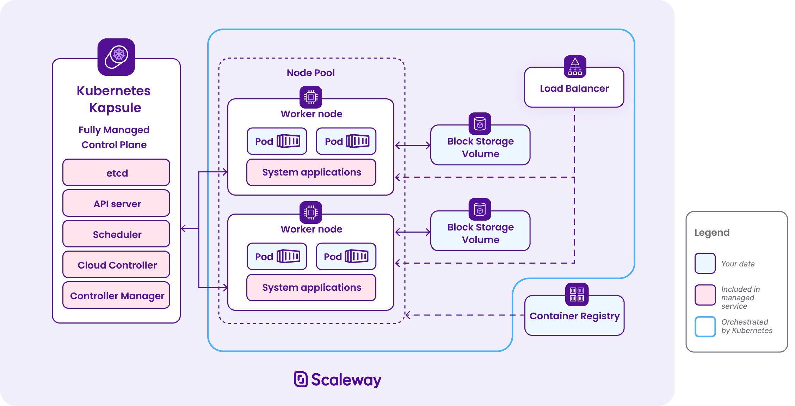
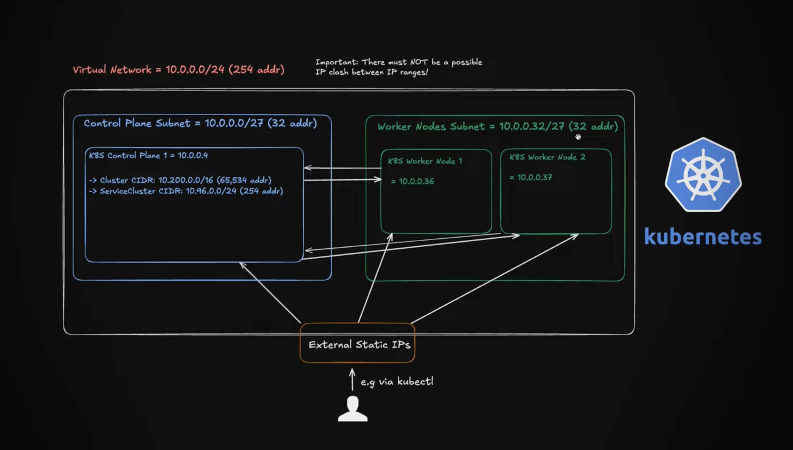

# scaleway
Scaleway manages the Kubernetes control plane (either Kapsule or Kosmos), which consists of various components responsible for managing and maintaining the cluster and its state, and scheduling applications. This includes components such as the control plane itself: etcd, API server, scheduler, cloud controller, and controller manager.

Scaleway takes care of Kubernetes system applications such as CoreDNS, Kubeproxy, Container Networking Interface (CNI), and Container Storage Interface (CSI), which are vital for the optimal functioning of the Kubernetes cluster and its associated resources.

Scaleway is also responsible for node provisioning and providing updates of operating system node images.

## Examples

Runnable programs against the generated clients live in [src/main/scala/examples/](src/main/scala/examples/). Each one
is an `IOApp` that provisions something, prints what it did, and deletes it again on the way out.

```sh
export SCW_SECRET_KEY=...              # from an IAM API key
export SCW_DEFAULT_ORGANIZATION_ID=...
export SCW_DEFAULT_PROJECT_ID=...
export SCW_DEFAULT_REGION=fr-par       # optional, this is the default
export SCW_DEFAULT_ZONE=fr-par-1       # optional, this is the default

sbt --client "runMain examples.VpcExample"
```

The listings are read-only, but anything an example creates — Instances, Kapsule clusters, Load Balancers — is billed
for as long as it exists, so let the teardown run.



[Building a Production-Ready Kubernetes Cluster on Scaleway with Terraform](https://hervekhg.medium.com/building-a-production-ready-kubernetes-cluster-on-scaleway-with-terraform-269e9d558128)

```sh
kubectl create secret docker-registry scw-registry \
  --docker-server=$REGISTRY_ENDPOINT \
  --docker-username=nologin \
  --docker-password=$REGISTRY_PASSWORD
```  
`/26` means `26` bits are network bits, `6` bits are host bits.
`Mask:  11111111.11111111.11111111.11000000  =  255.255.255.192`

### Determine the block size
The mask `192` in binary is `11000000`. The last `1` sits at the `64` position.
`Block size = 256 - 192 = 64`

This means subnets start every 64 addresses: `0`, `64`, `128`, `192`

### CIDR reference table

| CIDR  | Mask              | Total IPs | Usable Hosts | Block Size | Typical Use                           |
| ----- | ----------------- | --------- | ------------ | ---------- | ------------------------------------- |
| `/24` | `255.255.255.0`   | 256       | 254          | 1          | Standard VLAN, home network           |
| `/25` | `255.255.255.128` | 128       | 126          | 128        | Splitting a /24 in half               |
| `/26` | `255.255.255.192` | 64        | 62           | 64         | Small office, guest Wi-Fi             |
| `/27` | `255.255.255.224` | 32        | 30           | 32         | Point-to-point links, small teams     |
| `/28` | `255.255.255.240` | 16        | 14           | 16         | Server clusters, IoT segments         |
| `/29` | `255.255.255.248` | 8         | 6            | 8          | Router interconnects                  |
| `/30` | `255.255.255.252` | 4         | 2            | 4          | WAN links (now often replaced by /31) |
| `/31` | `255.255.255.254` | 2         | 2\*          | 2          | RFC 3021 point-to-point only          |
| `/32` | `255.255.255.255` | 1         | 0            | —          | Single host (loopback, ACLs)          |

## Why is /24 have one block size, while /25 has 128 block size?
The block size is determined by the number of host bits in the subnet mask.

A `/24` subnet mask is `255.255.255.0`
```sh
| Octet  | 1st      | 2nd      | 3rd          | 4th      |
| ------ | -------- | -------- | ------------ | -------- |
| Mask   | 255      | 255      | **255**      | 0        |
| Binary | 11111111 | 11111111 | **11111111** | 00000000 |
```
The block size formula is: 
```sh
Block Size = 256 - (mask value of interesting octet) //the interesting octet — the one where subnetting happens
Block Size = 256 - 255 = 1
```
So subnets increment by `1 `in the 3rd octet:
- 10.0.0.0/24
- 10.0.1.0/24
- 10.0.2.0/24
- 10.0.3.0/24

The block size (increment) in the interesting octet equals 2 raised to the power of the host bits in that specific octet:
`Block Size = 2^(host bits in the interesting octet)`

`Total addresses per subnet or subnet size = 2^(total host bits in full 32-bit address)` 

Block size is the value of the lowest set bit in the mask, i.e. 256 − (mask value of the interesting octet). A /24 is 255.255.255.0
```sh
1090 → 1100     add 10, tens digit +1
10.0.0.0 → 10.0.1.0   add 256, third octet +1
```

An IPv4 dotted-quad like 192.168.1.10 is just a 32-bit integer written in base-256, where each octet is a digit (0–255)
```
192.168.1.10  =  (192 × 256³) + (168 × 256²) + (1 × 256¹) + (10 × 256⁰)
              =  3,232,235,530
```
dotted-quad is base-256 notation. Every octet is a digit.              

 in any positional system with base b, the digit k places from the right has place value b^k. Decimal: 10⁰, 10¹, 10², 10³ = 1, 10, 100, 1000 — each step left multiplies by 10, because a decimal digit holds 10 possible values.

Here each digit holds 256 possible values (0–255), so each step left multiplies by 256:
```
256⁰ = 1          4th octet
256¹ = 256        3rd octet
256² = 65,536     2nd octet
256³ = 16,777,216 1st octet
```
Now rewrite those in powers of 2 instead. Since 256 = 2⁸:
```
256⁰ = (2⁸)⁰ = 2⁰   = 1
256¹ = (2⁸)¹ = 2⁸   = 256
256² = (2⁸)² = 2¹⁶  = 65,536
256³ = (2⁸)³ = 2²⁴  = 16,777,216
```

[RFC 950] (1985) introduced the idea that an address splits into a network part and a host part, chosen by a mask.

[RFC 1519 → RFC 4632] (CIDR, 1993/2006) added two things that matter enormously here:
- The `/n` slash notation. This is decreed — `/26` is just an agreed-upon shorthand for "the mask with 26 leading ones."
- The mask must be contiguous ones followed by contiguous zeros.

Given `/n`, the top n bits are fixed and the bottom `32 − n` bits vary freely over every combination. Therefore:
- Count: the subnet holds `2^(32−n)` addresses — because `32 − n` free bits produce `2^(32−n)` combinations.
- Contiguity: those addresses are consecutive integers — because the free bits are the low-order bits, so they count 0, 1, 2, … upward.
- Alignment: the first address is a multiple of `2^(32−n)` — because its low `32 − n` bits are all zero, which is what "multiple of `2^(32−n)`" means.

- `10.0.0.0 + 256 = 10.0.1.0` — third digit went 0→1. Nothing overflowed. No carry.
- `10.0.255.0 + 256 = 10.1.0.0` — third digit was already at max, rolled over to 0 and pushed +1 into the second digit. That is a carry.
- `A carry is the overflow event: a digit exceeding 255 and spilling leftward. It depends on what the digit currently holds, not on what you added.`

Decimal makes it obvious — adding 10 always targets the tens digit, but only sometimes carries:
```sh
1020 + 10 = 1030    tens 2→3        no carry
1090 + 10 = 1100    tens 9→overflow  carry into hundreds
```
```sh
10.0.0.0     + 256  =  10.0.1.0      targets 3rd digit, no overflow
10.0.7.0     + 256  =  10.0.8.0      targets 3rd digit, no overflow
10.0.255.0   + 256  =  10.1.0.0      CARRY: 3rd digit maxed -> spills into 2nd
10.0.0.255   +   1  =  10.0.1.0      CARRY: 4th digit maxed -> spills into 3rd
10.0.0.100   +   1  =  10.0.0.101    targets 4th digit, no overflow
```

Look at rows 1 and 4 — both land on `10.0.1.0`, by completely different mechanisms. Row 1 targeted the third digit directly. Row 4 carried into it from a maxed-out fourth digit. Same destination, different arithmetic.

- `Adding 256 adds 1 to the third octet. Always true. [MATH]`
- `A carry happens when a digit exceeds 255. Depends on the current value. [MATH]`

the address isn't "in" a base. A number has no base; only a written representation does. The address is a 32-bit quantity, and base-256-with-dots is one way to write it down. Same value, four notations:
```
base 256 (dotted) : 192.168.1.10
base 10           : 3232235786
base 16           : 0xC0A8010A
base 2            : 11000000101010000000000100001010
```
`All four lines are the same number. Base 16 is worth noticing: each octet is exactly two hex digits (C0 A8 01 0A = 192, 168, 1, 10), because 16² = 256 — which is why kernel and driver code handles addresses as integers or hex and leaves dotted-quad for printing.`

`A number is the abstract quantity; a numeral is a written symbol that denotes it. Base is a property of numerals only.`

### why 2 hex digits = exactly 1 octet
The cleaner reason is bits, not 16². One hex digit represents exactly 4 bits (since 16 = 2⁴). So:
```sh
2 hex digits  =  2 × 4 bits  =  8 bits  =  1 octet    ← exact, no remainder
```
The `16² = 256` framing says the same thing from the value side: two hex digits can express `16 × 16 = 256` distinct values, and an octet holds exactly `256` values. Perfect fit.

Compare with base 10, where this fails:
```sh
hex      C0   A8   01   0A       ← octet boundaries visible, 2 digits each
decimal  3232235786              ← octets invisible, no clean split
```
Decimal fails because one decimal digit isn't a whole number of bits — `log₂(10) ≈ 3.32`. You'd need `log₁₀(256) ≈ 2.408` decimal digits per octet, which is not an integer, so decimal digits never line up with byte boundaries.

```c
/* Returns whether matches rule or not. */
/* Performance critical - called for every packet */
static inline bool
ip_packet_match(const struct iphdr *ip,
		const char *indev,
		const char *outdev,
		const struct ipt_ip *ipinfo,
		int isfrag)
{
	unsigned long ret;

	if (NF_INVF(ipinfo, IPT_INV_SRCIP,
		    (ip->saddr & ipinfo->smsk.s_addr) != ipinfo->src.s_addr) ||
	    NF_INVF(ipinfo, IPT_INV_DSTIP,
		    (ip->daddr & ipinfo->dmsk.s_addr) != ipinfo->dst.s_addr))
		return false;

	ret = ifname_compare_aligned(indev, ipinfo->iniface, ipinfo->iniface_mask);

	if (NF_INVF(ipinfo, IPT_INV_VIA_IN, ret != 0))
		return false;

	ret = ifname_compare_aligned(outdev, ipinfo->outiface, ipinfo->outiface_mask);

	if (NF_INVF(ipinfo, IPT_INV_VIA_OUT, ret != 0))
		return false;

	/* Check specific protocol */
	if (ipinfo->proto &&
	    NF_INVF(ipinfo, IPT_INV_PROTO, ip->protocol != ipinfo->proto))
		return false;

	/* If we have a fragment rule but the packet is not a fragment
	 * then we return zero */
	if (NF_INVF(ipinfo, IPT_INV_FRAG,
		    (ipinfo->flags & IPT_F_FRAG) && !isfrag))
		return false;

	return true;
}
```

`(ip->saddr & ipinfo->smsk.s_addr) != ipinfo->src.s_addr` checks if the source IP address of the packet, when masked with the source mask, does not match the expected source address. This is used to determine if the packet's source IP falls within a specified range defined by the rule.
One bitwise AND, one compare, on 32-bit integers. That's two machine instructions, under a comment reading "Performance critical - called for every packet."
mask the address to strip the host bits, compare against the stored network.Contiguous-mask subnetting is designed to be exactly this cheap.

`(ip->daddr & ipinfo->dmsk.s_addr) != ipinfo->dst.s_addr` performs a similar check for the destination IP address, ensuring that it also falls within the expected range.

| form | base | used for |
| --- | --- | --- |
| `__be32` integer | binary (machine) | all real work — masking, comparing, hashing, routing |
| `0xC0A8010A` | 16 | humans reading memory/packet dumps; octets stay visible |
| `192.168.1.10` | 256 | humans reading logs and config; converted at the boundary via `%pI4` / `in4_pton` |

Hex earns its place in the middle row for exactly the Claim-1 reason: it's the most compact base that still lets you see octet boundaries at a glance. Decimal is compact but hides them; binary shows them but is 32 characters long.

prefix length is what routes are stored and sorted by (res->prefixlen). The route table is sorted by prefix length, so the longest prefix match is found first. The prefix length is also used to determine the subnet mask for the route.

`The representation question the kernel actually cares about isn't base — it's byte order`. That's what `__be32` means: big-endian, network byte order. You'll see `ntohl()` / `htonl()` all over the network stack, never base conversion. Endianness is a real, physical property of how the 4 bytes sit in memory

Worth being fair to octal, though — it isn't defective, it's just mismatched. It fails for bytes specifically. When the natural grouping genuinely is 3 bits, octal is the ideal base:
```sh
chmod 755    ->  111 101 101
                 rwx r-x r-x     ← 3 permission bits per digit, exact fit
```                 
That's why Unix permissions are still written in octal and always will be
```
  iptables -A INPUT -s 10.0.0.0/24 ...
        │
        │  ◄── BASE CONVERSION #1 (once, at config time)
        │      userspace parses base-256 text "10.0.0.0" -> 32-bit int
        │      "/24" -> mask 0xFFFFFF00
        ▼
  rule stored in kernel:  src = 0x0A000000, smsk = 0xFFFFFF00
        │
        ▼
  ══════ packet arrives ══════════════════════════════ 10 M times/sec
        │
        │   ip->saddr & ipinfo->smsk.s_addr == ipinfo->src.s_addr
        │   ◄── NO conversion. bits in, bit out. 2 instructions.
        ▼
  ACCEPT / DROP
        │
        │  ◄── BASE CONVERSION #2 (only if logging)
        │      %pI4 renders int -> base-256 text for the log line
        ▼
  "SRC=10.0.0.1"
```
hex is the conventional way to write bit patterns for human readers (and, per earlier, it shows octet boundaries)

```c
if (NF_INVF(ipinfo, IPT_INV_SRCIP,
		    (ip->saddr & ipinfo->smsk.s_addr) != ipinfo->src.s_addr) ||
	    NF_INVF(ipinfo, IPT_INV_DSTIP,
		    (ip->daddr & ipinfo->dmsk.s_addr) != ipinfo->dst.s_addr))
		return false;
```
If the packet's source address isn't in the rule's source subnet — or its destination isn't in the rule's destination subnet — this rule doesn't apply to this packet, so give up on it and move to the next rule.

No. Under CIDR (RFC 4632) a mask must be contiguous ones followed by contiguous zeros. That leaves exactly 33 legal masks, one per prefix length:
```
/0   0.0.0.0          0x00000000  00000000000000000000000000000000
/8   255.0.0.0        0xFF000000  11111111000000000000000000000000
/16  255.255.0.0      0xFFFF0000  11111111111111110000000000000000
/22  255.255.252.0    0xFFFFFC00  11111111111111111111110000000000
/24  255.255.255.0    0xFFFFFF00  11111111111111111111111100000000
/25  255.255.255.128  0xFFFFFF80  11111111111111111111111110000000
/26  255.255.255.192  0xFFFFFFC0  11111111111111111111111111000000
/30  255.255.255.252  0xFFFFFFFC  11111111111111111111111111111100
/31  255.255.255.254  0xFFFFFFFE  11111111111111111111111111111110
/32  255.255.255.255  0xFFFFFFFF  11111111111111111111111111111111
```
legal masks total: 33 (prefix 0..32)
ILLEGAL example: 255.0.255.0 -> 11111111000000001111111100000000 <- ones not contiguous

`Same mask, different networks — and same network, different masks:`
```
Same mask /24, different src -> different subnets:
   src=10.0.0.0       smsk=255.255.255.0   matches 10.0.0.0 - 10.0.0.255
   src=10.0.1.0       smsk=255.255.255.0   matches 10.0.1.0 - 10.0.1.255
   src=192.168.1.0    smsk=255.255.255.0   matches 192.168.1.0 - 192.168.1.255

Same src 10.0.0.0, different mask -> different sized subnets:
   src=10.0.0.0     smsk=255.0.0.0        matches 10.0.0.0 - 10.255.255.255  (16,777,216 addrs)
   src=10.0.0.0     smsk=255.255.0.0      matches 10.0.0.0 - 10.0.255.255  (65,536 addrs)
   src=10.0.0.0     smsk=255.255.255.0    matches 10.0.0.0 - 10.0.0.255  (256 addrs)
   src=10.0.0.0     smsk=255.255.255.192  matches 10.0.0.0 - 10.0.0.63  (64 addrs)

iptables masks your input before storing it:
   you type -s 10.0.0.7/24      -> kernel stores src=10.0.0.0, /24
   you type -s 10.0.0.200/24    -> kernel stores src=10.0.0.0, /24
   you type -s 192.168.5.99/16  -> kernel stores src=192.168.0.0, /16
```
`(ip->saddr & ipinfo->smsk.s_addr) != ipinfo->src.s_addr`
The left side is always the result of an `AND`, so its host bits are always zero. If `src `were stored as `10.0.0.7`, the left side could never equal it — for any packet       

```sh
NORMALIZED   src=10.0.0.0   (smsk=255.255.255.0)
    packet 10.0.0.7   -> (10.0.0.7 & mask)=10.0.0.0   == 10.0.0.0   match=True
    packet 10.0.0.1   -> (10.0.0.1 & mask)=10.0.0.0   == 10.0.0.0   match=True
    packet 10.0.0.99  -> (10.0.0.99 & mask)=10.0.0.0   == 10.0.0.0   match=True
    packet 10.0.1.7   -> (10.0.1.7 & mask)=10.0.1.0   != 10.0.0.0   match=False

UNNORMALIZED src=10.0.0.7   (smsk=255.255.255.0)
    packet 10.0.0.7   -> (10.0.0.7 & mask)=10.0.0.0   != 10.0.0.7   match=False
    packet 10.0.0.1   -> (10.0.0.1 & mask)=10.0.0.0   != 10.0.0.7   match=False
    packet 10.0.0.99  -> (10.0.0.99 & mask)=10.0.0.0   != 10.0.0.7   match=False
    packet 10.0.1.7   -> (10.0.1.7 & mask)=10.0.1.0   != 10.0.0.7   match=False
```

Look at the second block, first line: a packet from 10.0.0.7 itself doesn't match a rule written src=10.0.0.7. Every possible packet fails. The rule would be dead — silently matching nothing.

That's the reason normalization isn't optional tidying. The AND on the left permanently zeroes the host bits, so `src` must have zeroed host bits too or the equality can never hold. iptables does the masking once, at config time, so the fast path stays a single compare

You can see it reflect your input back — type `iptables -A INPUT -s 10.0.0.7/24 -j DROP`, then `iptables -S`, and it prints `-s 10.0.0.0/24`

```c
struct ipt_ip {
	/* Source and destination IP addr */
	struct in_addr src, dst;
	/* Mask for src and dest IP addr */
	struct in_addr smsk, dmsk;
	char iniface[IFNAMSIZ], outiface[IFNAMSIZ];
	unsigned char iniface_mask[IFNAMSIZ], outiface_mask[IFNAMSIZ];

	/* Protocol, 0 = ANY */
	__u16 proto;

	/* Flags word */
	__u8 flags;
	/* Inverse flags */
	__u8 invflags;
};
```
```c
/* Internet address. */
struct in_addr {
	__be32	s_addr;
};
```
- `ipinfo->src.s_addr`: network address (host bits zeroed)
- `ipinfo->smsk.s_addr`: a mask — not an address at all
- `ip->saddr`: host address (the actual sender)

`ipinfo->src.s_addr` (and `ipinfo->dst.s_addr`). Those are the only two that get normalized, and it happens in userspace, before the kernel ever sees the rule

`const struct ipt_ip *ipinfo`

```sh
  10.0.1.7      00001010 00000000 00000001 00000111
& 255.255.255.0 11111111 11111111 11111111 00000000
= 10.0.1.0      00001010 00000000 00000001 00000000
```
The rule is stored as:
```sh
src  = 10.0.1.0       (0x0A000100)
smsk = 255.255.255.0  (0xFFFFFF00)
and it matches 10.0.1.0 through 10.0.1.255 — 256 addresses, including the 10.0.1.7 you typed. iptables -S would print it back as -s 10.0.1.0/24.
```

a network address must have its host bits zero:
```sh
10 . 0 . 2 . 0
00001010 . 00000000 . 00000010 . 00000000
```

so 10.0.2.0/16 is not a valid network address, because the host bits are not zero

Going from `/n `to `/m` borrows `m − n` bits from the host part and hands them to the network part. Those borrowed bits are free to take any combination, so there are `2^(m−n)` of them. Each borrowed bit doubles the subnet count and halves the subnet size — so the product never changes:
`subnets  ×  size each  =  parent size      (always)`

A subnet is defined by two things:
- A network address (all host bits = 0)
- A mask (which draws the boundary)

If you want multiple subnets, you must change the mask (make it longer) to create smaller boundaries

You might be thinking: "But 10.0.2.0 is just an IP address. Who says it can't be part of many subnets at once?"
And you're right — an IP address can belong to nested subnets depending on context:
- 10.0.2.5 is inside 10.0.2.0/24
- 10.0.2.5 is also inside 10.0.0.0/16
- 10.0.2.5 is also inside 10.0.0.0/8

But `10.0.2.0/24` as a prefix is not an IP address floating in space. It is a specific boundary declaration. It claims exactly those 256 addresses as one routing entity.
A /24 means 24 bits are locked as the network portion, leaving the rest for hosts:
```
Total bits in IPv4:     32
Network bits:           24
Host bits:              32 - 24 = 8
```
Each host bit can be 0 or 1. With 8 bits, the number of possible combinations is:
```
2^8 = 256
```
That's where the 256 comes from.

`Your cloud provider assigns you 172.16.0.0/16 for your VPC. You want standard /24 networks per availability zone.`

Take `10.0.2.0/24` split into four `/26`s. The mask is `255.255.255.192 = 11000000` in the last octet — so the top 2 bits of the 4th octet select the subnet, the bottom 6 bits are the host.

```sh
THE FOUR /26 SUBNETS INSIDE 10.0.2.0/24
(mask 255.255.255.192 -> last octet = [2 subnet bits][6 host bits])

  #   4th octet      network          range
  0   00|000000      10.0.2.0/26      10.0.2.0 - 10.0.2.63
  1   01|000000      10.0.2.64/26     10.0.2.64 - 10.0.2.127
  2   10|000000      10.0.2.128/26    10.0.2.128 - 10.0.2.191
  3   11|000000      10.0.2.192/26    10.0.2.192 - 10.0.2.255
```
```sh
NORMALIZATION: what iptables stores for -s <addr>/26

  you type  -s 10.0.2.7/26
      10.0.2.7       last octet   7 = 00|000111
    & 255.255.255.192          192 = 11|000000
    ─────────────────────────────────────────
    = 10.0.2.0       last octet   0 = 00|000000   <- host bits zeroed, subnet bits kept
      STORED:  src = 10.0.2.0   smsk = 255.255.255.192   (subnet #0)

  you type  -s 10.0.2.63/26
      10.0.2.63      last octet  63 = 00|111111
    & 255.255.255.192          192 = 11|000000
    ─────────────────────────────────────────
    = 10.0.2.0       last octet   0 = 00|000000   <- host bits zeroed, subnet bits kept
      STORED:  src = 10.0.2.0   smsk = 255.255.255.192   (subnet #0)

  you type  -s 10.0.2.100/26
      10.0.2.100     last octet 100 = 01|100100
    & 255.255.255.192          192 = 11|000000
    ─────────────────────────────────────────
    = 10.0.2.64      last octet  64 = 01|000000   <- host bits zeroed, subnet bits kept
      STORED:  src = 10.0.2.64   smsk = 255.255.255.192   (subnet #1)

  you type  -s 10.0.2.130/26
      10.0.2.130     last octet 130 = 10|000010
    & 255.255.255.192          192 = 11|000000
    ─────────────────────────────────────────
    = 10.0.2.128     last octet 128 = 10|000000   <- host bits zeroed, subnet bits kept
      STORED:  src = 10.0.2.128   smsk = 255.255.255.192   (subnet #2)

  you type  -s 10.0.2.200/26
      10.0.2.200     last octet 200 = 11|001000
    & 255.255.255.192          192 = 11|000000
    ─────────────────────────────────────────
    = 10.0.2.192     last octet 192 = 11|000000   <- host bits zeroed, subnet bits kept
      STORED:  src = 10.0.2.192   smsk = 255.255.255.192   (subnet #3)

  you type  -s 10.0.2.255/26
      10.0.2.255     last octet 255 = 11|111111
    & 255.255.255.192          192 = 11|000000
    ─────────────────────────────────────────
    = 10.0.2.192     last octet 192 = 11|000000   <- host bits zeroed, subnet bits kept
      STORED:  src = 10.0.2.192   smsk = 255.255.255.192   (subnet #3)
```      

`10.0.0.0/13` is one network of `524,288` addresses, spanning `10.0.0.0 – 10.7.255.255`. Exactly as much "one network" as a `/24` is. The only visible difference: its boundary falls 5 bits into the second octet, so the mask is `255.248.0.0` rather than a tidy run of 255s and 0s.

Same for /8 (one network, 16.7M addresses) and /16 (one network, 65,536).

```sh
a /n is                  exactly one network
its size                 2^(32−n) addresses
its network address      a multiple of 2^(32−n)
/n blocks in all IPv4    2^n
/m subnets inside it     2^(m−n)
```
So — `/8` is one network. `/16` is one network. `/13` is one network. `/26` is one network. The prefix length changes only how big the set is, never how many sets a prefix denotes.

you choose a VPC CIDR when you create the VPC (typically from RFC 1918 space)
```sh
VPC CIDR          10.0.0.0/16          ← you pick this. THE PARENT.
  ├─ subnet       10.0.1.0/24          ← must be inside the VPC CIDR
  ├─ subnet       10.0.2.0/24          ← must not overlap other subnets
  └─ subnet       10.0.3.0/24          ← each lives in exactly ONE AZ
```

RFC 950 says network + broadcast are reserved → −2. AWS reserves five in every subnet:
```sh
address	purpose
.0	network address (RFC)
.1	VPC router (AWS)
.2	DNS / Route 53 Resolver (AWS)
.3	reserved for future use (AWS)
last	broadcast address (RFC — reserved even though AWS doesn't support broadcast)
```

```sh
VPC 10.0.0.0/16 -> subnet sizes

  subnet        total   RFC usable   AWS usable    subnets per /16
  /20           4,096        4,094        4,091                 16
  /24             256          254          251                256
  /26              64           62           59              1,024
  /27              32           30           27              2,048
  /28              16           14           11              4,096

Example 3-AZ layout inside 10.0.0.0/16:

  us-east-1a   public 10.0.0.0/24     (251 usable)   private 10.0.100.0/24   (251 usable)
  us-east-1b   public 10.0.1.0/24     (251 usable)   private 10.0.101.0/24   (251 usable)
  us-east-1c   public 10.0.2.0/24     (251 usable)   private 10.0.102.0/24   (251 usable)
  ```
  Note `/28` yields only 11 usable addresses — which is why AWS sets `/28` as the hard floor. A `/29` would leave 3, and a `/30` would leave nothing.

  ```sh
  Dividing 10.0.2.0/28 down as far as it goes:

  prefix    addresses  host bits  can split into 2?
  /28              16          4  yes -> two /29
  /29               8          3  yes -> two /30
  /30               4          2  yes -> two /31
  /31               2          1  yes -> two /32
  /32               1          0  NO - no host bits left

The last possible split: /31 -> two /32s
   10.0.2.0/32
   10.0.2.1/32

Trying to subnet a /32:

   subnets of /32 into /32 = 2^(32-32) = 1  (itself, trivially)
```

```sh
VPC 10.0.0.0/16
│
├─ rtb-public                    ┌─ 10.0.0.0/16 → local
│   associated with:             └─ 0.0.0.0/0   → igw-xxxx
│     10.0.0.0/24  (us-east-1a)
│     10.0.1.0/24  (us-east-1b)
│     10.0.2.0/24  (us-east-1c)
│
├─ rtb-private-1a                ┌─ 10.0.0.0/16 → local
│   associated with:             └─ 0.0.0.0/0   → nat-1a
│     10.0.100.0/24 (us-east-1a)
│
├─ rtb-private-1b                ┌─ 10.0.0.0/16 → local
│   associated with:             └─ 0.0.0.0/0   → nat-1b
│     10.0.101.0/24 (us-east-1b)
│
└─ rtb-private-1c                ┌─ 10.0.0.0/16 → local
    associated with:             └─ 0.0.0.0/0   → nat-1c
      10.0.102.0/24 (us-east-1c)
```
```sh
rtb-private-1a (associated with subnet 10.0.100.0/24)

   10.0.0.0/16      -> local
   10.1.0.0/16      -> pcx-peering
   192.168.0.0/16   -> tgw-onprem
   0.0.0.0/0        -> nat-1a

resolution by longest-prefix-match:

   10.0.100.9     matches [10.0.0.0/16 , 0.0.0.0/0]
                    -> wins /16  target=local        (same subnet)

   10.0.2.50      matches [10.0.0.0/16 , 0.0.0.0/0]
                    -> wins /16  target=local        (different subnet, same VPC)

   10.0.255.1     matches [10.0.0.0/16 , 0.0.0.0/0]
                    -> wins /16  target=local        (unused space in VPC)

   10.1.4.4       matches [10.1.0.0/16 , 0.0.0.0/0]
                    -> wins /16  target=pcx-peering  (peered VPC)

   192.168.5.5    matches [192.168.0.0/16 , 0.0.0.0/0]
                    -> wins /16  target=tgw-onprem   (on-prem via TGW)

   8.8.8.8        matches [0.0.0.0/0]
                    -> wins /0   target=nat-1a       (internet)
```
Same subnet and different subnet resolve identically — both win on `10.0.0.0/16` → local. AWS has no per-/24 route to distinguish them. Intra-VPC routing is one route, always.

`10.0.255.1` also resolves to local even though no subnet covers it. The local route spans the whole VPC CIDR, including unallocated space — traffic there just goes nowhere.

## Other routes you'd see in a real table

| destination | target | when |
| --- | --- | --- |
| `10.0.0.0/16` | `local` | always, automatic |
| `0.0.0.0/0` | `igw-…` | public subnets |
| `0.0.0.0/0` | `nat-…` | private subnets |
| `10.1.0.0/16` | `pcx-…` | VPC peering |
| `192.168.0.0/16` | `tgw-… / vgw-…` | Transit Gateway or VPN to on-prem |
| `pl-xxxxxxxx` (prefix list) | `vpce-…` | S3/DynamoDB gateway endpoints |
| `::/0` | `eigw-…` | IPv6 egress-only |

Note interface endpoints (PrivateLink) create no routes at all — they work via DNS and an ENI in the subnet.

- Route tables you'd actually build: typically 2–4 — one public, plus one private per AZ.
- What varies per subnet is the association, not the routes. Two identical /24s become "public" or "private" solely by which table they're attached to.


So at the routing layer, every subnet in a VPC can always reach every other subnet. That's by design 

`10.0.0.0/16 → local`

```sh
So the answer to "how do we stop traffic between subnets" is: not with routes. Routing decides where a packet is allowed to be sent; it was never the tool for whether it's permitted.
```

To stop `10.0.100.0/24` from reaching `10.0.101.0/24`, you attach a NACL to a subnet with something like:
```sh
inbound   rule 100   DENY   source 10.0.100.0/24   all traffic
inbound   rule 200   ALLOW  source 0.0.0.0/0       all traffic
```
Rule `100` is checked first, so traffic from that /24 is dropped at the subnet boundary. The route still says "local" — the packet is simply denied on arrival.

For instance-level control you'd instead use security groups, which is the more common approach.

```sh
                                     ┌─> LOCAL_IN ──> local process
  NIC ─> INGRESS ─> PRE_ROUTING ─────┤
                                     └─> FORWARD ─┐
                                                  ├─> POST_ROUTING ─> NIC
                    local process ─> LOCAL_OUT ───┘
```

- ipset — hash sets of addresses/networks for matching thousands of prefixes efficiently instead of thousands of linear rules.
- ufw / firewalld — friendly frontends that generate nft/iptables rules for you.

AWS aggregates them. Instead of three connected routes for your three /24s, it installs one route for the whole VPC CIDR:`10.0.0.0/16 → local`


```sh
# Inside an EC2 instance in 10.0.100.0/24, the guest OS routing table 
10.0.100.0/24  dev eth0  scope link          ← connected route, standard
default via 10.0.100.1  dev eth0             ← the VPC router, always .1
```
One logical router per VPC — but it presents an address in every subnet.

```sh
VPC 10.0.0.0/16 — reserved addresses per subnet

  subnet           .0 network    .1 ROUTER     .2 dns        .3 future    last bcast
  10.0.0.0/24      10.0.0.0      10.0.0.1      10.0.0.2      10.0.0.3     10.0.0.255
  10.0.1.0/24      10.0.1.0      10.0.1.1      10.0.1.2      10.0.1.3     10.0.1.255
  10.0.100.0/24    10.0.100.0    10.0.100.1    10.0.100.2    10.0.100.3   10.0.100.255
  10.0.2.0/26      10.0.2.0      10.0.2.1      10.0.2.2      10.0.2.3     10.0.2.63

  -> every subnet has its OWN .1, all served by the SAME logical router
  ```

- An instance in `10.0.100.0/24` has default gateway `10.0.100.1`.
- An instance in `10.0.0.0/24` has default gateway `10.0.0.1`.
- Those are not two routers — they're two addresses of the same distributed VPC router.

## Route Summarization
Route summarization (also aggregation or supernetting) means replacing several specific routes with one shorter prefix that covers them all.
```sh
BEFORE (4 routes)              AFTER (1 route)
  10.0.0.0/24 → R1
  10.0.1.0/24 → R1       ──>     10.0.0.0/22 → R1
  10.0.2.0/24 → R1
  10.0.3.0/24 → R1
 ``` 

 A set of prefixes summarizes exactly into a `/n` if and only if they completely and exactly cover an aligned `/n` block — no gaps, no extras.

```sh
STEP 1-2: write in binary, find longest common prefix

   10.0.0.0/24    00001010 00000000 00000000 00000000
   10.0.1.0/24    00001010 00000000 00000001 00000000
   10.0.2.0/24    00001010 00000000 00000010 00000000
   10.0.3.0/24    00001010 00000000 00000011 00000000

   first 22 bits identical in all four  ->  summary is a /22
                  ^^^^^^^^ ^^^^^^^^ ^^^^^^.. ........
                  |<------- 22 common ------->|<-- differ -->|

STEP 3: summary = 10.0.0.0/22
STEP 4: verify — covers 1,024 addresses (10.0.0.0 - 10.0.3.255)
        the four /24s cover 1,024 addresses
        EXACT MATCH -> summarization is safe
```

```sh
you own: 10.0.1.0/24, 10.0.2.0/24, 10.0.3.0/24
          = 768 addresses

LAZY: longest common prefix = /22  ->  advertise 10.0.0.0/22
      but 10.0.0.0/22 covers 1024 addresses (10.0.0.0 - 10.0.3.255)
      => you'd advertise 256 addresses you DON'T own: 10.0.0.0/24
      => traffic for 10.0.0.x is drawn to you and BLACK-HOLED

CORRECT: minimal safe set = 10.0.1.0/24, 10.0.2.0/23
         covers 768 addresses — exactly what you own
         3 routes -> 2 routes (still a win)
```         


kube-controller-manager runs with:
```sh
--allocate-node-cidrs=true
--cluster-cidr=10.200.0.0/16
--node-cidr-mask-size=24
```
It hands each node a /24 slice and writes it to `node.spec.podCIDR`:

| Node | Node IP | podCIDR |
| --- | --- | --- |
| Control plane 1 | 10.0.0.4 | 10.200.0.0/24 (only if it schedules pods) |
| Worker 1 | 10.0.0.36 | 10.200.1.0/24 |
| Worker 2 | 10.0.0.37 | 10.200.2.0/24 |

```sh
192.168.1.0/24  dev eth0  proto kernel  scope link  src 192.168.1.50  metric 100
└── destination  └ iface   └── origin    └ reachability └ source IP    └ priority

default  via 192.168.1.1  dev eth0  proto dhcp  metric 100
└ dest ┘ └── next hop ──┘ └ iface ┘ └ origin ─┘ └ priority ┘
```

So a gateway(`via`) route means: "put the router's MAC on the frame, but leave the IP header alone." The router then repeats the decision with its own table. The IP destination never changes hop to hop — only the MAC does. That's the entire mechanism of hop-by-hop forwarding.

proto — from RTPROT_*

| value | shown as | who added it |
| --- | --- | --- |
| 2 | kernel | automatic — created when you assigned an IP to an interface |
| 4 | static | you, via `ip route add` |
| 16 | dhcp | the DHCP client |
| 3 | boot | added during boot, no daemon owns it |
| 9 | ra | IPv6 router advertisement |
| 1 | redirect | an ICMP redirect |
| 11/12/42/84 | zebra/bird/babel/ovn | routing daemons (FRR, BIRD, OVN…) |

There are three built-in tables: `local` (255), `main` (254), `default` (253). Policy rules choose which to consult:

```sh
$ ip rule
0:      from all lookup local
32766:  from all lookup main
32767:  from all lookup default
```

The full decision sequence:
- `ip rule` — walk rules by priority, pick a table
- Longest prefix match within that table
- Lowest `metric` breaks ties among equal-length prefixes
- ECMP hashing if the winner has multiple nexthops
- If no match, try the next rule/table

```sh
ip route                      # the main table
ip route show table all       # every table
ip rule                       # policy rules
ip route get 8.8.8.8          # ask the kernel to RESOLVE one destination
```

`dev eth0 `answers a different question from `via`.

| field | question it answers | layer |
| --- | --- | --- |
| dev eth0 | which wire does the frame leave by? | physical port |
| via 192.168.1.1 | whose MAC goes in the frame header? | layer 2 addressing |
| destination IP | who is this ultimately for? | layer 3 — never changes |

The machine has one NIC, so everything leaves via `eth0`. What differs is who on that wire is meant to pick the frame up.

To 192.168.1.60 (connected route):

```sh
Ethernet  dst = MAC of 192.168.1.60      ← ARP asked for the destination itself
IP        dst = 192.168.1.60
```
To 8.8.8.8 (default route):

```sh
Ethernet  dst = MAC of 192.168.1.1       ← ARP asked for the GATEWAY
IP        dst = 8.8.8.8                   ← unchanged
```

The default route only works because the connected route exists. To use `via 192.168.1.1`, the kernel must first answer `"how do I reach 192.168.1.1?"` — so it does a second lookup:

```sh
default via 192.168.1.1  ─────┐
                              │ resolve the gateway
                              ▼
            192.168.1.0/24 dev eth0 scope link   ← matches! directly reachable
                              │
                              ▼
                         ARP for 192.168.1.1 → send out eth0
```                         
That's where the `dev eth0` on the default route comes from — `it's inherited from resolving the gateway`, not independently configured. Remove the address from eth0 and the connected route vanishes, taking the default route with it.

Try setting a gateway that isn't in any connected subnet and the kernel refuses:
```sh
$ ip route add default via 10.99.99.1
#Error: Nexthop has invalid gateway
```
Because there's no route telling it how to reach `10.99.99.1`. The `onlink` flag from the earlier reference exists exactly to override this — "trust me, that gateway is on this link":
```sh
ip route add default via 10.99.99.1 dev eth0 onlink
```
## When dev would differ
Only when the machine has multiple interfaces — a router:
```sh
192.168.1.0/24  dev eth0  scope link     ← LAN
203.0.113.0/24  dev eth1  scope link     ← WAN
default via 203.0.113.1   dev eth1
```
Here the LAN route uses eth0, the default uses eth1.

*You state it explicitly*:

`ip route add default via 192.168.1.1 dev eth0`
*You omit it, and the kernel derives it once*:

`ip route add default via 192.168.1.1`
## nftables
The replacement for iptables, ip6tables, arptables and ebtables — one framework instead of four;driven by a single userspace tool: `nft`


