## Memory

## Energy bands

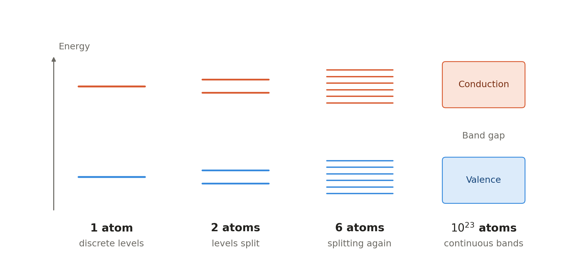
An isolated atom has discrete energy levels — an electron can sit at specific energies and nowhere in between. Now bring atoms together. The Pauli exclusion principle forbids two electrons from occupying the identical state, so as atoms approach, each shared level must split into slightly different energies.

Valence band — the lower group. These states correspond to electrons sitting in covalent bonds. At absolute zero it is completely full.
Conduction band — the upper group. These states correspond to electrons roaming freely through the crystal. At absolute zero it is completely empty.

Conduction requires electrons to change state — to pick up momentum in the direction of the applied field. But changing state requires an empty state to move into.

A completely full band has nowhere to go. Every seat is taken, so applying a voltage does nothing. That's why pure silicon is a poor conductor despite being packed with electrons.

You get conduction two ways: put a few electrons in the empty conduction band where they have room to roam, or take a few electrons out of the valence band so the remaining ones have vacancies to shuffle into. Those vacancies are holes. In intrinsic silicon, creating an electron-hole pair requires crossing the band gap; doping creates carriers through shallow donor or acceptor levels instead.

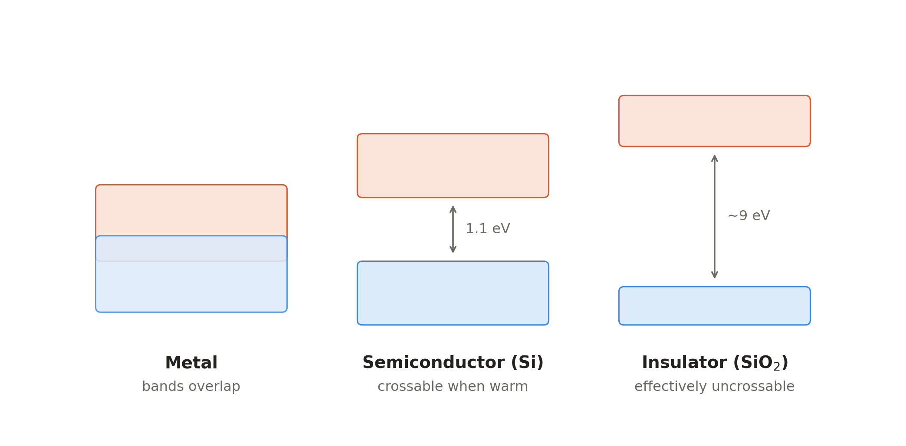

## Gap Size
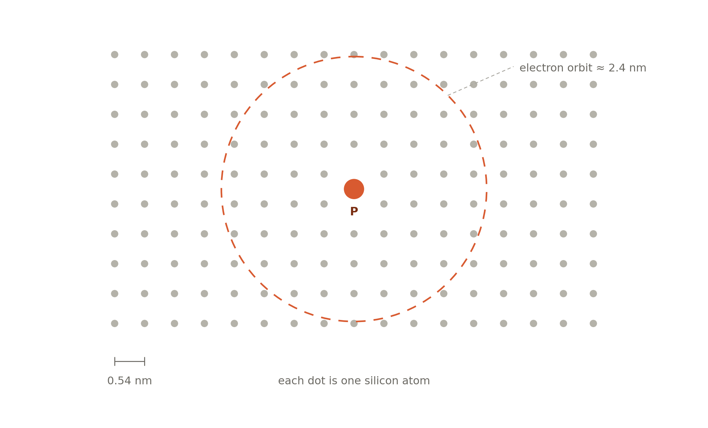

A metal has either a partially filled band or overlapping bands, so there are always empty states adjacent to filled ones and it conducts even at very low temperatures. Silicon's ~1.12 eV gap is small enough that thermal energy occasionally creates carriers, but rarely — it sits in the interesting middle. Silicon dioxide's ~9 eV gap makes it a very good insulator, though a real gate oxide can still leak through defects, tunnelling, or excessive electric field.

In a traditional silicon MOSFET, silicon provides the switchable semiconductor and its oxide provides a high-quality insulating gate dielectric. Other semiconductor and dielectric material combinations are also used.

Each dot is a silicon atom, spaced by the interatomic bond distance (0.235 nm; the cubic lattice constant is 0.543 nm). The dashed circle represents the approximate spatial extent of the donor electron's wavefunction — enclosing roughly hundreds to thousands of lattice sites, depending on the dopant and material parameters.

The electron is barely attached. It's smeared over thousands of atoms, held by a Coulomb pull that the surrounding silicon has almost entirely screened away. Prying it loose from the phosphorus costs almost nothing — 0.045 eV — compared with the 1.12 eV it would cost to rip an electron out of an actual covalent bond.

And that's exactly why the donor level is drawn just below the conduction band edge: the level's depth below Ec is the binding energy. Shallow drawing, shallow binding.

Boron works in the complementary way. The acceptor state is a localized, hydrogen-like state around the B⁻ ion; its binding energy is about 0.045 eV, which is why the acceptor level sits just above the valence band edge.

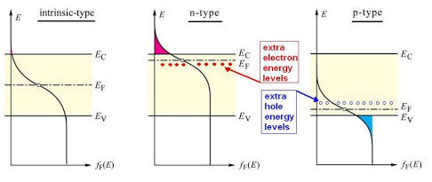

When you introduce dopants into silicon, you drastically change the population of free charge carriers. Because electrons are fermions and obey Pauli exclusion (Fermi-Dirac statistics), the entire probability distribution must shift to account for this new population.

The Fermi level is the energy parameter that sets the occupation probabilities and makes the carrier populations satisfy charge neutrality and the mass-action relation. If you add electrons (n-type), it moves upward toward the conduction band. The 50% occupation interpretation applies to a state with negligible degeneracy effects, not to a literal pile of electrons.
## Doping controls resistivity

In pure silicon an electron must climb the full 1.12 eV gap to become mobile, and thermal energy at room temperature (kT) is only about 0.026 eV. So it essentially never happens — which is why intrinsic silicon has only ~10¹⁰ carriers/cm³.

A phosphorus donor sits its spare electron on a level just 0.045 eV below the conduction band. That's less than twice kT. At room temperature virtually every donor is ionized, so you get one free electron per dopant atom, reliably, without heating anything.

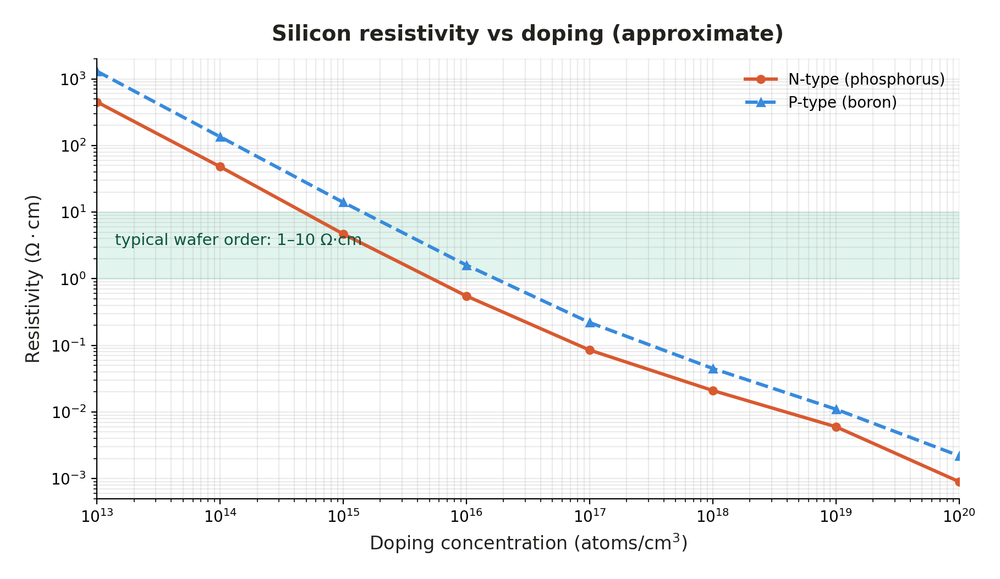
In the nondegenerate, fully ionized, single-carrier regime, doubling the dopant concentration roughly halves the resistivity, because conductivity scales with carrier count. At high concentrations, compensation, incomplete ionization, and mobility degradation make this approximation fail.

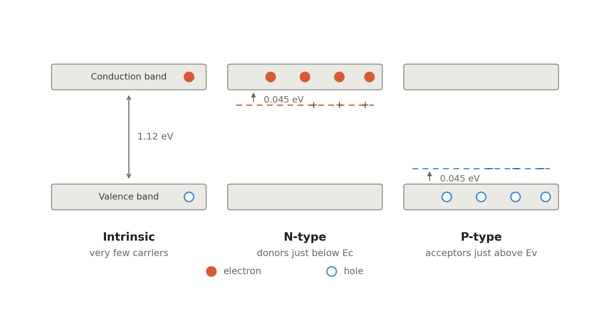
P-type has higher resistivity than n-type at the same doping in silicon because holes have lower mobility than electrons. A hole is a valence-band quasiparticle, not literally an electron relayed one bond at a time. This mobility difference is also why NMOS transistors are stronger than PMOS devices of the same size, and why CMOS designers generally make PMOS devices wider to compensate.

## the PN junction

The exposed ions — negative acceptor ions on the p side and positive donor ions on the n side — create an electric field pointing from n toward p. That field drives electrons toward n and holes toward p, opposing diffusion. Equilibrium arrives when drift and diffusion balance, leaving a depletion region with very few mobile carriers and a potential step across it.

Forward bias (+ on p) opposes the built-in field, lowers the barrier, and narrows the depletion region. Carriers pour across. Reverse bias raises the barrier and widens the depletion region — almost nothing flows.

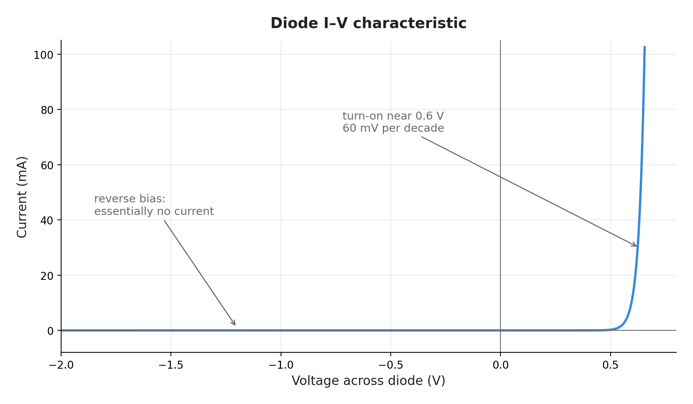

## Depletion layer
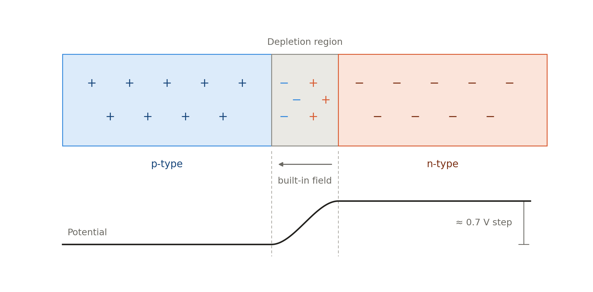

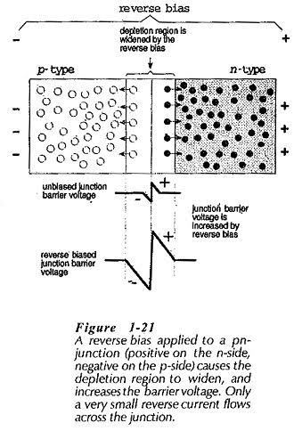
When you apply a reverse bias, you are connecting the battery in a way that reinforces the natural electric field of the depletion region, making the "wall" wider and stronger
## Transistors
Source and drain are both n+ islands in a p body. With the gate below threshold, no conducting inversion channel connects them, so the transistor is off. The source/body and drain/body junctions help isolate the terminals; with the body tied to the source, the drain/body junction is reverse-biased for the usual positive drain voltage. This is not simply two ideal back-to-back diodes: the body connection and parasitic body diode matter.
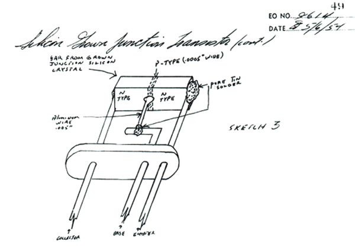

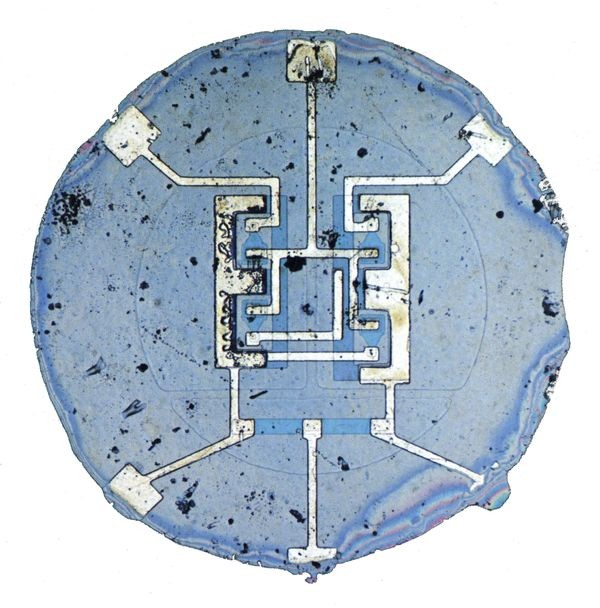

Computer circuits are built from simple elements called “gates,” made from either mechanical or electronic switches. They operate according to Boolean algebra to determine the value of an output signal (one or zero), or to save a value in a “flip-flop,” a storage unit built from several gates.

Three basic gate types are AND, OR, and NOT. But others, such as NAND (NOT AND), can by themselves form any computer circuit, including those for arithmetic, memory, and executing instructions. Modern processors can contain billions of transistor-scale logic elements; the equivalent NAND-gate count depends on the chip and on what is included in the estimate.

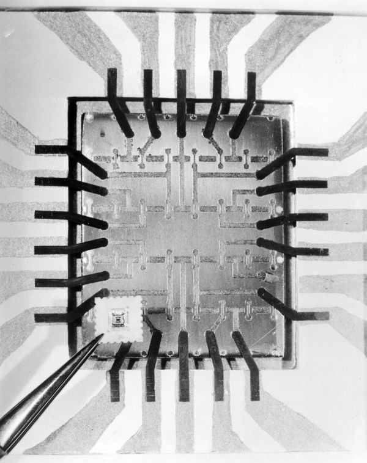

16-transistor integrated circuit 

The MOSFET won the computing revolution because of its high input impedance. Because the Gate is insulated by oxide, holding a MOSFET in the "ON" state requires virtually zero continuous current. BJTs require constant base current to stay on, which means a CPU built of billions of BJTs would melt instantly from static power dissipation.

To operate as an amplifier, a BJT must be properly biased. The base-emitter junction must be forward-biased, while the base-collector junction must be reverse-biased

- Emitter: Has a very high density of free charge carriers (electrons or holes) ready to be pushed into the device.
- Base: Very thin, lightly doped physical layer that controls the transistor through its junction bias. Most carriers injected from the emitter cross it without recombining.
- Collector: moderately doped region that collects the charge carriers injected from the emitter.Collects the charge carriers that pass through the base region.

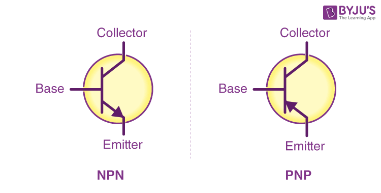

NPN Transistors: Consist of a `P-type` base sandwiched between two `N-type` regions. The primary charge carriers are free electrons.
PNP Transistors: Consist of an `N-type` base sandwiched between two `P-type` regions. The primary charge carriers are holes. The physical operation is very similar to the NPN type, but the roles of the electrons and holes are swapped, and the current directions are completely reversed

## NPN Transistor Operation
When the base-emitter junction is forward-biased, free electrons from the heavily doped emitter easily cross into the very thin, lightly doped base

Because the base is so thin and lightly doped, only a small fraction of the injected electrons recombine there, producing the base current. The vast majority cross into the collector region and are swept across its reverse-biased junction by the electric field.

Ultimately, the magnitude of the emitter current equals the sum of the small base current and the large collector current. In conventional-current notation, those terminal currents are usually defined as entering the device; electron flow in an NPN transistor runs in the opposite direction.
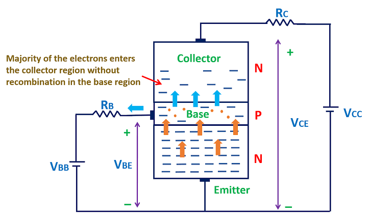

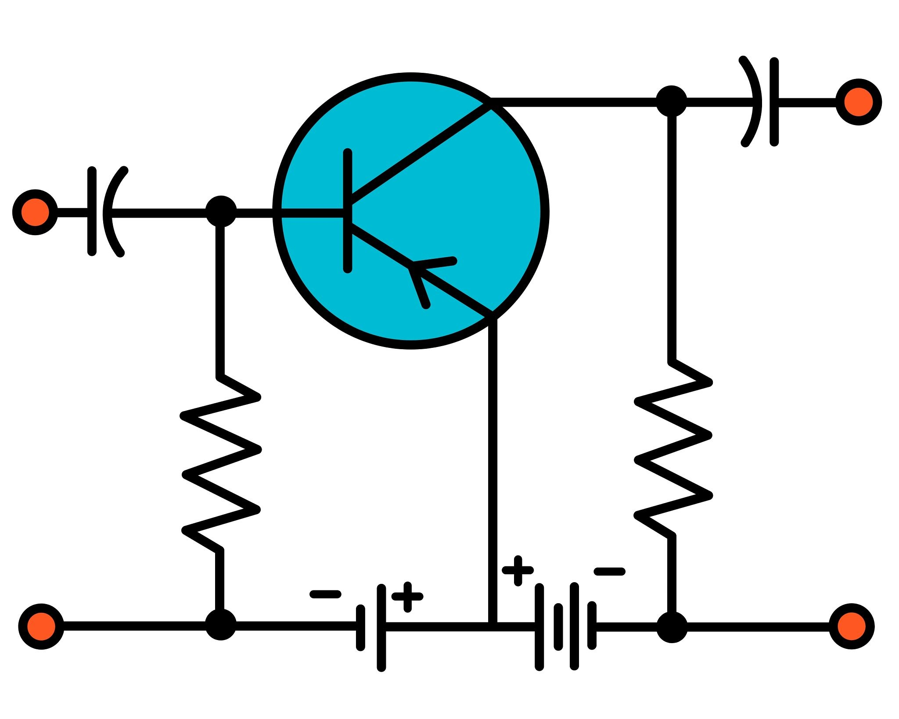

Imagine you plug a microphone into the Base wire. A microphone produces a very weak, fluctuating electrical current based on your voice.

As you speak, your voice causes the Base current to fluctuate slightly

*I still do not understand how we get a base current at all if all the holes are filled*

The base current is mainly the small recombination current: some emitter electrons recombine with holes in the base, and the base contact supplies replacement holes. Forward bias also injects holes from the base into the emitter. The base is not a one-time container that becomes permanently filled; bias and the external circuit maintain a steady flow.

Intrinsic silicon at absolute zero: valence band completely full, conduction band completely empty, nowhere for anything to move. Current is exactly zero

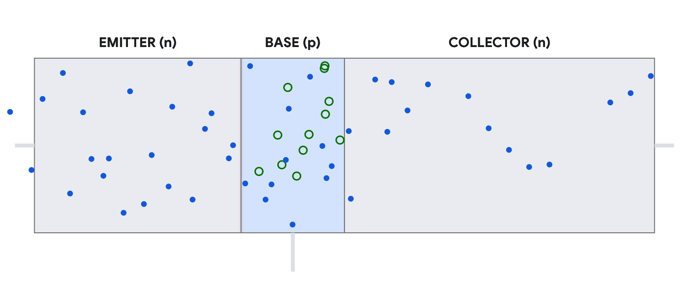

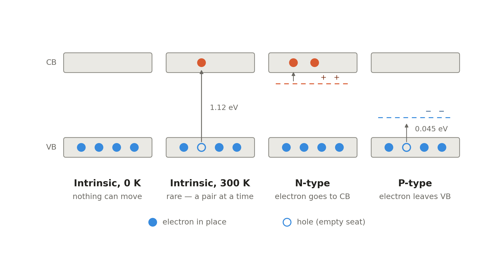

Look at the fourth panel. The hole in p-type silicon is made by an electron leaving the valence band and landing on the boron atom.

Boron has three valence electrons, so one of its four bonds is unfilled. An electron from a neighbouring silicon–silicon bond — which means,an electron from the valence band — hops across and completes boron's bond.

And that hop costs 0.045 eV, not 1.12 eV. The electron doesn't go to the conduction band. It goes onto the acceptor level, which sits just above the valence band edge. Cheap enough that room temperature does it to essentially every boron atom.
The valence band is now missing an electron. It is no longer full. The remaining electrons have somewhere to go, and current can flow.

Phosphorus: 
- gives an electron to the conduction band	
- Mobile carrier is an electron in CB	
- fixed charge: P⁺ ion

Boron:
- takes an electron out of the valence band	
- Mobile carrier is a hole in VB	
- fixed charge: B⁻ ion

In n-type, the valence band stays essentially full and contributes almost nothing. All conduction happens up in the conduction band. In p-type, the conduction band stays essentially empty and contributes almost nothing. (Minority carriers exist in both cases — np = ni² always holds — they are just outnumbered by many orders of magnitude.) All conduction happens down in the valence band, through the vacancies.

An electron arriving on the p side is now surrounded by holes. It falls into one and both vanish as mobile carriers.An electron in the conduction band is roaming free. A hole in the valence band is an empty seat. When the electron drops down into that empty seat, it's now sitting in a covalent bond — bound, not roaming.The hole "vanishes" because a hole was never a thing; it was the name for a missing electron. Fill the gap and there's nothing left to name.

Phosphorus is 2, 8, 5. It has one more valence electron than silicon, so four of its five bond to neighbouring silicon atoms and the fifth is only loosely held. At room temperature that electron is thermally released into the conduction band. The phosphorus atom is now a P⁺ ion, fixed in the lattice and unable to move.

Boron is 2, 3. It has one fewer valence electron than silicon, so one of its four bonds is unfilled. At room temperature an electron from the valence band moves onto it, completing the bond and leaving a hole behind. The boron atom is now a B⁻ ion, fixed in the lattice and unable to move

The electron has to go somewhere better, energetically, than where it is. Boron's unfilled bond is exactly that — a vacancy that will accept an electron, sitting only 0.045 eV above the top of the valence band.

## Why Oxide layer matters
Converting the top silicon layers into silicon dioxide (SiO₂) creates a high-quality insulator and passivates the silicon surface. This enabled reliable MOS gates and planar integrated circuits; metal interconnections are isolated from one another by dielectric layers, including oxide.

- Dry Oxidation: Uses pure oxygen (O₂). It creates high-quality, relatively dense oxide but grows slowly, so it is commonly used when thin or especially high-quality oxide is needed.

- Wet Oxidation: Uses steam (H₂O). It grows oxide much faster than dry oxidation, but the oxide is generally less dense, so it is commonly used for thicker field-oxide layers. The useful thickness and speed depend on the process.

## Measuring thickness of oxide layer
- Light reflects off both the top surface of the oxide and the silicon substrate beneath it .
- The paths cause light waves to interfere constructively and destructively, altering the perceived color depending on the layer's precise thickness.
- The color cycles (silver -> purple -> blue -> green -> yellow) as thickness increases.
- Oxide growth slows down over time because oxygen must diffuse through the existing oxide layer to react with the silicon underneath 

## The Evolution of Computing
Before stored-program computers, some computers were configured directly with switches, plugs, or fixed logic. If you wanted the machine to calculate artillery trajectories, you might physically wire or configure circuits for that specific task. A fixed-function block in a chip can still work this way today, although a microwave timer, thermostat, or ASIC may also contain a CPU and firmware. You could build a machine that plays chess with nothing but gates and wires, and it would play chess and nothing else, forever.
  
The von Neumann (stored-program) architecture is what made software possible—the brilliant idea that the instructions for the machine could be stored in memory as data (1s and 0s), rather than being hardcoded into the physical wires. It didn't just make it easier to talk to different CPUs; it made it possible for a single machine to be a calculator, a word processor, and a video game without changing its physical circuitry. 

`one program running on many CPUs — is a real benefit of software, but it came late and it's arguably the smaller one. The bigger thing software bought us is the reverse: one machine that can run many programs.`

The stored-program idea was to put the instructions in the same memory as the data, so changing what the machine does becomes writing to memory instead of rewiring metal. That's what turned a computer from an appliance into a general-purpose thing. Portability across CPU families came decades later with compilers and standardized instruction sets.

## Hardware Without Software Today

We still use hardware without software all the time. When a device only ever needs to do one specific thing, it's often cheaper, faster, and more power-efficient to build the logic directly into the silicon rather than running software on a general-purpose CPU.

- `Fixed-function devices`: A simple timer or controller may be built from fixed logic, or it may contain a small microcontroller running firmware. The distinction is whether its behavior is stored as executable instructions rather than implemented only by fixed hardware.
- `ASICs (Application-Specific Integrated Circuits)`: These are custom chips designed for a narrow class of jobs. Bitcoin-mining ASICs and dedicated video encoders are examples. Their datapath and control logic are fixed in hardware, but an ASIC can still include firmware, configuration registers, or a processor core; its hardware is not literally stored source code etched into silicon.

A suitable feedback loop, such as a latch or bistable circuit, can preserve a state. Mere feedback from a gate to itself is not sufficient in every circuit.

`Some early programs were written in machine-code notation such as octal or hex, then manually entered as the corresponding bits.`

## Instruction Set Architecture (ISA)
The Instruction Set (specifically the Instruction Set Architecture, or ISA) exists primarily because of software. More accurately, it exists so that software doesn't have to be rewritten every time someone builds a new physical CPU.

computers used to do only what the hardware was designed for. If you wanted to do something new, you had to build a new machine. The ISA is the contract between software and hardware that says, "If you give me these instructions in this format, I promise to do what they say." It allows software to be written once and run on any CPU that implements the same ISA, even if the underlying hardware is completely different.The hardware was the program.

Memory Management Unit (MMU): This piece of hardware is dedicated solely to translating the "virtual" memory addresses that your software uses into the actual physical addresses on your RAM sticks

A perfect example is cryptography. Modern Intel and AMD chips include AES-NI (Advanced Encryption Standard New Instructions). This is dedicated silicon inside the CPU that does nothing but encrypt and decrypt AES data.

a fixed-function unit can be much more efficient than general code doing the same job, but the exact speed and energy benefit depends on the implementation, workload, and comparison baseline.

A few algorithms get the VIP treatment—they have dedicated instruction sets baked directly into the CPU core. When your code calls these, the CPU doesn't run a software algorithm; it routes the math to a specific physical circuit.
- AES (Advanced Encryption Standard): Handled by AES-NI on Intel/AMD chips, and similar instructions on ARM. This is used for encrypting almost all data in transit (TLS/HTTPS) and at rest (disk encryption).
- SHA (Secure Hash Algorithm): Many modern CPUs have Intel SHA Extensions or ARM equivalents specifically to accelerate SHA-1 and SHA-256 hashing. These are crucial for verifying file integrity, digital signatures, and TLS certificates.

- AES — AES-NI on x86 (since 2010), ARMv8 crypto extensions. Nearly universal.
- SHA-1 and SHA-256 — Intel SHA extensions, ARMv8. SHA-512 was standardized at the same time as SHA-256, but dedicated acceleration for it is less common.
- CRC32 — since SSE4.2. Note it implements CRC-32C (Castagnoli polynomial), not the CRC-32 used by zlib/gzip/Ethernet, so it does not accelerate those directly. ARMv8 has CRC32 instructions for both.
- Carry-less multiply (PCLMULQDQ, ARM PMULL) — not a cipher, but the primitive that makes AES-GCM's authentication fast.
- SM3/SM4 — the Chinese national standards, on recent Intel and some ARM parts.
- RNG — RDRAND/RDSEED, ARM RNDR, pulling from an on-die entropy source.

- Hardware Acceleration is the use of dedicated hardware to accelerate an operation so that it runs faster and or more efficiently.
- It can involve optimizing functions and code to use existing hardware(COTS) or it may involve the development of new hardware designed for a specific task
  - COTS hardware includes CPUs,GPUs, and FPGAs. 
  - Custom hardware is often referred to as ASICs (Application-Specific Integrated Circuits) and is designed for a specific application or task.

the AES algorithm mathematically processes data in 128-bit blocks. the CPU bypasses the standard general-purpose registers (which are only 64 bits wide on modern machines) and uses specialized, extra-wide registers designed for SIMD (Single Instruction, Multiple Data) operations.

Processing one block at a time is fast, but processing multiple blocks at once is faster. To handle high-throughput cryptography (like terminating thousands of TLS connections on an identity server), chipmakers introduced Vectorized AES (VAES).

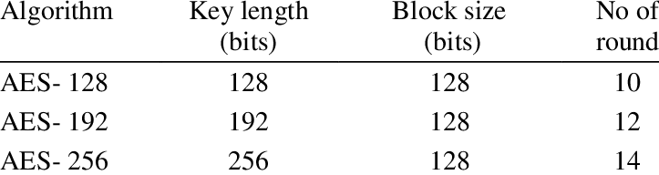
"AES-256," the 256 only refers to the size of the secret key. The data block—the chunk of plaintext actually being encrypted in the hardware—is always exactly 128 bits, no matter what.

## Addresses
On a modern 64-bit CPU, an address is a 64-bit integer (though practically, most CPUs only use the bottom 48 or 52 bits to save hardware costs). 

### The Memory Management Unit (MMU)
The MMU is a piece of hardware that translates virtual addresses used by software into physical addresses used by the RAM. It allows for features like virtual memory, memory protection, and address space isolation between processes.

When the CPU executes an instruction that requests memory, the address translation hardware uses the virtual address and consults a translation lookaside buffer (TLB). On a TLB miss, it walks the page tables configured by the OS, checks permissions, and obtains a physical-page mapping. The resulting physical address is then used by the memory hierarchy; a missing or unauthorized mapping raises a page fault or protection fault rather than producing an address.

Because translation is needed for each memory access, it has to be extremely fast. CPUs have a specialized, ultra-fast hardware cache called the TLB (Translation Lookaside Buffer) inside the MMU to remember recent translations and avoid walking the page tables repeatedly.

### Page Tables
Page tables are data structures used by the MMU to map virtual addresses to physical addresses. Each process has its own page table, which allows for isolation between processes. The OS manages these tables, and they can be hierarchical (multi-level) to save space. For example, a 64-bit address space might use a 4-level page table, where each level indexes into the next, ultimately leading to the physical frame number.

### Address Bus
The address bus is the collection of signals used to communicate memory addresses between the processor or memory controller and memory. Its width limits the addressable range: a 32-bit address bus can address $2^{32}$ byte locations (4 GB), while a 64-bit address bus can theoretically address $2^{64}$ bytes (16 exbibytes, ~18.4 exabytes), though practical limits are much lower. Modern systems may multiplex signals and place the memory controller on the CPU, so this is not necessarily a direct bundle of 64 traces from the CPU to the RAM slots.

## The Grid and The Hardware Decoder
8 GB of RAM = 64 billion bits (about 59.6 Gibit), or 68.7 billion bits if the intended capacity is 8 GiB. Each DRAM cell stores one bit as charge on a capacitor, gated by a single access transistor.

Arranged as one long line, those cells would need ~68.7 billion select lines from the address decoder, plus a single shared data line whose capacitance would make access hopelessly slow.

#### The solution: a 2D grid
Cells sit at the intersections of horizontal word lines and vertical bit lines.
- Linear array of N cells → N wires
- Square grid of N cells → 2√N wires
- For 64 Gbit: approximately 253K × 253K, so ~506K wires instead of 64 billion

Reads are destructive. Draining the capacitors means the sense amps must write the row back afterward. Every read is really read-then-restore. (Separately, cells leak, so all rows need periodic refresh regardless of access.)

Sequential access is fast. Once a row is open, additional columns from it cost almost nothing — a "row hit." Switching rows means closing the old one and paying full latency.

`Dimensionality trades against wire count: 1D → 2D takes N to 2√N. The same logic drives current 3D approaches`

The CPU emits a physical address; the memory controller decomposes it into channel, rank, bank group, bank, row, and column fields. Row and column are two fields among several.The mapping is a controller design choice — deliberately interleaved so that consecutive addresses land in different banks and channels, enabling parallel access.

The Address Decomposition
- Channel: The highest level of parallelism. Separate channels have their own independent data, address, and control buses connecting back to the CPU.
- Rank: A set of memory chips connected to the same channel that are accessed simultaneously to read or write a full data bus width (64 bits for DDR4; DDR5 splits each DIMM into two independent 32-bit sub-channels).
- Bank Group & Bank: Inside the chips, memory is divided into banks. A bank is essentially an independent memory array. While one bank is busy retrieving a row of data, another bank can be precharged or accessed.
- Row & Column: The fundamental grid inside a bank. Activating a row (bringing it into the sense amplifiers) is the most time-consuming step. Once the row is "open," selecting the column is much faster

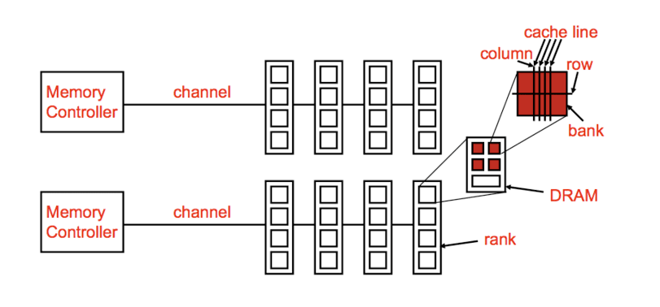

## Reads
- ACTIVATE with the row address → one word line rises → that entire row (~8 KB) dumps onto the bit lines → sense amps latch it
- READ/WRITE with the column address → selects bits from the already latched row

## Decoder
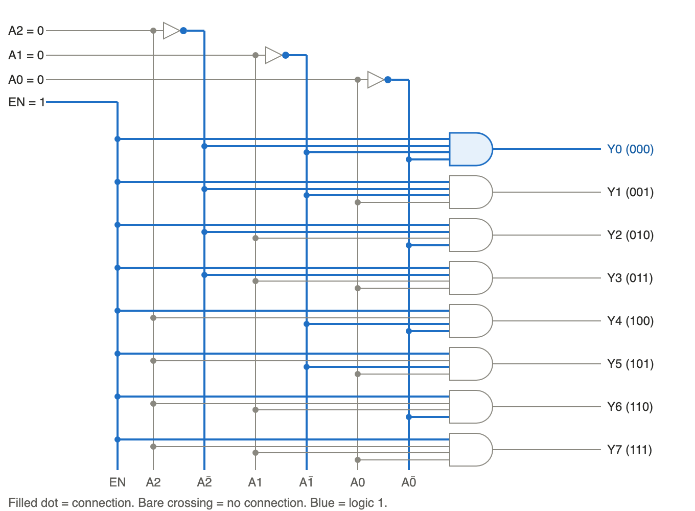
The problem it solves is sharing.
Every part of a computer runs into this, and decoding is the standard answer.

1. Wires are the scarcest resource, not logic. Transistors are nearly free — a chip has billions. Pins and traces are not. A DDR5 module has 288 pins total. If each of 8 billion byte locations needed its own wire, the module would need 8 billion pins, which is not an engineering challenge but a physical impossibility. Encoding lets 33 wires name 8 billion places. Decoding converts that back into actuation at the far end. Without the pair, memory beyond a few dozen bytes cannot be built.

The general rule is n inputs → 2ⁿ outputs.
- 3 inputs -> 8 outputs
- 4 inputs -> 16 
- 8 inputs -> 256 outputs
- 16 inputs -> 65,536
- 20 inputs -> 1,048,576

Each wire you add doubles what you can name. That's the good half — 20 wires reach a million locations, which is why the address bus stays small while memory grows.

The bad half is that the decoder grows just as fast. A 4-to-16 needs 16 AND gates of 4 inputs. A 20-to-1M needs a million gates of 20 inputs each. Same exponential, now on the transistor side instead of the wire side.

Which is where predecoding earns its place, and the 4-bit case is the cleanest way to see it. Split the four bits into two pairs. Decode each pair with a 2-to-4 decoder — that's 8 small gates total. Now AND every output of the first with every output of the second: 4 × 4 = 16 combinations, each a 2-input gate.

Compare the two builds:
- Flat: 16 gates, 4 inputs each = 64 gate-inputs
- Predecoded: 8 gates of 2 inputs + 16 gates of 2 inputs = 48 gate-inputs

A single cell of Dynamic Random Access Memory (DRAM) is beautifully simple. It consists of exactly two microscopic components: a capacitor and a transistor.

This is why data buses are wide. 64 data wires means 64 cells are read simultaneously and 64 bits arrive at once

A DRAM row is about 8 KB — roughly 65,000 cells. When the word line rises, all 65,000 share charge with their bit lines and get latched by the sense amplifiers. That happens whether you wanted one byte or all of them; there is no way to open part of a row.

Then the column address selects which slice of that latched row actually leaves the chip. You asked for one byte, so 8 bits come out. The other ~65,000 sit in the sense amps, latched and unused.

Why the hardware reads 65,000 cells when you request 8 bits: it pays off when you come back. The row stays latched, so the next access to the same row skips the expensive step entirely and just picks different columns.

## How Addressing Works
- Memory is organized as a 2D matrix to minimize address pins
- Row address activates an entire row into the row buffer
- Column address selects specific bits from the active row
- This 8×8 array needs only 6 address bits (3 row + 3 column) driving 8 + 8 = 16 select lines, instead of 64 individual select lines

This row/column approach minimizes the number of wires needed—a 1 GB memory chip with 8 billion bits can be reached with only about 180,000 row and column wires (word lines + bit lines, roughly 2 × √8 billion) instead of 8 billion individual connections!

[how your computer's memory works](https://medium.com/@hasancansert/ever-wondered-how-your-computers-memory-works-so-fast-dive-deep-into-the-world-of-dram-5438cd62bbe2)

`Hex` is just shorthand for reading binary. Each hex digit stands for exactly 4 bits: `0x1A3F  =  0001 1010 0011 1111`

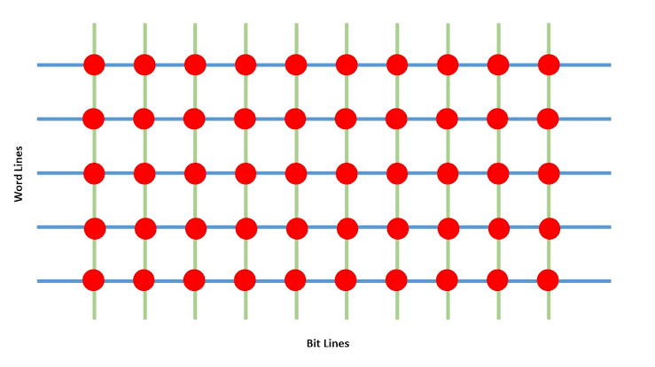

- The horizontal wires coming from the Row Decoder are called Wordlines.
- The vertical wires coming from the Column Decoder are called Bitlines.

- At every single point where a horizontal Wordline crosses a vertical Bitline, there is a DRAM memory cell (a transistor and a capacitor).
- The Row Decoder applies high voltage to Wordline 11.
- This voltage physically turns on the transistor gate of every single memory cell attached to that horizontal line. Tens of thousands of tiny capacitors (~65,000 for an 8 KB row) suddenly dump their stored electrons onto their respective vertical Bitlines.
- However, the CPU doesn't want the whole row. It only wants Column 5.
- The Column Decoder acts as a filter. It only allows the electrical signal traveling up Bitline 5 to pass through to the memory controller. All the other data dumped by the other cells in the row is ignored (and then immediately written back so it isn't lost).

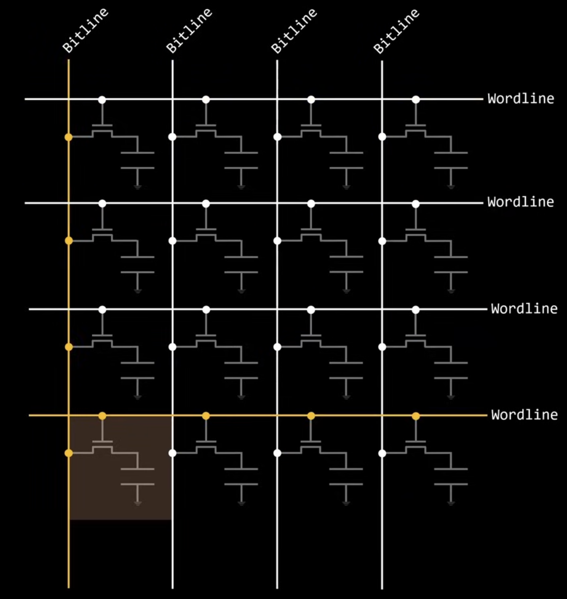

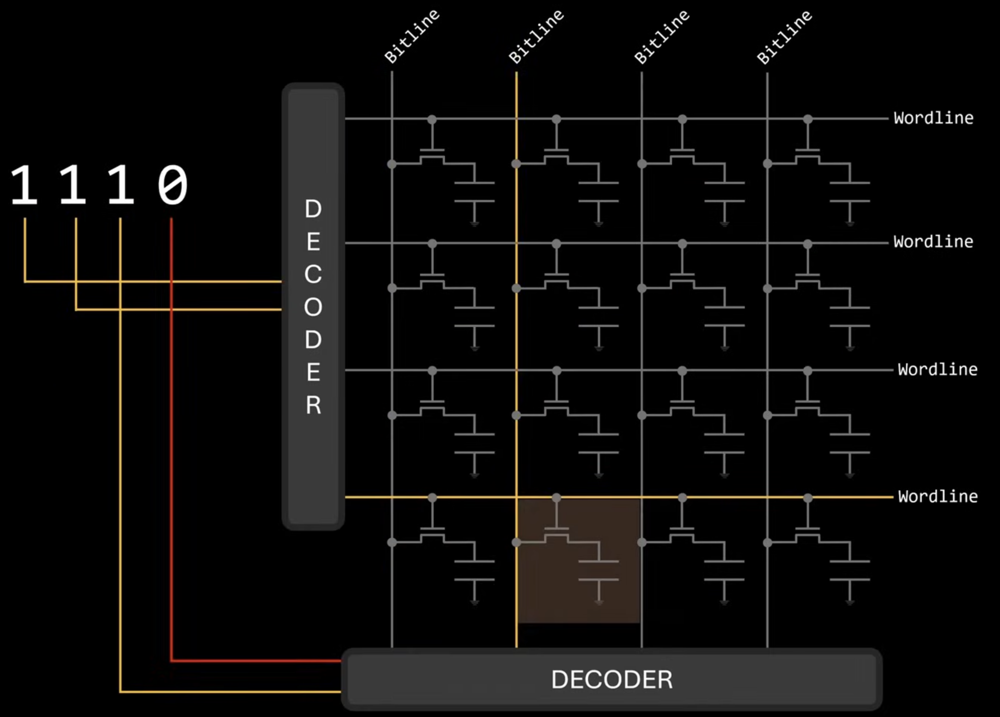

using a decoder to select a row and another to select a column,let's us pinpoint the specific intersection or memory cell

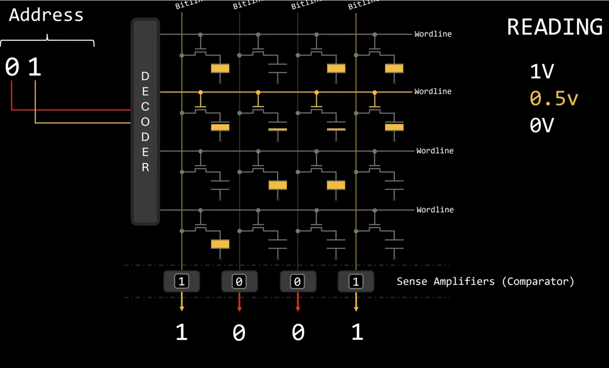

Since we do not want the value of the entire row,we want the value of a specific cell in that row. here, we use a component that gathers these outputs and uses the address inputs to determine which one is sent to the output line. This is exactly want a multiplexor does

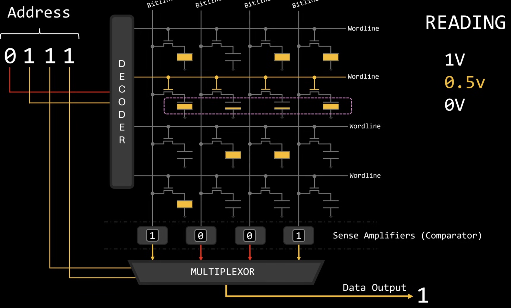

But since reading alters the state of the capacitor storing those bits,we need to reset them to their original state. We use the sense amplifier to read the value from the latch and send it back to the bitlines,restoring the capacitors to their previous state
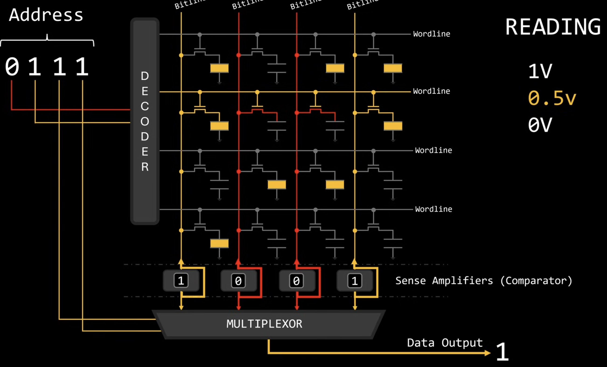

For writing, we can't use a multiplexor, we need a demultiplexor; hence we need a component that can act both as a multiplexor and demultiplexor. Generic parts that do both are sold as analog multiplexer/demultiplexers (e.g. the 74HC4051). In an actual DRAM the equivalent is the column decoder driving bidirectional column-select pass transistors, which conduct either way, so no separate demux is built

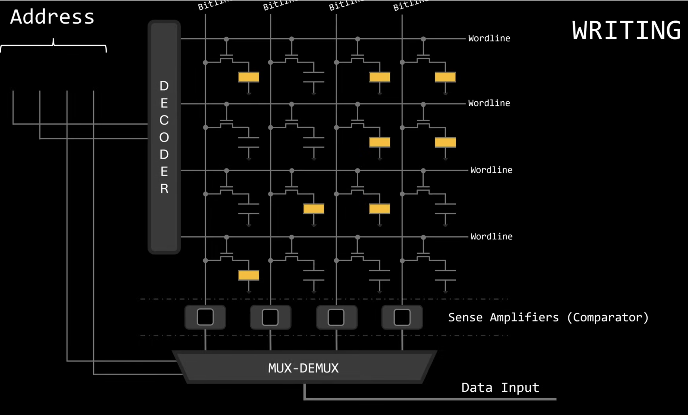

An 8-bit 6502 has 16 address pins, because it addresses 64 KB. The data path is 8 bits wide; the address space is 16 bits wide. Different numbers describing different things
The 8088 is the sharpest case: architecturally 16-bit, with 16-bit registers, but only 8 data pins.

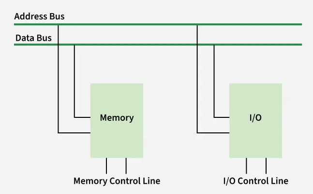

Everything shares the same Address Bus. A system decoder decides who gets to answer..

So, if every component is listening to the same wires, how does the CPU talk to the video chip without the RAM accidentally answering?

The answer is a brilliant trick called Memory-Mapped I/O.

register width is what "64-bit CPU" means.

`https://www.universitywafer.com/`

Silicon dioxide (SiO2) can serve as an insulating dielectric,surface-passivation layer, diffusion or implantation mask, and processing layer in many device-fabrication sequences. 

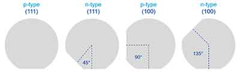

Silicon (100) wafers (prime grade, 100 mm diameter, n-type, phosphorous doped, resistivity = 5{10 ohm-cm) 

UniversityWafer, Inc. sells all orientations including silicon 100, 111, 110, 112, 211, 511 et

[silicon-wafer-orientation](https://www.universitywafer.com/silicon-wafer-orientation.html)

## Which N-Doped Silicon Wafer Has the Highest Electric Conductivity?

### Sb-doped silicon

It is generally accepted that Sb-doped silicon has the highest electrical conductivity of all semiconductors. This material has a very narrow band gap of 1.12 eV, and the donor level of Sb doped into it is 0.039 eV below the bottom of the conduction band. This makes it an ideal material for transistors.

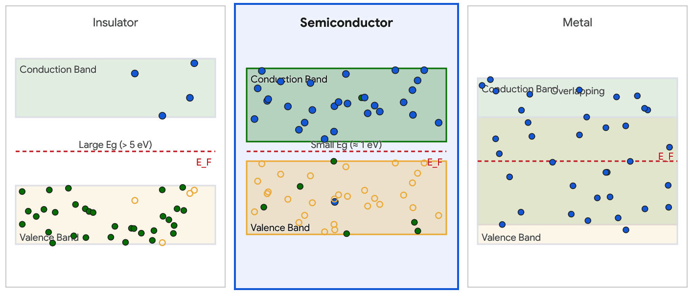

The valence electrons are not tightly held to the nucleus due to which a few of these valence electrons leave the outermost orbit even at room temperature and become free electrons. The free electrons conduct current in conductors and are therefore known as conduction electrons. The conduction band is one that contains conduction electrons and has the lowest occupied energy levels.

An electron hole is not a physical particle; it is the absence of an electron where one should normally be.

When a valence electron absorbs enough energy to break out of its covalent bond and jump into the conduction band, it leaves behind an empty space in the silicon crystal's valence band. This vacancy is the "hole."

Because a neutral silicon atom has an equal number of positive protons and negative electrons, losing a negative electron means that specific spot in the lattice now has a net positive charge.

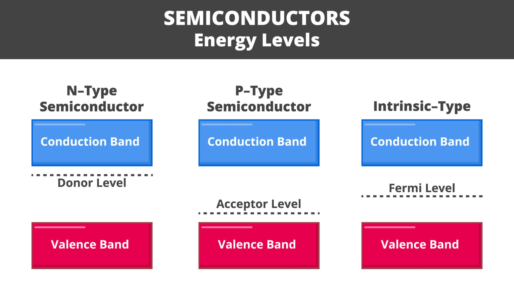

doping does not actually change the silicon's native conduction or valence bands. The physical distance (the band gap) between silicon's bands stays exactly the same.Instead, doping works by inserting entirely new, artificial "stepping stone" energy levels right into the middle of the forbidden band gap.

Depending on whether you use n-type or p-type impurities, this stepping stone is placed at the very top or the very bottom of the gap

### N-Type Doping: The Donor Level 

When you dope silicon with a Group V element (like Phosphorus), that extra loosely-bound fifth electron has its own specific energy level.
 - This new energy level, called the Donor Level , forms inside the band gap just barely below the Conduction Band.The 
 - Because the Donor Level is practically touching the Conduction Band, it takes almost zero energy (about $0.05 eV) for those extra electrons to hop up and become free.
- At room temperature, the Donor Level constantly "donates" electrons directly into the Conduction Band without needing to pull anything out of the Valence Band.

### P-Type Doping: The Acceptor Level 
When you dope silicon with a Group III element (like Boron), the atom is missing an electron, which creates a strong pull for one.

- This creates an Acceptor Level inside the band gap just barely above the Valence Band.
- Because this empty level is so close to the Valence Band, electrons from the Valence Band can easily hop up into it, capturing the electron.

By accepting those electrons, the Acceptor Level constantly leaves behind millions of positive holes in the Valence Band. The material now conducts electricity using those holes, while the Conduction Band remains mostly empty.

This area is called the Depletion Region (or depletion layer) because it is entirely depleted of the free electrons and holes that normally conduct electricity.

When an electron leaves the n-side, it leaves behind a Phosphorus (or other Group V) atom that is now missing a negative charge. That atom becomes a fixed positive ion.

When a hole is filled on the p-side, the Boron (or Group III) atom gains an extra negative charge. It becomes a fixed negative ion.

As the depletion region grows, a massive wall of positive ions builds up on the n-side of the border, and a wall of negative ions builds up on the p-side. This creates a strong internal electric field pointing across the junction.

negative on the p-side, positive on the n-side — creates an electric field pointing from n to p. This field pushes electrons back toward n and holes back toward p, exactly opposing the diffusion that created it.

Eventually, this electric field becomes so strong that it pushes back against any new electrons trying to cross. It acts as an invisible wall, stopping the diffusion process completely. For silicon, this built-in potential barrier stabilizes at around 0.7 volts.

## Forward Bias
Forward bias happens when you connect the positive terminal of a battery to the p-type side, and the negative terminal to the n-type side.
- The positive terminal repels the positive holes in the p-side, pushing them toward the center junction. Simultaneously, the negative terminal repels the free electrons in the n-side, pushing them toward the junction as well.

- If the battery provides enough voltage to overcome the built-in barrier (about 0.7 volts for silicon), the depletion region collapses completely.

- With the barrier gone, electrons easily sweep across the junction from the n-side, fall into the holes on the p-side, and flow out through the positive terminal.

## Reverse Bias
you connect the negative terminal to the p-type side, and the positive terminal to the n-type side.
- The negative terminal attracts the positive holes on the p-side, pulling them away from the center junction. The positive terminal attracts the free electrons on the n-side, pulling them away from the junction.

- Because all the free charge carriers are being pulled away from the center, the depletion region stretches and gets much wider.

## NPN
The Emitter (N-type): Heavily doped, meaning it is absolutely packed with free electrons in its conduction band.

The Base (P-type): The middle layer. It is manufactured to be incredibly thin and very lightly doped (meaning it has very few holes in its valence band).

The Collector (N-type): Moderately doped with electrons, designed to "collect" current.

- Base-Emitter should be forward biase: We apply a small positive voltage (over 0.7V) to the Base. This puts the Base-Emitter junction into forward bias
- Just like a standard diode, that forward bias collapses the first depletion region. Millions of free electrons from the Emitter are pushed across the border into the P-type Base.

The "Trap" Fails: Normally, those electrons would fall into the holes in the p-type material and flow out the Base wire. But remember the manufacturing secret: the Base is incredibly thin and barely has any holes

- Because there are almost no holes to fall into, and because the electrons are moving so fast, roughly 99% of them overshoot the Base completely. They fly straight into the second junction (the Base-Collector junction). The strong electric field of that second depletion region acts like a vacuum, sweeping the electrons directly into the Collector.

Base-Collector is reverse bias: prevents holes in the Base from going to the Collector, and prevents electrons in the Collector from going to the Base.

However, that exact same electric field does something very different to a rogue electron that suddenly appears on the Base side of the border.
- The Electric Field Direction: The positive ions on the Collector side and the negative ions on the Base side create an electric field pointing from the Collector to the Base.
- The Suction: Because electrons are negatively charged, they are forced to move in the opposite direction of an electric field.

`the heavy doping of the Emitter is exactly what creates that massive current gain, working hand-in-hand with the lightly doped Base`

In a MOSFET, there are actually two entirely separate electric fields at work, pointing in two different directions.in the MOSFET there are two of them, perpendicular to each other, doing completely different jobs
Convention: `E points from positive charge toward negative charge. A hole feels force along E; an electron feels force opposite to E.`

The vertical field runs from the positive gate downward through the insulator into the silicon. Force on an electron is therefore upward, toward the oxide interface. That's what gathers electrons at the surface and inverts it into a channel. Note what this field does not do: it drives no current at all, because the insulator blocks it. It runs perpendicular to the direction current will eventually flow. It builds the road; it doesn't move anything along it

The lateral field appears only when you put the drain at a higher potential than the source. It points from drain to source, along the channel. Force on an electron is opposite, so electrons travel source→drain. Conventional current runs drain→source. The names are literal: the source supplies electrons, the drain collects them

To add 1+1+1 in binary
- Add the first two 1s
If you add the first two binary digits together:1 + 1 = 10 (which equals 2 in decimal)So, your partial result gives you a Sum of 0 for that column, and a Carry of 1 to the next column.

- Add the third 1
Now, you take that partial sum of 10 and add the third 1 to it: 10 + 1 = 11

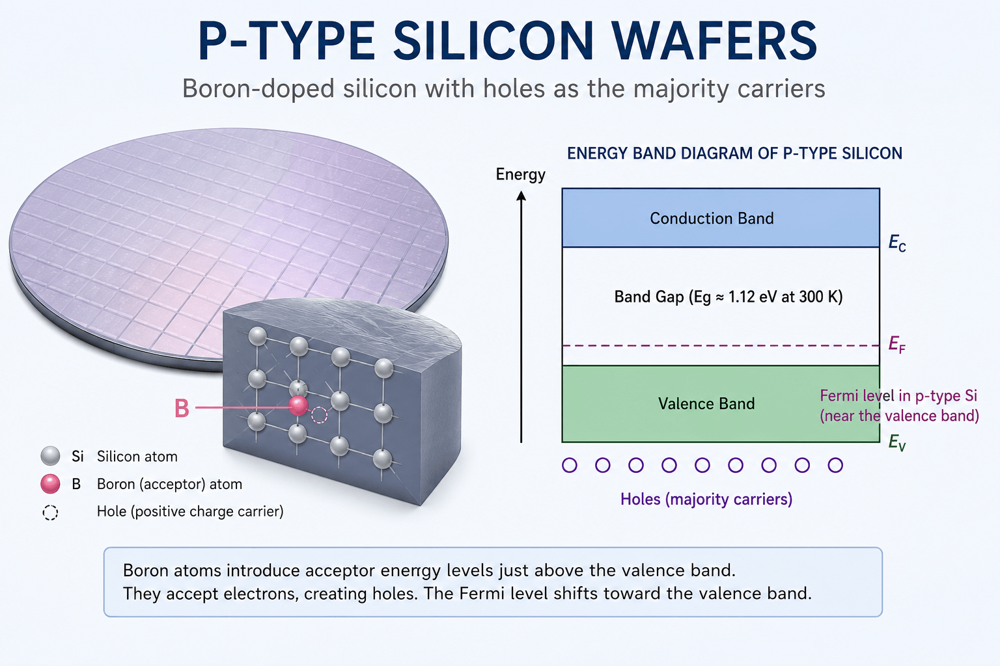

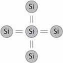
If you replace one of the silicon atoms in the lattice with an impurity atom known as a dopant, you can modify the electrical properties of the structure. By replacing a silicon atom with an atom that has five valence electrons, from column five of the periodic table, such as phosphorus, arsenic, or antimony, four of the electrons would be required for covalent bonding, leaving an extra electron "free" to wander the lattice. These dopant atoms are known as donors, because they "donate" their extra electron to the lattice, effectively increasing the number of negative charge carriers in the solid, which increases the material's conductivity (and decreases its resistivity).

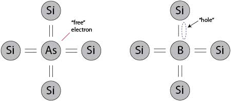

In similar fashion, if you were to replace one of the silicon atoms in the lattice with an atom that has three valence electrons, from column three of the period table, such as boron, indium, gallium, or aluminum, three of the electrons would be used up in covalent bonding, leaving a hole where a bond was previously. Electrons can jump in and fill that hole, leaving a hole elsewhere, in effect allowing the hole to move, therefore you have created a positive charge carrier, which also increases the material's conductivity and decreases its resistivity. These dopant atoms are known as acceptors, because they accept an electron from the lattice.

To put the Base-Collector junction into reverse bias, the Collector needs to be held at a much higher positive voltage than the Base.In a real-world amplifier circuit, you would have a second, much larger power source (often called VCC, like a +9V or +12V battery) connected between the Collector and the Emitter.

William Shockley believed they could make an amplifier by using a notion called the field effect.  He theorilzed that an electric field erected (directly)perpendicular to a metal plate  near to the insulated from the surface of a slab of silicon should draw electrons out of the semi-conductor material and create a path of current

in 1959, Atalla and Kahng at the same laboratory found the answer to the original problem: thermally grown silicon dioxide. Grow SiO₂ on silicon and the interface is astonishingly clean — the dangling bonds get tied up, and the density of interface states drops by orders of magnitude. Suddenly the gate field does penetrate

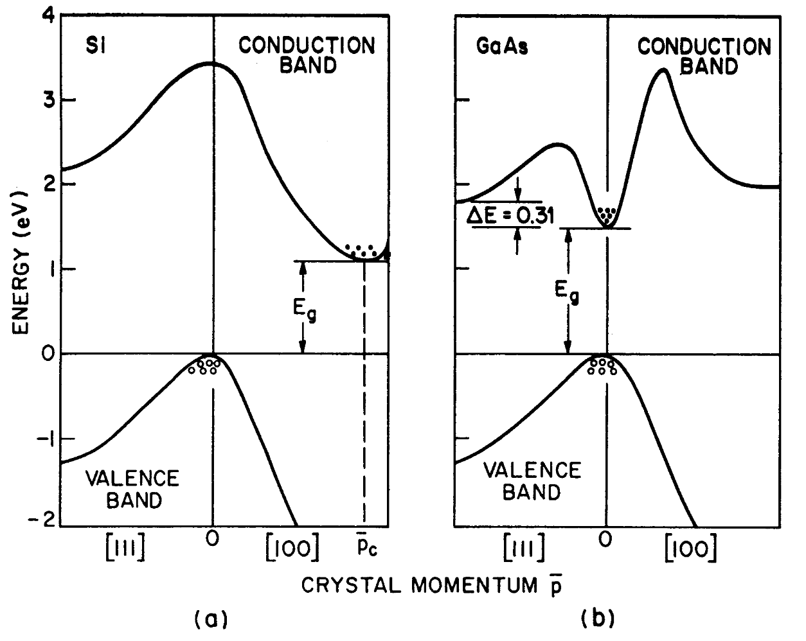
Energy band structures of Si and GaAs. Circles (o) indicate holes in
the valence bands and dots (.) indicate electrons in the conductor bands.

A detailed schematic of the energy band structures for
silicon and gallium arsenide in which the energy is plotted against the crystal momentum for two crystal directions. For silicon, the minimum of the conduction band and the maximum of the valence band have different crystal momenta. Silicon is therefore an indirect bandgap semiconductor as a change in crystal momentum is required for an electron transition between the valence and conduction bands. On the contrary, GaAs is a direct bandgap semiconductor and generation of photons is more efficient.

The arsenic atom forms covalent bonds with its four adjacent silicon
atoms, and the fifth electron becomes a conduction electron, thereby giving rise to a positively charged arsenic atom. As a consequence, the silicon crystal becomes n-type and arsenic is called a donor. Boron, on the other hand, has only three outer shell electrons and is an acceptor in silicon. Impurities such as
arsenic and boron have energy levels very close to the conduction band and valence band, respectively

The structure of a material determines its properties. In biology, the structure of a protein determines its enzymatic activities; what it reacts with and what it doesn't. In chemistry, the chemical structure of atoms in a chemical molecule determines the how something reacts. In the mechanical world,the atomic structure of a material determines how stiff it is.. The atomic structure of a material determines its electronic properties

When both donors and acceptors are present simultaneously, the impurity present at a higher concentration determines the type of conductivity in the semiconductor. The electron in an n-type semiconductor is called the majority carrier, whereas the hole in n-type semiconductor is termed the minority carrier. Conversely, in a p-type semiconductor, holes are majority carriers and electrons
are minority carriers.

In crystalline solids like silicon, carrier mobility and chemical etching rates change depending on the exposed crystal plane—such as the {100} versus {111} family of planes—because electron wavefunctions interact differently along different lattice vectors.

Elemental semiconductor: Carbdon,Silicon and Germanium
Compound Semiconductors:
- SiC,SiGe
- AlP,AlAs,AlSb,GaN,GaP,GaAs,GaSb,InP,InAs,InSb (column 3 and 5)
- ZnS,ZnSe,ZnTe,CdS,CdSe,CdTe(Column 2 and 6)

Elemental semiconductors can form lattices on their own because of their 4 valence electrons, which they use to form covalent bonds with four other atoms
You could also take two column four elements and put them together into a lattice,assuming that they are of not too dramatically different sizes
The further you go down the peridic table, the larger the atoms become.. Carbon and silicon are not as drastically different in sizes as carbon and germanium..You can also have silicon and germanium

Because Carbon is substantially smaller than Silicon, SiC forms a distinct, highly rigid crystal structure (often Zinc Blende or hexagonal polytypes) with a wide bandgap (3.2eV), making it ideal for high-voltage, high-temperature power electronics.

- Moving Down a Column: Atoms Get Bigger (Principal Quantum Number n)
- Moving Left-to-Right Across a Row: Atoms Get Smaller (Nuclear Charge Zeff)

A family of planes,denoted {abc}, includes all the planes that have the same atomic distributions on their surfaces
- In a cubic lattice,there are three families of planes: {100},{110} and the {111} planes

The large carrier concentration gradients at a p-n junction cause carrier diffusion. Holes from the p-side diffuse into the n-side, and electrons from the n-side diffuse into the p-side. This sets up an electric field, which in equilibrium,exactly counteracts these diffusion tendencies and thus permits no net transport
of electrons or holes across the junction. When a small positive voltage is applied to the p-side, there will be a net
movement of holes flowing from the p-side to the n-side, thereby creating a forward bias situation. Conversely, if a negative voltage is applied to the p-side, i.e. reverse bias condition, the p-n junction becomes an open circuit. A p-n junction therefore acts as a diode.

In a MOSFET device, the channel current is controlled by a voltage applied to a gate that is separated from the channel by an insulator typically made of SiO2. It works as a switch in that
when a positive voltage is applied to the gate, negative charges are attracted towards the gate insulator. If the voltage is large enough, enough negative charges accumulate underneath the gate dielectric to result in a conductive path between the source and drain. In the enhancement mode,the transistor is normally off, and no current flows between the source and drain for a gate voltage (VG) = 0 V. A conducting channel is then induced by applying a
voltage of the appropriate polarity (positive for n-channel MOSFET or negative for p-channel MOSFET) to the gate. In the depletion-mode, a conducting channel already exists, and the device is on with no bias applied to the gate. The channel is depleted of mobile carriers by applying a gate voltage

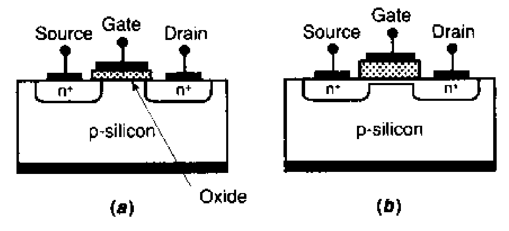

## Intel 4004 Microprocessor
The Intel 4004 was the first commercially available microprocessor, released in 1971.

[Assembly Language Programming Manual](https://bitsavers.trailing-edge.com/components/intel/MCS4/MCS-4_Assembly_Language_Programming_Manual_Dec73.pdf)

[revisiting the Intel 4004](https://www.hackster.io/Mayukhmali_Das/revisiting-intel-4004-microprocessor-37fed8)