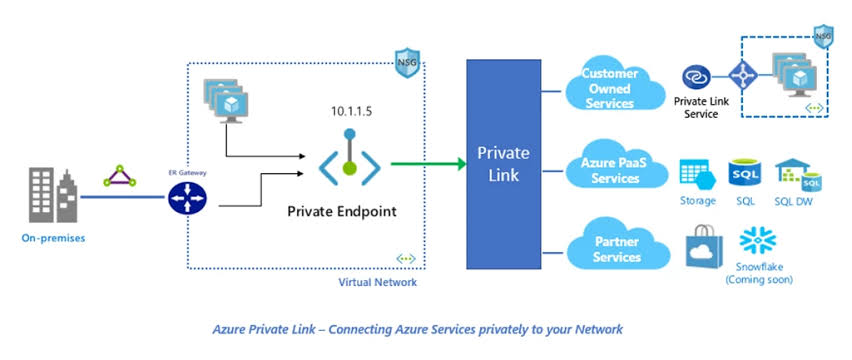
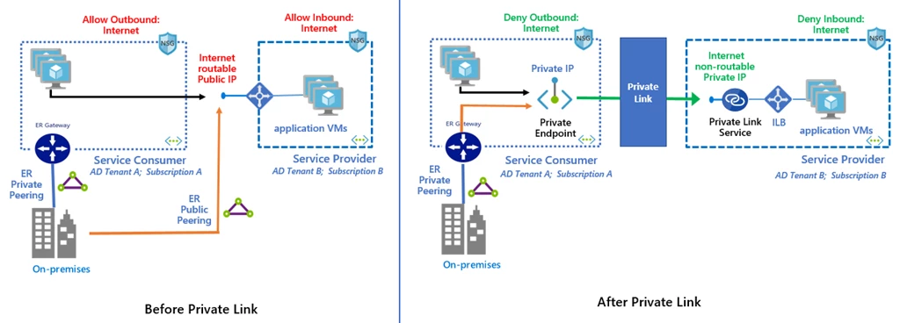
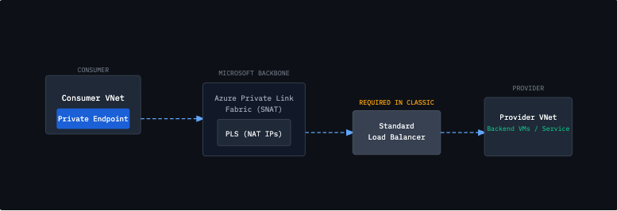
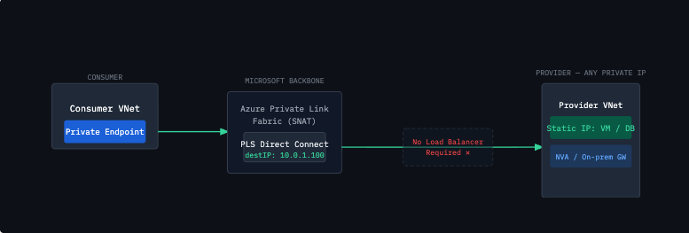
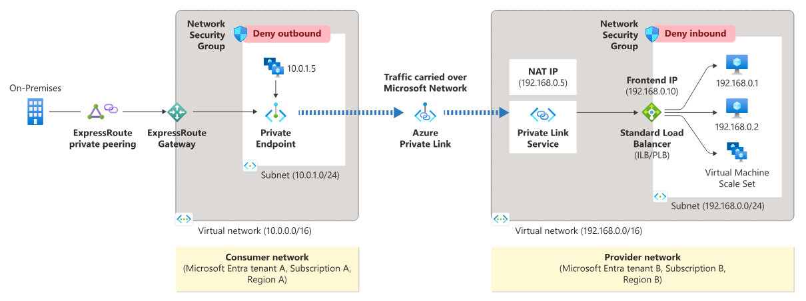
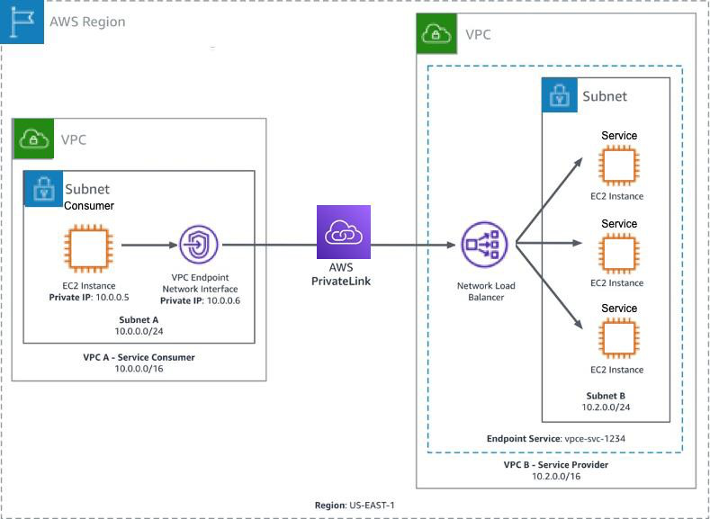
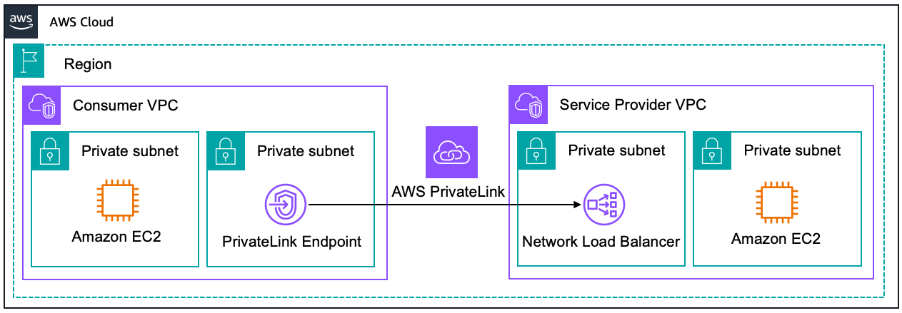
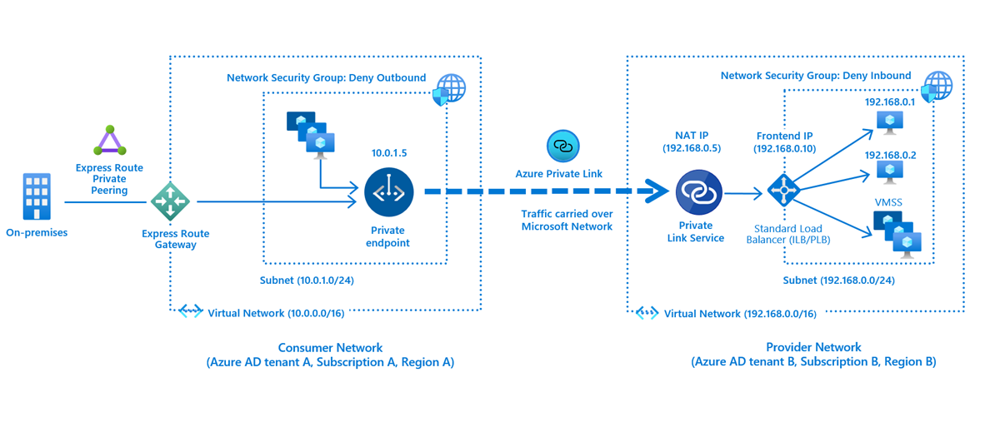
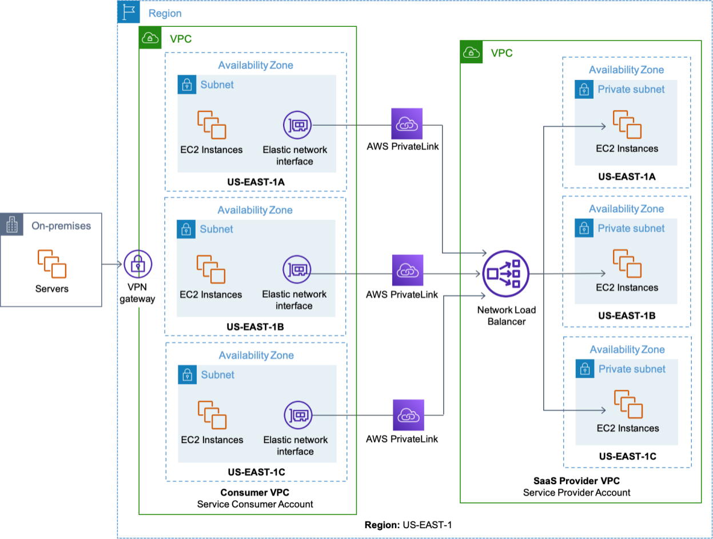
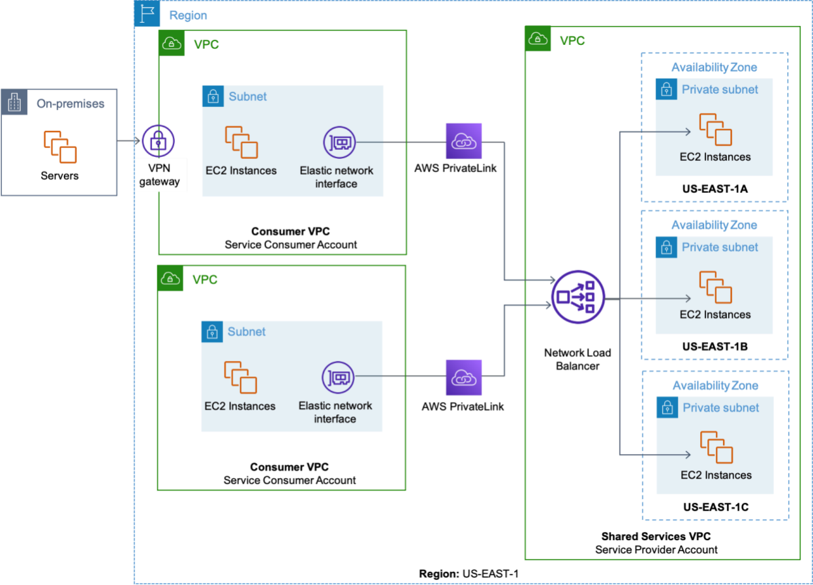

# Private Link
Private Link is a cloud networking technology (offered as AWS PrivateLink, Azure Private Link, and Google Cloud Private Service Connect) that provides secure, private connectivity between your virtual network (VPC/VNet) and cloud services.

Instead of sending traffic over the public internet to reach a cloud provider's managed services (like databases, storage, or third-party SaaS apps), Private Link keeps all traffic entirely on the cloud provider's global backbone network.


There is no need for gateways, network address translation (NAT) devices, or public IP addresses to communicate with the service.
## Problem it solves
Historically, if a virtual machine inside your private cloud network needed to access a managed cloud service (like an Amazon S3 bucket or an Azure SQL database), that managed service lived on a public IP address.

To reach it, your traffic had to leave your private network, go through an Internet Gateway or NAT device, and travel over the public internet to reach the service. 

### How Private Link Works

Private Link fundamentally flips this model. Instead of reaching out to a public service, it brings the service into your private network.

- Creation of a Private Endpoint: You create a "Private Endpoint" inside your virtual network. This endpoint is essentially a virtual network interface (ENI/NIC) that is assigned a private IP address directly from your own subnet (e.g., 10.1.1.5 in the diagram above).

- Mapping the Service: This private IP is securely mapped on the backend to the specific target service you want to access (like a specific storage bucket or database instance).

- Private Routing: When your applications send data to that private IP address, the cloud provider's underlying software-defined network intercepts the traffic.

- Backbone Transit: The traffic is routed directly to the destination service using the cloud provider's private fiber-optic backbone. It never touches the public internet.


### Private connectivity to your own service

> Quoted from the Azure Private Link GA announcement (2019) — "today" means 2019, and Azure Active Directory has since been renamed Microsoft Entra ID.

This new offering is not limited to Azure PaaS services, you can leverage it for your own service as well. Today, as a service provider in Azure, you have to make your service accessible over a public interface (IP address) in order for it to be accessible for other consumers running in Azure. You could use VNet peering and connect to the consumer’s VNet to make it private, but it is not scalable and will soon run into IP address conflicts. With today’s announcement, you can run your service completely private in your own VNet behind an Azure Standard Load Balancer, enable it for Azure Private Link, and allow it to be accessed by consumers running in different VNet, subscription, or Azure Active Directory (AD) tenant all using simple clicks and approval call flow. As a service consumer all you will have to do is create a private endpoint in your own VNet and consume the Azure Private Link service completely private without opening your access control lists (ACLs) to any public IP address space.


## DNS Zones
In DNS, a zone is the set of records for a particular suffix, held by whoever is authoritative for it. Microsoft owns and publishes the zone `blob.core.windows.net`, and inside it there's a record for `mystore`. Anyone on the internet can query it and get an answer. (`mystore.blob.core.windows.net`)

To make this seamless for applications, Private Link relies heavily on DNS.
If your application usually calls auth.identity-server.com, Private Link intercepts that DNS request using a Private DNS Zone. Instead of resolving to the public IP of the identity server, the DNS resolves locally to the private IP of your injected Endpoint (10.0.1.45).

### Why it has to be named exactly privatelink.blob.core.windows.net

This is the part that feels arbitrary but isn't. Once you attach a private endpoint, Azure rewrites the *public* answer for `mystore.blob.core.windows.net` into a CNAME pointing at `mystore.privatelink.blob.core.windows.net`. That name is now the thing being resolved, and the resolver will keep chasing the chain.

So your Private DNS Zone has to be named `privatelink.blob.core.windows.net` exactly, because that is the suffix the resolver is now asking about. Name the zone anything else and it never gets consulted — the chain walks past it to public DNS and you get the public IP back. You are not overriding `blob.core.windows.net`; you are becoming authoritative for the private suffix Microsoft deliberately redirected you to.

The chain resolves from anywhere on the internet, by design, so hybrid clients don't break. A successful lookup proves only that the resource name exists — it grants no access. If **Public network access** is Disabled, the service rejects the connection regardless of what DNS returned.


#### Storage

| Sub-resource | Zone name |
|---|---|
| blob, blob_secondary | `privatelink.blob.core.windows.net` |
| table, table_secondary | `privatelink.table.core.windows.net` |
| queue, queue_secondary | `privatelink.queue.core.windows.net` |
| file | `privatelink.file.core.windows.net` |
| web, web_secondary | `privatelink.web.core.windows.net` |
| dfs, dfs_secondary (Data Lake Gen2) | `privatelink.dfs.core.windows.net` |
| afs (File Sync) | `privatelink.afs.azure.net` |
| disks (Managed Disks) | `privatelink.blob.core.windows.net` |
| volumegroup (Elastic SAN) | `privatelink.blob.core.windows.net` |

#### Databases

| Service / sub-resource | Zone name |
|---|---|
| SQL Database (`sqlServer`) | `privatelink.database.windows.net` |
| SQL Managed Instance | `privatelink.{dnsPrefix}.database.windows.net` |
| Cosmos DB (`Sql`) | `privatelink.documents.azure.com` |
| Cosmos DB (`MongoDB`) | `privatelink.mongo.cosmos.azure.com` |
| Cosmos DB (`Cassandra`) | `privatelink.cassandra.cosmos.azure.com` |
| Cosmos DB (`Gremlin`) | `privatelink.gremlin.cosmos.azure.com` |
| Cosmos DB (`Table`) | `privatelink.table.cosmos.azure.com` |
| Cosmos DB (`Analytical`) | `privatelink.analytics.cosmos.azure.com` |
| Cosmos DB for PostgreSQL (`coordinator`) | `privatelink.postgres.cosmos.azure.com` |
| Cosmos DB for MongoDB vCore | `privatelink.mongocluster.cosmos.azure.com` |
| PostgreSQL single + flexible | `privatelink.postgres.database.azure.com` |
| MySQL single + flexible | `privatelink.mysql.database.azure.com` |
| MariaDB (service retired 19 Sept 2025; zone still listed in the docs) | `privatelink.mariadb.database.azure.com` |
| Cache for Redis | `privatelink.redis.cache.windows.net` |
| Redis Enterprise | `privatelink.redisenterprise.cache.azure.net` |
| Azure Managed Redis | `privatelink.redis.azure.net` |

#### Security

| Service / sub-resource | Zone name |
|---|---|
| Key Vault (`vault`) | `privatelink.vaultcore.azure.net` |
| Key Vault Managed HSM | `privatelink.managedhsm.azure.net` |
| App Configuration | `privatelink.azconfig.io` |
| Attestation | `privatelink.attest.azure.net` |


#### Web

| Service / sub-resource | Zone name |
|---|---|
| Web Apps / Function Apps | `privatelink.azurewebsites.net`, `scm.privatelink.azurewebsites.net` |
| Static Web Apps | `privatelink.azurestaticapps.net`, `privatelink.{partitionId}.azurestaticapps.net` |
| AI Search | `privatelink.search.windows.net` |
| Relay | `privatelink.servicebus.windows.net` |
| SignalR | `privatelink.service.signalr.net` |
| Web PubSub | `privatelink.webpubsub.azure.com` |
| Maps | `privatelink.account.maps.azure.com` |


A private endpoint on the App Service itself is inbound: it gives your app a private IP so that only clients inside your network can reach the site. It says nothing about what your app can reach.

Your app reaching other resources' private endpoints — storage, SQL, Key Vault — is outbound, and that needs regional VNet integration. An app with a private endpoint but no VNet integration still calls storage over the public internet

Even if `Service B` has VNet Integration and can reach the network, it is probably still trying to look up the public IP address of Service A (e.g., `serviceA.azurewebsites.net`).

`Service B `needs to know to look up the private IP address. You must ensure that an Azure Private DNS Zone (specifically `privatelink.azurewebsites.net`) is created, contains the A-record for Service A's private IP, and—most importantly—is Linked to the VNet that Service B is sitting in.


Because a multi-tenant App Service lives in Microsoft's network, it is completely disconnected from your private VNet (e.g., 10.0.0.0/16) by default. (An App Service Environment is the exception — an ASE is deployed directly into a subnet of your own VNet, so it needs neither of the features below to reach VNet resources.)This physical separation is exactly why the two networking features we discussed exist:
- `Private Endpoints` (For Inbound): Because the App Service is in Microsoft's network, it has a public endpoint by default. To make it private, Azure takes a Private Endpoint (a virtual network interface) and drops it into your VNet. It acts as a secure, one-way tunnel from your VNet into Microsoft's managed network where your app is running. 
- `VNet Integration` (For Outbound): When your App Service needs to talk to a database inside your VNet, it can't just reach out because it doesn't live there. VNet Integration creates a bridge from Microsoft's managed network into your VNet. Azure essentially mounts a virtual interface on the Microsoft worker nodes, giving them a temporary IP address from your subnet so they can route traffic inside.


`Any time you use an Azure service where you deploy code or logic, but Microsoft manages the underlying servers, you will rely on VNet Integration to allow that code to securely send traffic out into your private network.`

Because they control different directions of traffic, you can configure your App Service in one of three distinct ways:

### Private Endpoint ONLY (Inbound Private, Outbound Public)

You create a Private Endpoint but skip VNet Integration.
Users or services can only reach your App Service if they are inside your private network. However, when your App Service reaches out to the internet (e.g., to call a public API like Stripe, or a public Azure Storage URL), that traffic goes out over the normal public internet.


### VNet Integration ONLY (Inbound Public, Outbound Private)

You set up VNet Integration but do not create a Private Endpoint.
Anyone on the internet can access your App Service via its public URL. But when your App Service needs data, it routes that request through the virtual cable into your VNet to talk to a hidden, secure resource (like a private PostgreSQL database).
- When to use it: You are building a public-facing customer portal that requires a high-security backend database that cannot be exposed to the internet.

`VNet Integration is required anytime your App Service needs to initiate an outbound connection to ANY resource that is hidden inside a private network.`

### Private Endpoint + VNet Integration (Inbound Private, Outbound Private)
You set up both a Private Endpoint and VNet Integration on the same App Service.
The App Service is completely dark to the outside world. It can only receive traffic from inside your VNet (via the Private Endpoint), and it can only talk to things inside your VNet (via VNet Integration).
- When to use it: This is the standard for enterprise microservices. For example, Service A (an internal app) calls Service B via its Private Endpoint. Service B then uses VNet Integration to query an internal database.


It depends entirely on how your App Service Plans and Virtual Networks (VNets) are structured, rather than the Resource Groups themselves.

Because App Services are tied to App Service Plans (the underlying servers that run your code), the networking rules apply at the Plan and VNet level.

Classic Private Link Service Flow

Direct Connect Flow

The key mechanic under the hood is that the Private Link Service performs Source NAT (SNAT) on the consumer’s traffic using NAT IP addresses allocated from the provider’s subnet – the same as in the classic model. However, instead of forwarding the post-SNAT traffic to a Load Balancer frontend, the platform routes it directly to the destination IP address you configure during PLS creation

This means the destination could be any privately routable IP: a VM NIC, an NVA, an internal Azure resource, or – critically – an IP that resolves to an ExpressRoute or VPN-connected on-premises endpoint.


Azure Private Link has been a transformational capability for Azure networking since its general availability. It lets service providers – whether ISVs, platform teams, or enterprises – expose their applications to consumers privately over the Microsoft backbone, without the traffic ever traversing the public internet. Consumers connect through a Private Endpoint, which gets a private IP inside their own VNet, making the remote service feel entirely local.

Private Endpoint is a virtual NIC that connects PAAS services to a customers virtual network. Once connected, we can access that service by its private IP on our private network. Take a Storage account for example,we can create a storage private endpoint attached to our virtual private network and use that instead of the public endpoint to connect to the storage account

The private link is the connection between a private endpoint and Azure PAAS service.. Traffic stays on the Microsoft backbone network

A private link service - a reference to an IaaS service hosted behind an Azure Standard Load Balancer. Traffic to the service lerverages a Private Link

We do not need peering for private link to work, we simply put our private endpoint in a clinet's virtual network



# AWS PrivateLink
With a private link, you no longer need an internet gateway, NAT device, or public IP for your VPC. With aws private link, you can simplify both the network management and the security of your VPC without requiring firewall rules or proxy devices or route tables


AWS PrivateLink is a networking service that provides secure, private connectivity between Virtual Private Clouds (VPCs), supported AWS services, and third-party applications. It allows you to consume or expose services as if they were hosted directly inside your own VPC, without ever sending traffic over the public internet

## How It Works
- `VPC Endpoints`: The consumer creates an Interface VPC Endpoint within their subnet, which acts as the entry point.  - `Endpoint Services`: The provider places their application behind a Network Load Balancer (NLB) and exposes it as an Endpoint Service.  
- `Private IP - Routing`: Traffic flows entirely across the AWS backbone infrastructure. The external service is mapped directly to a private IP address in your network.

## Key Benefits
- `Security & Compliance`: Traffic never touches the public internet, significantly reducing your attack surface and helping meet strict regulatory standards like HIPAA or PCI-DSS.  
- `Simplified Architecture`: Eliminates the need to configure Internet Gateways, NAT devices, firewall rules, or complex route tables.  
- `Overlapping IP Support`: Unlike standard VPC Peering, PrivateLink easily handles overlapping CIDR blocks across different networks.  
- `Unidirectional Access`: Connections can only be initiated by the consumer. The service provider cannot initiate a connection back into the consumer's VPC, ensuring tight blast-radius control.

```sh
Without Private Link

Application
   |
   v
NAT / Internet gateway
   |
   v
Public service endpoint
```

```sh
With Private Link

Application
   |
   v
Private IP in your VPC/VNet
   |
   v
Cloud provider's private network
   |
   v
Specific service or resource
```

AWS creates endpoint network interfaces with private IP addresses inside your selected VPC subnets. Azure creates a private endpoint, effectively a network interface with a private IP address inside your VNet

Suppose an application needs to access:
AWS Secrets Manager, an internal API, or a third-party SaaS service
Azure SQL, Storage, Key Vault, or an internal service

Production databases and secrets systems must not be accessible through public endpoints

### Provide narrow connectivity instead of joining entire networks
Private Link gives access to a `specific service`, not general access to the provider’s whole network.
Imagine a SaaS provider and its customer:
```sh
Customer VPC                    SaaS provider VPC

10.1.0.0/16                     10.1.0.0/16
     |                                |
Private endpoint  ------------>  Billing API
```
The networks can even have overlapping address ranges because the customer connects to an endpoint IP in its own network rather than routing directly into the provider’s address space

`Use Private Link when you want to make one service appear privately inside another network without merging those networks.`

The provider hosts a service behind a load balancer and exposes it as an endpoint. The consumer provisions a network interface (a Private Endpoint) inside their own VPC or VNet. Traffic flows unidirectionally from consumer to provider over the cloud backbone, never touching the public internet.

### Internal Platform APIs (Microservices)
A central platform team builds core microservices (e.g., authentication, payment processing) that product teams need to consume securely without complex network peering.
- `AWS`: The platform team hosts the API on Amazon ECS or API Gateway (Private) behind a Network Load Balancer (NLB). They publish this as an Endpoint Service. Product teams create Interface Endpoints in their respective VPCs to consume the API natively.  
- `Azure`: Internal APIs hosted on Azure App Service or Azure Kubernetes Service (AKS) are mapped directly to a Private Endpoint in the consumer's VNet. This eliminates the need for Transitive Routing or VNet Peering, completely avoiding IP overlap conflicts.

 A central platform team provides internal capabilities such as:
- Customer or employee profiles
- Payment processing
- Authentication and authorization
- Logging and monitoring
- Token Exchange
- Certificate issuance and management

```sh
 Workload account A          Workload account B          Platform account
┌──────────────────┐        ┌──────────────────┐        ┌──────────────────────┐
│ Application A    │        │ Application B    │        │ Platform API         │
│       │          │        │       │          │        │ instances/tasks/pods │
│       ▼          │        │       ▼          │        │          ▲           │
│ Interface VPC    │        │ Interface VPC    │        │          │           │
│ Endpoint         │        │ Endpoint         │        │     Target group     │
│ 10.1.4.10        │        │ 10.2.6.15        │        │          ▲           │
└───────┬──────────┘        └───────┬──────────┘        │          │           │
        │                           │                   │ Network Load Balancer│
        └────────── AWS PrivateLink ┴──────────────────►│          ▲           │
                                                        │          │           │
                                                        │ VPC endpoint service │
                                                        └──────────────────────┘
```                                                        
The platform account creates:
- A Network Load Balancer.
- Targets behind that load balancer.
- A VPC endpoint service associated with the NLB.
- Permissions for the workload accounts.
- Optionally, a requirement that each endpoint connection be manually accepted.
- A private DNS name such as `profile.platform.example.com`.

Each workload account creates an interface VPC endpoint in its own VPC. AWS assigns private IP addresses to endpoint ENIs in the consumer’s selected subnets. The applications connect to these addresses without having routes to the platform VPC CIDR

A provider-owned Azure service can be published through a Private Link Service attached to a Standard Load Balancer. Consumers create private endpoints in their own VNets. A single Private Link Service can be consumed from multiple VNets, subscriptions, and Microsoft Entra tenants after the connection is approved

### SaaS Products Offered Privately (B2B)
Independent Software Vendors (ISVs) build SaaS platforms (e.g., Snowflake, Databricks, dbt) for enterprise customers who refuse to send sensitive data over the public internet.
- `AWS`: The SaaS provider creates a PrivateLink Endpoint Service in their own AWS account. The enterprise customer initiates a connection from their VPC. Because PrivateLink is unidirectional at the connection layer, the SaaS provider cannot initiate traffic back into the customer's network, satisfying strict infosec compliance. 
 - `Azure`: The ISV publishes an Azure Private Link Service backed by a Standard Load Balancer. To solve the challenge of identifying which customer is sending traffic through the shared load balancer, Azure uses TCP Proxy Protocol v2. This injects a unique LINKID into the connection header, allowing the SaaS application to route traffic to the correct tenant backend.  

 ```sh
 Customer A                                  SaaS provider
VPC: 10.0.0.0/16                         VPC: 10.0.0.0/16
┌────────────────────┐                 ┌──────────────────────────────┐
│ Customer app       │                 │ SaaS ingress                 │
│       │            │                 │ NLB / Standard Load Balancer │
│       ▼            │                 │              │               │
│ Private endpoint   ├───────┐         │              ▼               │
│ 10.0.5.10          │       │         │ Tenant-aware API gateway     │
└────────────────────┘       │         │              │               │
                             ├────────►│ Authentication               │
Customer B                   │ Private │ Authorization                │
VPC: 10.0.0.0/16             │ Link    │ Rate limiting                │
┌────────────────────┐       │         │ Audit                        │
│ Customer app       │       │         │              │               │
│       │            │       │         │              ▼               │
│       ▼            │       │         │ Shared or dedicated SaaS     │
│ Private endpoint   ├───────┘         │ tenant resources             │
│ 10.0.8.20          │                 └──────────────────────────────┘
└────────────────────┘
```
Customer A, Customer B, and the SaaS provider can all use the same private CIDR. Private Link works because it does not establish ordinary routing between those CIDRs. Each customer connects to an endpoint IP in its own network. AWS identifies this as a suitable pattern for overlapping VPC address ranges, while Azure applies NAT between the customer endpoint and Private Link Service

#### Shared Private Link ingress
```sh
Customer A endpoint ─┐
Customer B endpoint ─┼──► shared private ingress ──► shared SaaS platform
Customer C endpoint ─┘
```

#### Dedicated endpoint service per deployment stamp
```sh
Customers A–J  ──► Private Link Service 1 ──► Stamp 1
Customers K–T  ──► Private Link Service 2 ──► Stamp 2
Customers U–Z  ──► Private Link Service 3 ──► Stamp 3
```

#### Dedicated private service per customer
```sh
Customer A endpoint ──► dedicated ingress ──► dedicated tenant stack
Customer B endpoint ──► dedicated ingress ──► dedicated tenant stack
```

The key property is that the private endpoint is a NIC in your address space. The consumer's CIDR and the provider's CIDR can overlap completely, because there is no route between the two networks — only a NAT'd tunnel through the platform's backbone.

the endpoints live in unrelated address spaces and never see each other. What makes this work in practice is DNS: you overlay a private DNS zone so `payments.internal.company.com` resolves to the local endpoint IP inside each consumer network, and to nothing at all outside them

Because traffic is NAT'd, every request arrives from an address in your NAT pool — you cannot identify a tenant by source IP. AWS gives you the endpoint ID via Proxy Protocol v2 TLV; Azure gives you the link identifier via TCP Proxy v2 on the link service

## Why is a load balancer used?
The load balancer is not there merely because the provider happens to have a lot of traffic. It serves as the stable provider-side attachment point for Private Link.

### Private Link needs a stable destination
Backend instances, containers, and pods are temporary:
```sh
Monday:
api-1 = 10.1.1.10
api-2 = 10.1.2.10

Tuesday:
api-1 terminated
api-3 = 10.1.4.27
api-4 = 10.1.5.18
```
Private Link should not have to know about every backend change. Instead:
```sh
Private Link
     │
     ▼
Stable load-balancer frontend
     │
     ├──► current backend 1
     ├──► current backend 2
     └──► current backend 3
```     
The provider can replace, scale, or relocate backends without asking every consumer to recreate its private endpoint.

### It defines the service boundary
Private Link does not connect the consumer to the entire provider VPC or VNet.
The load balancer defines the published network interface:
```sh
TCP 443 -> internal API
TCP 8443 -> administration API, if intentionally configured
```
Everything else remains unreachable:

```sh
# Consumer cannot directly reach:
10.1.1.10:22       SSH
10.1.2.20:5432     internal database
10.1.3.30:9090     metrics endpoint
10.1.4.40:any      unrelated workload
```
Conceptually:
```sh
Consumer
   │
   ▼
Private endpoint
   │
   ▼
Published listener: TCP 443
   │
   ▼
Approved service backends
```
This is what makes Private Link service-oriented connectivity, rather than network-to-network connectivity.

### It provides backend health checking
Suppose one API instance becomes unhealthy:
```sh
API node 1: healthy
API node 2: unhealthy
API node 3: healthy
```
The load balancer can stop forwarding new connections to node 2:
```sh
Private Link connection
         │
         ▼
Load balancer
   ├──► API node 1 ✓
   ├─X► API node 2 ✗
   └──► API node 3 ✓
```   
Without an intermediary, Private Link would need some other mechanism to know which dynamically changing backend is healthy.

### It enables horizontal scaling
Many consumer endpoints can access the same published service:
```sh
Consumer account A ─┐
Consumer account B ─┤
Consumer account C ─┼──► Private Link service
Consumer account D ─┤             │
Consumer account E ─┘             ▼
                              Load balancer
                         ┌────────┼────────┐
                         ▼        ▼        ▼
                       API 1    API 2    API 3
```     
As demand grows, the provider adds more targets:
```sh
Before:

LB -> API 1
   -> API 2

After:

LB -> API 1
   -> API 2
   -> API 3
   -> API 4
   -> API 5
```
The consumers’ endpoint configuration does not change.

### It isolates consumers from the provider’s implementation

Consumers only see:
```sh
api.platform.example.com
            │
            ▼
Private endpoint IP
```
They do not need to know whether the service runs on:
```sh
EC2 today
EKS tomorrow
A new VPC next year
A completely rewritten service later
```
The provider can change implementation details behind the load balancer:
```sh
                         ┌──► EC2
Private Link -> NLB ─────┼──► ECS
                         ├──► EKS
                         └──► another internal proxy
```
This makes the load balancer an abstraction boundary between the Private Link contract and the service implementation.


## When a load balancer is not required
There are several important cases where you do not create or manage one.
### Cloud-managed service
When connecting to a provider-integrated service:
```sh
Application
    │
    ▼
Private Endpoint
    │
    ▼
Azure SQL / Key Vault / Storage
```
```sh
Application
    │
    ▼
Interface VPC Endpoint
    │
    ▼
AWS-managed service
```
The provider has already created a load balancer for you. You do not need to create or manage one yourself. You simply create a Private Endpoint in your VNet, and the provider handles the rest. The load balancer is still there, but it is invisible to you.

You do not deploy your own load balancer. The cloud provider owns the service-side infrastructure.
For example, an Azure App Service application can have a native private endpoint. You create the private endpoint and configure DNS; you do not place your own Standard Load Balancer in front of App Service

### AWS resource VPC endpoint
```sh
Consumer VPC                            Provider VPC
┌──────────────────┐                  ┌──────────────────────┐
│ Application      │                  │ RDS database         │
│       │          │                  │ or resource target   │
│       ▼          │                  │          ▲           │
│ Resource endpoint├─────────────────►│ Resource gateway     │
└──────────────────┘                  └──────────────────────┘
```
AWS also supports resource VPC endpoints that can access supported resources, such as RDS resources and resource configurations representing domain names or IP addresses, without requiring an NLB. The path instead uses a resource configuration and resource gateway

### Native Azure PaaS private endpoint
For Azure PaaS resources:
```sh
Private Endpoint
      │
      ▼
Specific Azure SQL server
Specific Storage account
Specific Key Vault
Specific App Service app
```
The private endpoint maps directly to the selected PaaS resource instance. You do not deploy a custom Private Link Service or load balancer. Azure documents this as a private NIC in the consumer VNet mapped to the particular PaaS resource.

you only build an LB when you are the provider publishing your own service. For managed PaaS — Azure Storage, SQL, Key Vault, S3, Secrets Manager — there is no LB for you to create. Microsoft or AWS already runs that plumbing on their side; you just create the endpoint. The LB requirement is specific to use cases where the thing behind the alias is your own workload.

When exposing a database cluster and connection poolers (like PgBouncer or HAProxy) via PrivateLink, the setup follows this exact path:
- `Target the Database Infrastructure`: Provider VPC
Because an NLB operates at Layer 4, it needs IP addresses to route traffic. You register the private IP addresses of your PostgreSQL instances or connection poolers as targets in an NLB Target Group.
- `Provision the Network Load Balancer`: Provider VPC
The NLB is configured to listen on your database port (e.g., 5432) and forward raw TCP connections to those backend IPs.
- `Publish the Endpoint Service`: Provider VPC
The platform team takes that NLB and creates an AWS VPC Endpoint Service. This generates a unique service name (e.g., `com.amazonaws.vpce.us-east-1.vpce-svc-0987654321`).
- `Consume via Interface Endpoint`: Consumer VPC
The consumer team creates an Interface Endpoint in their own VPC using that service name. AWS drops an Elastic Network Interface (ENI) directly into the consumer's subnet

Concretely, Azure implements this with a `CNAME` chain. The public name is permanently a `CNAME` to a privatelink name:
```sh
mydb.postgres.database.azure.com
  → CNAME mydb.privatelink.postgres.database.azure.com
      → A 20.1.2.3        (public resolver)
      → A 10.0.1.5        (your private DNS zone)
```      
Both resolvers see the same `CNAME`. The difference is that a VNet linked to the `privatelink.postgres.database.azure.com` private zone answers the second hop with the endpoint's private IP, while the internet's resolver answers with the public one. That's why DNS is where these deployments break — the endpoint can be perfectly configured and traffic still goes out the public path because a resolver somewhere didn't get the private zone

Then you set `public network access: disabled` on the server, and the public IP stops answering entirely


For AWS service endpoints, enabling private DNS creates an AWS-managed private hosted zone so that the normal AWS service hostname resolves to the endpoint ENIs. Interface endpoints also receive regional and zonal endpoint-specific DNS names.

The application resolves: `api.vendor.example.com`
Private DNS returns: `10.20.10.25`

The endpoint ENI has security groups. A typical rule might be:
```sh
Allow TCP 443
#From application security group
```
Network ACLs can also affect traffic between the caller and endpoint ENI. AWS documentation requires the endpoint security group and applicable network ACLs to permit the expected traffic.
```sh
Application
    │
    ▼
Endpoint SG:
Is TCP/443 allowed from this workload?
    │
    ├── No  -> drop
    │
    └── Yes -> PrivateLink forwarding
```    

AWS associates the endpoint service with one or more Network Load Balancers. The NLB listener determines which port and protocol are published:
```sh
NLB listener:
TCP 443 -> target group api-servers
```
The NLB selects a healthy target from its target group according to its flow-distribution and zonal configuration. AWS supports one endpoint ENI per selected Availability Zone and recommends multiple zones for production availability


For Azure PaaS, resolution commonly uses a public `CNAME` plus a private DNS zone:
```sh
database.windows.net
        │ CNAME
        ▼
privatelink.database.windows.net
        │ private DNS A record
        ▼
10.20.10.25
```
Azure private DNS zone groups can associate the Private Endpoint with the required private DNS records.

**Azure routes to the Private Endpoint IP**
Azure installs a highly specific /32 route for the Private Endpoint: `10.20.10.25/32 -> Private Endpoint`
Because `/32` is more specific than a default route or VNet-wide route, it normally sends traffic directly to the endpoint.

```sh
Routes:

10.20.10.25/32 -> Private Endpoint
10.20.0.0/16   -> VNet local
0.0.0.0/0      -> Azure Firewall
```

### Private Link performs provider-side translation
For a custom Private Link Service, Azure performs destination-side NAT.
The consumer sends:
```sh
Source:      10.20.1.10:53124
Destination: 10.20.10.25:443
```
Conceptually, Azure translates the flow toward:
```sh
Source:      one Private Link Service NAT IP
             for example 10.90.10.4

Destination: internal Load Balancer frontend
             10.90.20.10:443
```
```sh             
# Consumer packet

10.20.1.10:53124
        ->
10.20.10.25:443
        │
        ▼
Azure Private Link NAT
        │
        ▼
10.90.10.4:translated-port
        ->
10.90.20.10:443
```
Azure explicitly documents that all consumer traffic appears to the provider as originating from the Private Link Service NAT-IP pool. Multiple NAT IPs increase the available translated-port capacity.
This NAT is the reason the provider and consumer can both use `10.20.0.0/16`, or any other overlapping range.




The creation of VPC endpoint services goes through four stages, which we develop here. The generation of a DNS hostname, the use of private IP address, the deployment of the endpoint, and its configuration.

In the above figure, the account owner of VPC B is a service provider and has a service running on instances in subnet B. The owner of VPC B has a service endpoint (vpce-svc-1234) with an associated Network Load Balancer that points to the instances in subnet B as targets. Instances in subnet A of VPC A use an interface endpoint to access the services in subnet B






### Private access to SaaS applications

AWS PrivateLink enables Software-as-a-Service (SaaS) providers to build highly scalable and secure services on AWS. Service providers can privately expose their service to thousands of customers on AWS with ease.

A SaaS (or service) provider can use a Network Load Balancer to target instances in their Amazon VPC which will represent their endpoint service. Customers in AWS can then be granted access to the endpoint service and create an interface VPC endpoint in their own Amazon VPC that is associated with the endpoint service. This allows customers to access the SaaS provider’s service privately from within their own Amazon VPC.

Follow the best practice of creating an AWS PrivateLink endpoint in each Availability Zone within the region that the service is deployed into. This provides a highly available and low-latency experience for service consumers.

Service consumers who are not already on AWS and want to access a SaaS service hosted on AWS can utilize AWS Direct Connect for private connectivity to the service provider. Customers can use an AWS Direct Connect connection to access service provider services hosted in AWS.

For example, a customer is interested in understanding their log data and selects a logging analytics SaaS offering hosted on AWS to ingest their logs in order to create visual dashboards. One way of transferring the logs into the SaaS provider’s service is to send them to the public-facing AWS endpoints of the SaaS service for ingestion.

With AWS PrivateLink, the service provider can create an endpoint service by placing their service instances behind a Network Load Balancer enabling customers to create an interface VPC endpoint in their Amazon VPC that is associated with their endpoint service. As a result, customers can privately and securely transfer log data to an interface VPC endpoint in their Amazon VPC and not over public facing AWS endpoints.



[use-case-examples](https://docs.aws.amazon.com/whitepapers/latest/aws-privatelink/use-case-examples.html)

### Shared services

As customers deploy their workloads on AWS, common service dependencies will often begin to emerge among the workloads. These shared services include security services, logging, monitoring, Dev Ops tools, and authentication to name a few. These common services can be abstracted into their own Amazon VPC and shared among the workloads that exist in their own separate Amazon VPCs. The Amazon VPC that contains and shares the common services is often referred to as a Shared Services VPC.

Traditionally, workloads inside Amazon VPCs use VPC peering to access the common services in the Shared Services VPC. Customers can implement VPC peering effectively, however, there are caveats. VPC peering allows instances from one Amazon VPC to talk to any instance in the peered VPC. Customers are responsible for implementing fine grained network access controls to ensure that only the specific resources intended to be consumed from within the Shared Services VPC are accessible from the peered VPCs. In some cases, a customer running at scale can have hundreds of Amazon VPCs, and VPC peering has a limit of 125 peering connections to a single Amazon VPC.

AWS PrivateLink provides a secure and scalable mechanism that allows common services in the Shared Services VPC to be exposed as an endpoint service, and consumed by workloads in separate Amazon VPCs. The actor exposing an endpoint service is called a service provider. AWS PrivateLink endpoint services are scalable and can be consumed by thousands of Amazon VPCs.

The service provider creates an AWS PrivateLink endpoint service using a Network Load Balancer that then only targets specific ports on specific instances in the Shared Services VPC. For high availability and low latency, we recommend using a Network Load Balancer with targets in at least two Availability Zones within a Region.

A service consumer is the actor consuming the AWS PrivateLink endpoint service from the service provider. When a service consumer has been granted permission to consume the endpoint service, they create an interface endpoint in their VPC that connects to the endpoint service from the Shared Services VPC. As an architectural best practice to achieve low latency and high availability, we recommend creating an Interface VPC endpoint in each available Availability Zones supported by the endpoint service. Service consumer VPC instances can use a VPC’s available endpoints to access the endpoint service via one of the following ways:
- The private endpoint- specific DNS hostnames that are generated for the interface VPC endpoints, or
- The Interface VPC endpoint’s IP addresses.




`The NAT is mainly there because the provider must see the connection as coming from an address it can safely route back to, without needing a route into the consumer VNet.`

 AWS PrivateLink uses Network Load Balancers to connect interface endpoints to services. A Network Load Balancer functions at the network transport layer (layer 4) and can handle millions of requests per second. In the case of AWS PrivateLink, it is represented inside the consumer Amazon VPC as an endpoint network interface.

Customers can specify multiple subnets in different Availability Zones to ensure that their service is resilient to an Availability Zone service disruption. To achieve this, they can create endpoint network interfaces in multiple subnets mapping to multiple Availability Zones. 

The following diagram shows how you share your service that's hosted in AWS with other AWS customers, and how those customers connect to your service. As the service provider, you create a Network Load Balancer in your VPC as the service front end. You then select this load balancer when you create the VPC endpoint service configuration. You grant permission to specific AWS principals so that they can connect to your service. As a service consumer, the customer creates an interface VPC endpoint, which establishes connections between the subnets that they select from their VPC and your endpoint service. The load balancer receives requests from the service consumer and routes them to the targets hosting your service

`an endpoint service is a provider-side AWS resource that you create specifically to make a service available through AWS PrivateLink`

The consumer creates: `VPC Endpoint`
The provider creates: `Endpoint Service`

For Azure, the consumer creates: `Private Endpoint` and the provider creates: `Private Link Service`

## The Problem with NAT Gateways
Traditionally, if a resource like an EC2 instance or a Lambda function in a private subnet needs to access an AWS service (like S3 or Step Functions), the traffic is routed through a NAT Gateway and an Internet Gateway. This approach has three major drawbacks:
- `Cost`: NAT Gateways incur hourly charges and data processing fees.
- `Security`: Traffic exits the secure AWS network and travels over the public internet before reaching the destination AWS service.
- `Reliability`: The NAT Gateway introduces an additional point of failure into the architecture.

### The VPC Endpoint Solution
VPC Endpoints solve these issues by allowing you to privately connect your VPC to supported AWS services. The traffic remains entirely within the AWS network, meaning you no longer need a NAT Gateway or an Internet Gateway to communicate with services like S3.

Key setup requirements include:
- `Service Mapping`: You must create a specific VPC Endpoint for each AWS service you want to communicate with
- `DNS Resolution`: DNS host resolution must be enabled in your VPC settings, or the solution will fail

### Security Group Configuration
The most critical part of configuring a VPC Endpoint is establishing mutual trust between your resources. You need two distinct Security Groups configured to talk to each other:
- `VPC Endpoint Security Group`: Must contain an inbound rule that allows traffic specifically from your Lambda/EC2 Security Group.
- `Resource Security Group`: Your Lambda or EC2 instance's Security Group must contain an outbound rule allowing traffic to the VPC Endpoint Security Group


Like most Azure platform as a service (PaaS) solutions, Azure web apps and function apps are publicly reachable over the internet by default. You can restrict inbound traffic to Azure web apps and function apps by using private endpoints